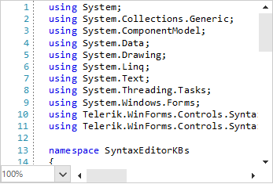

## Environment
 
|Product Version|Product|Author|
|----|----|----|
|2020.3.1020|RadSyntaxEditor for WinForms|[Desislava Yordanova](https://www.telerik.com/blogs/author/desislava-yordanova)|
 
## Description

[RadSyntaxEditor]() provides a convenient way to manage the [selection]() programmatically by using the SyntaxEditorElement.**Selection** property. 
 
This article demonstrates how to click somewhere in **RadSyntaxEditor** and select the word under the mouse cursor.  



## Solution 
 
The solution is achieved in two main parts:
* Subscribe to the RadSyntaxEditor.**MouseDown** event and detect the **CaretPosition** by the mouse coordinates.
* Define a start/end range associated to the start/end of the clicked word and select this range. We will use the current CaretPosition and navigate it to the word's start/end.
 

````C#

private void RadSyntaxEditor1_MouseDown(object sender, MouseEventArgs e)
{
    System.Drawing.Point position = this.radSyntaxEditor1.SyntaxEditorElement.EditorPresenter.PointFromControl(e.Location);
    CaretPosition clickPosition = this.radSyntaxEditor1.SyntaxEditorElement.EditorPresenter.GetPositionFromViewPoint(position);
    CaretPosition start = new CaretPosition(clickPosition);
    start.MoveToCurrentWordStart();
    CaretPosition end = new CaretPosition(clickPosition);
    end.MoveToCurrentWordEnd();
    this.radSyntaxEditor1.SyntaxEditorElement.Selection.Select(start, end);
}
 
````
````VB.NET

Private Sub RadSyntaxEditor1_MouseDown(sender As Object, e As MouseEventArgs)
    Dim position As System.Drawing.Point = Me.RadSyntaxEditor1.SyntaxEditorElement.EditorPresenter.PointFromControl(e.Location)
    Dim clickPosition As CaretPosition = Me.RadSyntaxEditor1.SyntaxEditorElement.EditorPresenter.GetPositionFromViewPoint(position)
    Dim start As CaretPosition = New CaretPosition(clickPosition)
    start.MoveToCurrentWordStart()
    Dim [end] As CaretPosition = New CaretPosition(clickPosition)
    [end].MoveToCurrentWordEnd()
    Me.RadSyntaxEditor1.SyntaxEditorElement.Selection.[Select](start, [end])
End Sub
 

```` 


# See Also

* [RadSyntaxEditor]()
* [Selection]()
* [How to Detect Mouse Input for a Word in RadSyntaxEditor]()

