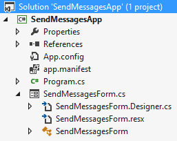
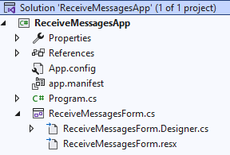
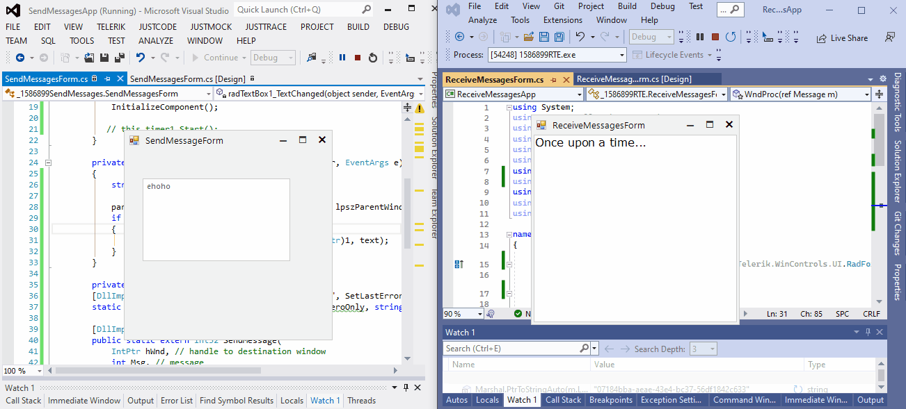

## Environment
|Product Version|Product|Author|
|----|----|----|
|2022.3.913|UI for WinForms|[Desislava Yordanova](https://www.telerik.com/blogs/author/desislava-yordanova)|

## Description

This article demonstrates a general approach for transferring messages between two separate Windows Forms Applications.  

## Solution

It is necessary to create two separate Windows Forms Applications, one with name "**SendMessagesApp**" and another one called "**ReceiveMessagesApp**".

>caption SendMessagesApp

 

>caption ReceiveMessagesApp

 

We will use the [SendMessage function](https://learn.microsoft.com/en-us/windows/win32/api/winuser/nf-winuser-sendmessage) passing **WM_SETTEXT** with the input available in a RadTextBox control. Then, the form that is expecting to receive the message from another application, should override its **WndProc** method and execute the desired action - in our case this will be inserting the text in a RadRichTextEditor. 

This is the code added to the **SendMessagesApp**: 

````C#

private void radTextBox1_TextChanged(object sender, EventArgs e)
{
    string text = this.radTextBox1.Text; 

    parenthWnd = FindWindowByCaption(IntPtr.Zero, lpszParentWindow);
    if (!parenthWnd.Equals(IntPtr.Zero))
    {
        SendMessage(parenthWnd, WM_SETTEXT, (IntPtr)1, text);
    }
}

private const int WM_SETTEXT = 0x000C; 
[DllImport("user32.dll", EntryPoint = "FindWindow", SetLastError = true)]
static extern IntPtr FindWindowByCaption(IntPtr ZeroOnly, string lpWindowName);

[DllImport("User32.dll")]
public static extern Int32 SendMessage(
    IntPtr hWnd, // handle to destination window
    int Msg, // message
    IntPtr wParam, // first message parameter
    String lParam); // second message parameter
 
string lpszParentWindow = "ReceiveMessagesForm";
IntPtr parenthWnd = new IntPtr(0);

````
````VB.NET

Private Sub RadTextBox1_TextChanged(sender As Object, e As EventArgs) Handles RadTextBox1.TextChanged
    Dim text As String = Me.RadTextBox1.Text
    parenthWnd = FindWindowByCaption(IntPtr.Zero, lpszParentWindow)

    If Not parenthWnd.Equals(IntPtr.Zero) Then
        SendMessage(parenthWnd, WM_SETTEXT, CType(1, IntPtr), text)
    End If
End Sub

Private lpszParentWindow As String = "ReceiveMessagesForm"
Private parenthWnd As IntPtr = New IntPtr(0)

Private Const WM_SETTEXT As Integer = &HC
<DllImport("user32.dll", EntryPoint:="FindWindow", SetLastError:=True)>
Private Shared Function FindWindowByCaption(ByVal ZeroOnly As IntPtr, ByVal lpWindowName As String) As IntPtr

End Function
<DllImport("User32.dll")>
Public Shared Function SendMessage(ByVal hWnd As IntPtr, ByVal Msg As Integer, ByVal wParam As IntPtr, ByVal lParam As String) As Int32
End Function

````

This is the code added to the **ReceiveMessagesApp**:

````C#

public ReceiveMessagesForm()
{
    InitializeComponent();

    this.radRichTextEditor1.Text = "Once upon a time..."; 
} 

private const int WM_SETTEXT = 0x000C;
protected override void WndProc(ref Message m)
{
    if (m.Msg == WM_SETTEXT)
    {
        if (m.WParam == (IntPtr)1)
        {
             this.radRichTextEditor1.Text= Marshal.PtrToStringAuto(m.LParam);
        }
    }
    else
    {
        base.WndProc(ref m);
    }
}

````
````VB.NET
Public Sub New()
    InitializeComponent()
    Me.RadRichTextEditor1.Text = "Once upon a time..."
End Sub

Private Const WM_SETTEXT As Integer = &HC

Protected Overrides Sub WndProc(ByRef m As Message)
    If m.Msg = WM_SETTEXT Then

        If m.WParam = CType(1, IntPtr) Then
            Me.RadRichTextEditor1.Text = Marshal.PtrToStringAuto(m.LParam)
        End If
    Else
        MyBase.WndProc(m)
    End If
End Sub


````

>note It is important to note that the Text of the receiver form is set to "ReceiveMessagesForm" since the **handle** is found by the caption.

 

# See Also

* [SendMessage](https://social.msdn.microsoft.com/Forums/vstudio/en-US/d52b9825-dd13-4fd4-bfa8-722114f2ba44/sendmessage-retain-existing-text?forum=csharpgeneral)
* [FindWindow](https://stackoverflow.com/questions/5712930/get-handle-of-a-specific-window-using-user32-dll)


 