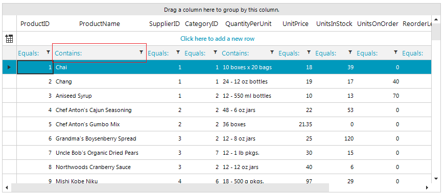
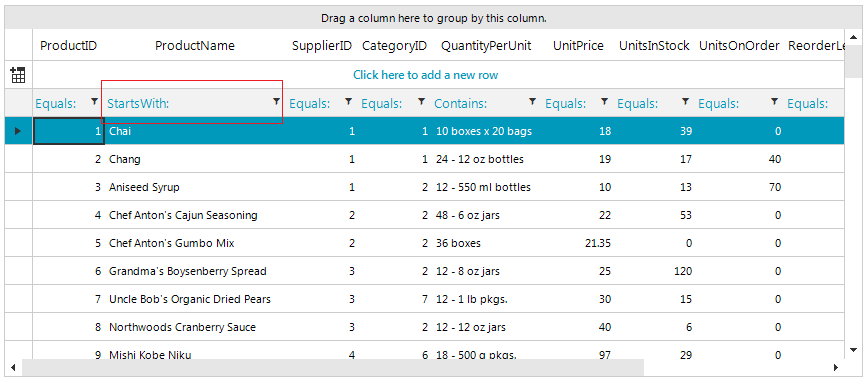

## Environment
 
|Product Version|Product|Author|
|----|----|----|
|2018.3.1016|RadGridView for WinForms|[Desislava Yordanova](https://www.telerik.com/blogs/author/desislava-yordanova)|
 

## Description

The default filter operator in the **RadGridView**'s columns depends on the data type that is being stored in that column. For example, the default filter operator for a text column is *Contains*. This article will demonstrate a sample approach how to change it and apply another relevant filter operator for this data type.



## Solution 

Subscribe to the RadGridView.**CreateCell** event and replace the default **GridFilterCellElement** with your custom one where you can specify the default filter operator, e.g. *StartsWith*:

#### Custom filter cell element

````C#

private void radGridView1_CreateCell(object sender, Telerik.WinControls.UI.GridViewCreateCellEventArgs e)
{
    if (e.CellType == typeof(GridFilterCellElement))
    {
        if (e.Column.Name == "ProductName")
        {
            e.CellElement = new CustomGridFilterCellElement(e.Column as GridViewDataColumn, e.Row);
        }
        else
        {
            e.CellElement = new DefaultGridFilterCellElement(e.Column as GridViewDataColumn, e.Row);
        }
    }
}

public class DefaultGridFilterCellElement : GridFilterCellElement
{
    public DefaultGridFilterCellElement(GridViewDataColumn column, GridRowElement row)
        : base(column, row)
    {
    }

    protected override Type ThemeEffectiveType
    {
        get
        {
            return typeof(GridFilterCellElement);
        }
    }

    public override bool IsCompatible(GridViewColumn data, object context)
    {
        return data.Name != "ProductName";
    }
}

public class CustomGridFilterCellElement : GridFilterCellElement
{
    protected override Type ThemeEffectiveType
    {
        get
        {
            return typeof(GridFilterCellElement);
        }
    }

    public CustomGridFilterCellElement(GridViewDataColumn column, GridRowElement row)
        : base(column, row)
    {
        this.FilteringRowInfo.SuspendPropertyNotifications();
        this.SetFilterOperator(Telerik.WinControls.Data.FilterOperator.StartsWith);
        this.FilteringRowInfo.ResumePropertyNotifications();
    }

    public override bool IsCompatible(GridViewColumn data, object context)
    {
        return data.Name == "ProductName";
    }
}
    

````
````VB.NET

Private Sub radGridView1_CreateCell(ByVal sender As Object, _
    ByVal e As Telerik.WinControls.UI.GridViewCreateCellEventArgs) Handles RadGridView1.CreateCell
    If e.CellType = GetType(GridFilterCellElement) Then

        If e.Column.Name = "ProductName" Then
            e.CellElement = New CustomGridFilterCellElement(TryCast(e.Column, GridViewDataColumn), e.Row)
        Else
            e.CellElement = New DefaultGridFilterCellElement(TryCast(e.Column, GridViewDataColumn), e.Row)
        End If
    End If
End Sub

Public Class DefaultGridFilterCellElement
    Inherits GridFilterCellElement

    Public Sub New(ByVal column As GridViewDataColumn, ByVal row As GridRowElement)
        MyBase.New(column, row)
    End Sub

    Protected Overrides ReadOnly Property ThemeEffectiveType As Type
        Get
            Return GetType(GridFilterCellElement)
        End Get
    End Property

    Public Overrides Function IsCompatible(ByVal data As GridViewColumn, ByVal context As Object) As Boolean
        Return data.Name <> "ProductName"
    End Function
End Class

Public Class CustomGridFilterCellElement
    Inherits GridFilterCellElement

    Protected Overrides ReadOnly Property ThemeEffectiveType As Type
        Get
            Return GetType(GridFilterCellElement)
        End Get
    End Property

    Public Sub New(ByVal column As GridViewDataColumn, ByVal row As GridRowElement)
        MyBase.New(column, row)
        Me.FilteringRowInfo.SuspendPropertyNotifications()
        Me.SetFilterOperator(Telerik.WinControls.Data.FilterOperator.StartsWith)
        Me.FilteringRowInfo.ResumePropertyNotifications()
    End Sub

    Public Overrides Function IsCompatible(ByVal data As GridViewColumn, ByVal context As Object) As Boolean
        Return data.Name = "ProductName"
    End Function
End Class
    

````

As a result, the default filter operator for the **ProductName** column is changed:



# See Also

* [Basic Filtering]()
* [Custom Filtering]() 

