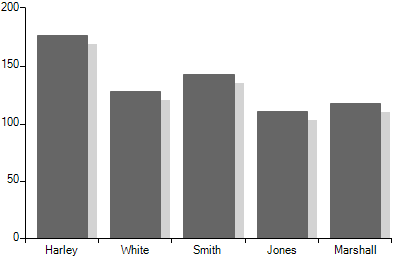

## Environment
 
|Product Version|Product|Author|
|----|----|----|
|2020.2.512|RadChartView for WinForms|[Desislava Yordanova](https://www.telerik.com/blogs/author/desislava-yordanova)|
 

## Description

This tutorial aims to demonstrate a sample approach for achieving a shadow effect for the [BarSeries]() in **RadChartView**.

|No shadow|Shadow|
|----|----|
|||

## Solution 

The [custom rendering]() functionality that **RadChartView** offers is suitable for drawing a thin rectangle next to default bar element that is being rendered. The main rendering logic for each bar element is executed in the **BarSeriesDrawPart** class. We will create a derivative of **BarSeriesDrawPart** and override the **DrawSeriesParts** method. Then, along with the default rendering of the bar element we will draw a gray rectangle using the **RadGdiGraphics**: 

````C#

        public Form1()
        {
            InitializeComponent();
            
            this.radChartView1.CreateRenderer += new ChartViewCreateRendererEventHandler(radChartView1_CreateRenderer);
            BarSeries barSeries = new BarSeries("Performance", "RepresentativeName");
            barSeries.Name = "Q1";
            barSeries.DataPoints.Add(new CategoricalDataPoint(177, "Harley"));
            barSeries.DataPoints.Add(new CategoricalDataPoint(128, "White"));
            barSeries.DataPoints.Add(new CategoricalDataPoint(143, "Smith"));
            barSeries.DataPoints.Add(new CategoricalDataPoint(111, "Jones"));
            barSeries.DataPoints.Add(new CategoricalDataPoint(118, "Marshall"));
            this.radChartView1.Series.Add(barSeries);
        }

        void radChartView1_CreateRenderer(object sender, ChartViewCreateRendererEventArgs e)
        {
            RenderParameter param = new RenderParameter();
            param.Color = Color.Red;
            e.Renderer = new CustomCartesianRenderer(param, e.Area as CartesianArea);
        }
    }

    public class RenderParameter
    { 
        public Color Color { get; set; }
     
        public RenderParameter()
        {
        }
    }
    
    public class CustomCartesianRenderer : CartesianRenderer
    {
        internal RenderParameter RenderParameter { get; set; }

        public CustomCartesianRenderer(CartesianArea area) : base(area)
        {
        }
        public CustomCartesianRenderer(RenderParameter renderParameter, CartesianArea area) : base(area)
        {
            RenderParameter = renderParameter ?? throw new ArgumentNullException(nameof(renderParameter));
        }

        protected override void Initialize()
        {
            base.Initialize();

            for (int i = 0; i < this.DrawParts.Count; i++)
            {
                BarSeriesDrawPart linePart = this.DrawParts[i] as BarSeriesDrawPart;
                if (linePart != null)
                {
                    this.DrawParts[i] = new CustomBarSeriesDrawPart((BarSeries)linePart.Element, this);
                }
            }
        }
    }

    public class CustomBarSeriesDrawPart : BarSeriesDrawPart
    {
        public CustomBarSeriesDrawPart(BarSeries series, IChartRenderer renderer) : base(series, renderer)
        {
        }

        public override void DrawSeriesParts()
        {
            CustomCartesianRenderer customRenderer = this.Renderer as CustomCartesianRenderer;
            RenderParameter param= customRenderer.RenderParameter;

            Graphics graphics = customRenderer.Graphics;
            RadGdiGraphics radGraphics = new RadGdiGraphics(graphics);

            for (int j = 0; j < this.Element.DataPoints.Count; j++)
            {
                RadRect slot = this.Element.DataPoints[j].LayoutSlot;
                RectangleF temp = new RectangleF((float)(this.OffsetX + slot.X), (float)(this.OffsetY + slot.Y), (float)slot.Width, (float)slot.Height);
                RectangleF barBounds = new RectangleF(temp.X + 10,temp.Y + 10,temp.Width,temp.Height + 10);

                DataPointElement childElement = (DataPointElement)this.Element.Children[j];

                float realWidth = barBounds.Width * childElement.HeightAspectRatio;
                barBounds.Width = realWidth;
                
                barBounds.Height = Math.Max(barBounds.Height, 1f);
                
                radGraphics.FillRectangle(barBounds, Color.LightGray);
            }
            base.DrawSeriesParts();
        }
    }   
    

````
````VB.NET

     Public Sub New()
        InitializeComponent()
        AddHandler Me.RadChartView1.CreateRenderer, AddressOf radChartView1_CreateRenderer
        Dim barSeries As BarSeries = New BarSeries("Performance", "RepresentativeName")
        barSeries.Name = "Q1"
        barSeries.DataPoints.Add(New CategoricalDataPoint(177, "Harley"))
        barSeries.DataPoints.Add(New CategoricalDataPoint(128, "White"))
        barSeries.DataPoints.Add(New CategoricalDataPoint(143, "Smith"))
        barSeries.DataPoints.Add(New CategoricalDataPoint(111, "Jones"))
        barSeries.DataPoints.Add(New CategoricalDataPoint(118, "Marshall"))
        Me.RadChartView1.Series.Add(barSeries)
    End Sub

    Private Sub radChartView1_CreateRenderer(ByVal sender As Object, ByVal e As ChartViewCreateRendererEventArgs)
        Dim param As RenderParameter = New RenderParameter()
        param.Color = Color.Red
        e.Renderer = New CustomCartesianRenderer(param, TryCast(e.Area, CartesianArea))
    End Sub
End Class

Public Class RenderParameter
    Public Property Color As Color

    Public Sub New()
    End Sub
End Class

Public Class CustomCartesianRenderer
    Inherits CartesianRenderer

    Friend Property RenderParameter As RenderParameter

    Public Sub New(ByVal area As CartesianArea)
        MyBase.New(area)
    End Sub

    Public Sub New(ByVal renderParameter As RenderParameter, ByVal area As CartesianArea)
        MyBase.New(area)
        If renderParameter Is Nothing Then
            Throw New ArgumentNullException(NameOf(renderParameter))
        End If
        renderParameter = renderParameter
    End Sub

    Protected Overrides Sub Initialize()
        MyBase.Initialize()

        For i As Integer = 0 To Me.DrawParts.Count - 1
            Dim linePart As BarSeriesDrawPart = TryCast(Me.DrawParts(i), BarSeriesDrawPart)

            If linePart IsNot Nothing Then
                Me.DrawParts(i) = New CustomBarSeriesDrawPart(CType(linePart.Element, BarSeries), Me)
            End If
        Next
    End Sub

End Class

Public Class CustomBarSeriesDrawPart
    Inherits BarSeriesDrawPart

    Public Sub New(ByVal series As BarSeries, ByVal renderer As IChartRenderer)
        MyBase.New(series, renderer)
    End Sub

    Public Overrides Sub DrawSeriesParts()
        Dim customRenderer As CustomCartesianRenderer = TryCast(Me.Renderer, CustomCartesianRenderer)
        Dim param As RenderParameter = customRenderer.RenderParameter
        Dim graphics As Graphics = customRenderer.Graphics
        Dim radGraphics As RadGdiGraphics = New RadGdiGraphics(graphics)

        For j As Integer = 0 To Me.Element.DataPoints.Count - 1
            Dim slot As RadRect = Me.Element.DataPoints(j).LayoutSlot
            Dim temp As RectangleF = New RectangleF(CSng((Me.OffsetX + slot.X)), CSng((Me.OffsetY + slot.Y)), CSng(slot.Width), CSng(slot.Height))
            Dim barBounds As RectangleF = New RectangleF(temp.X + 10, temp.Y + 10, temp.Width, temp.Height + 10)
            Dim childElement As DataPointElement = CType(Me.Element.Children(j), DataPointElement)
            Dim realWidth As Single = barBounds.Width * childElement.HeightAspectRatio
            barBounds.Width = realWidth
            barBounds.Height = Math.Max(barBounds.Height, 1.0F)
            radGraphics.FillRectangle(barBounds, Color.LightGray)
        Next

        MyBase.DrawSeriesParts()
    End Sub   

````

# See Also

* [BarSeries]()
* [Custom Rendering]() 

