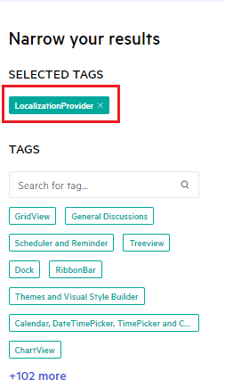
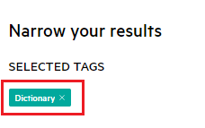
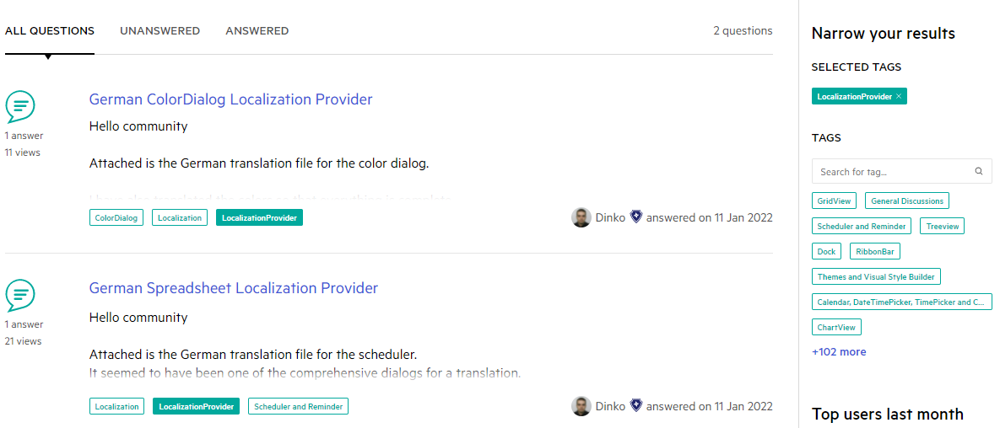
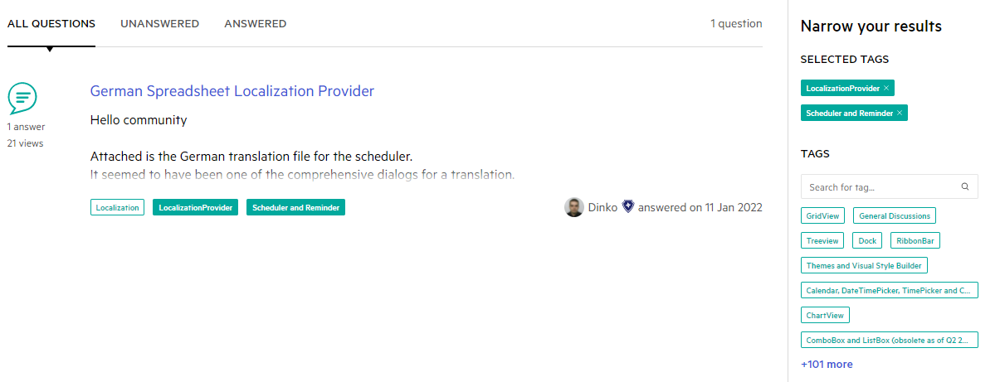

## Environment
 
|Product Version|Product|Author|
|----|----|----|
|2022.1.222|UI for WinForms|[Desislava Yordanova](https://www.telerik.com/blogs/author/desislava-yordanova)|

## How To

[This](https://www.telerik.com/support/code-library/winforms/localization-providers) is the place where our community used to share localization providers and spell checking dictionaries for different languages for the controls in the Telerik UI for WinForms suite. They are currently closed for posting new replies since we are intending to migrate the Code Library.

Currently, you can share the localization provider or dictionary with the community via the [Telerik WinForms forum](https://www.telerik.com/forums/winforms). It is just necessary to use the correct forum tags that are specifically created for this purpose: "**LocalizationProvider**" and "**Dictionary**".

>caption Tag **LocalizationProvider**

>caption Tag **Dictionary**

They can be used to easily narrow your results:

>caption List of all localization providers available in the forums:

>caption List of localization providers for RadScheduler:

We encourage our clients to share localization providers with the community (if they still don't exist in the code library) and collaboratively work on enhancing them.
 
Each submission of a provider receives up to 2000 [Telerik points](http://www.telerik.com/community/telerik-points) based on the complexity of the localization provider - single control translations or the entire suite.  

# See Also

* [Embedded Labels](https://docs.telerik.com/devtools/winforms/controls/editors/textbox/programming-radtextbox#embedded-labels)