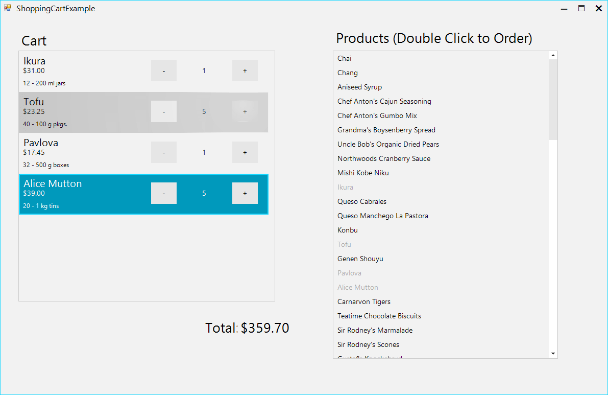

## Environment
<table>
    <tr>
        <td>Product Version</td>
        <td>2018.1 220</td>
    </tr>
    <tr>
        <td>Product</td>
        <td>RadListView for WinForms</td>
    </tr>
</table>

## Description
 
This article demonstrates how one can create a shopping cart item where the user can see the product detail and adjust the amount.  

>caption Figure 1: Shopping Cart Item for RadListView

## Solution

You should inherit the __SimpleListViewVisualItem__ class and add the necessary elements. In this case you will add two buttons for adjusting the amount and three LightVisualElements for displaying the product details. You will need a single label to display the current amount as well. You will add the elements to StackLayoutElements which will allow you to create the layout. 

The example is bound to a custom created business object which allows you to easily get the data and calculate the total amount. 

A complete C# and VB code is available in our sdk-repository: [ShoppingCartItem](https://github.com/telerik/winforms-sdk/tree/master/ListView/ShoppingCartItem)

# See Also

* [ListView Custom Item]()
* [LightVisualElement]()
* [StackLayoutElement]()

