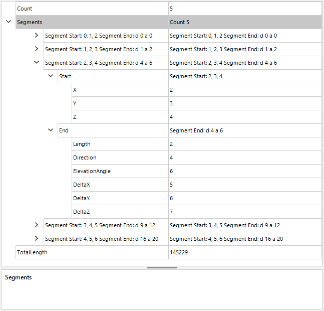

## Environment
|Product Version|Product|Author|
|----|----|----|
|2021.2.511|RadPropertyGrid|[Desislava Yordanova](https://www.telerik.com/blogs/author/desislava-yordanova)|

## Description

**RadPropertyGrid** doesn't display the nested collections and properties in the illustrated way out of the box:
 

## Solution

A complete C# and VB.NET project is available in the Telerik WinForms SDK [here](https://github.com/telerik/winforms-sdk/tree/master/PropertyGrid/PropertyGridNestedCollections).

The sample solution is based on the following article: [Customized Display of Collection Data in a PropertyGrid](https://www.codeproject.com/Articles/4448/Customized-Display-of-Collection-Data-in-a-Propert).  
 
# See Also

* [Type Converters]()
* [Attributes]()

 

 
