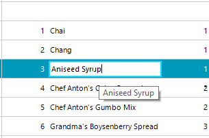

## Environment
 
|Product Version|Product|Author|
|----|----|----|
|2020.3.915|RadGridView for WinForms|[Desislava Yordanova](https://www.telerik.com/blogs/author/desislava-yordanova)|
 

## Description

**RadGridView** offers a convenient way for showing [tool tips for the cell elements]() when they are **not** being edited. However, once an editor is activated, it handles the keyboard and mouse input. That is why the cell's tool tip is not shown in this case. 

This article demonstrates a sample approach how to show a tool tip for the cell's editor:



## Solution 

Subscribe to the **CellEditorInitialized** event which is fired when the editor is activated. Then, handle the **MouseHover** event for the hosted text box in the editor and show programmatically a **RadToolTip** at the cursor's position:

````C#
RadToolTip toolTip;

public RadForm1()
{
    InitializeComponent();
     
    this.radGridView1.CellEditorInitialized += radGridView1_CellEditorInitialized;
    this.radGridView1.CellEndEdit += radGridView1_CellEndEdit;
}

private void radGridView1_CellEndEdit(object sender, GridViewCellEventArgs e)
{
    if (toolTip != null)
    {
        toolTip.Hide();
    }
}

private void radGridView1_CellEditorInitialized(object sender, GridViewCellEventArgs e)
{
    RadTextBoxEditor tbEditor = e.ActiveEditor as RadTextBoxEditor;
    if (tbEditor != null)
    {
       
        RadTextBoxEditorElement elementUnderMouse = tbEditor.EditorElement as RadTextBoxEditorElement;
        if (elementUnderMouse != null)
        {
            elementUnderMouse.TextBoxItem.TextBoxControl.MouseHover -= ElementUnderMouse_MouseHover;
            elementUnderMouse.TextBoxItem.TextBoxControl.MouseHover += ElementUnderMouse_MouseHover;
        }
    }
}

private void ElementUnderMouse_MouseHover(object sender, EventArgs e)
{
    HostedTextBoxBase elementUnderMouse = sender as HostedTextBoxBase;
    if (toolTip == null)
    {
        toolTip = new RadToolTip();
        toolTip.InitialDelay = 1000; 
    }
    toolTip.Show(elementUnderMouse.Text, Cursor.Position); 
}
 

````
````VB.NET
Private toolTip As RadToolTip

Public Sub New()
    InitializeComponent()
    AddHandler Me.RadGridView1.CellEditorInitialized, AddressOf radGridView1_CellEditorInitialized
    AddHandler Me.RadGridView1.CellEndEdit, AddressOf radGridView1_CellEndEdit
End Sub

Private Sub radGridView1_CellEndEdit(ByVal sender As Object, ByVal e As GridViewCellEventArgs)
    If toolTip IsNot Nothing Then
        toolTip.Hide()
    End If
End Sub

Private Sub radGridView1_CellEditorInitialized(ByVal sender As Object, ByVal e As GridViewCellEventArgs)
    Dim tbEditor As RadTextBoxEditor = TryCast(e.ActiveEditor, RadTextBoxEditor)

    If tbEditor IsNot Nothing Then
        Dim elementUnderMouse As RadTextBoxEditorElement = TryCast(tbEditor.EditorElement, RadTextBoxEditorElement)

        If elementUnderMouse IsNot Nothing Then
            RemoveHandler elementUnderMouse.TextBoxItem.TextBoxControl.MouseHover, AddressOf ElementUnderMouse_MouseHover
            AddHandler elementUnderMouse.TextBoxItem.TextBoxControl.MouseHover, AddressOf ElementUnderMouse_MouseHover
        End If
    End If
End Sub

Private Sub ElementUnderMouse_MouseHover(ByVal sender As Object, ByVal e As EventArgs)
    Dim elementUnderMouse As HostedTextBoxBase = TryCast(sender, HostedTextBoxBase)

    If toolTip Is Nothing Then
        toolTip = New RadToolTip()
        toolTip.InitialDelay = 1000
    End If

    toolTip.Show(elementUnderMouse.Text, Cursor.Position)
End Sub   

```` 
 

# See Also

* [Tooltips for Cell Elements]() 


    
   
  
    
 
