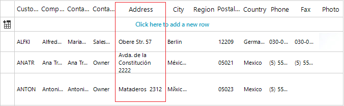
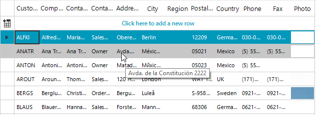
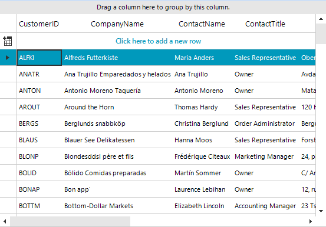

## Environment
 
|Product Version|Product|Author|
|----|----|----|
|2020.2.616|RadGridView for WinForms|[Desislava Yordanova](https://www.telerik.com/blogs/author/desislava-yordanova)|
 

## Description

When the width of a column in **RadGridView** is not enough to show the whole cell's text, its context is either clipped or wrapped:

>caption GridViewColumnInfo.**WrapText**=true



This article aims to show a sample approach of displaying a tooltip only for the cells that don't display the entire content and their text is clipped:



## Solution 
 
The challenging part here is to determine whether the text within a cell is entirely visible or it is clipped. There are different approaches for measuring some text considering the font family and font size. That is why it is important to know first how the text is being rendered in order to measure it correctly.

By default, Telerik Presentation Framework uses **GDI+** to measure and render the text. You can easily switch to **GDI** instead by setting the **UseCompatibleTextRendering** property to *false* for the respective control:

[Draw text with GDI: TextRenderer.DrawText](https://docs.microsoft.com/en-us/dotnet/framework/winforms/advanced/how-to-draw-text-with-gdi)

[Draw text with GDI+: Graphics.DrawString](https://docs.microsoft.com/en-us/windows/win32/gdiplus/-gdiplus-drawing-text-use)

>note In R2 2017 we introduced the static property RadControl.**UseCompatibleTextRenderingDefaultValue** which allows the user to globally control the default value for **UseCompatibleTextRendering** property. It is recommended to set it before calling **InitializeComponent**.  

>caption Show ToolTips only when it is necessary




````C#

public RadForm1()
{
    RadControl.UseCompatibleTextRenderingDefaultValue = false;// to test with GDI
    RadControl.UseCompatibleTextRenderingDefaultValue = true;//to test with GDI+
    InitializeComponent(); 
    this.radGridView1.ToolTipTextNeeded += radGridView1_ToolTipTextNeeded;
}

private void radGridView1_ToolTipTextNeeded(object sender, Telerik.WinControls.ToolTipTextNeededEventArgs e)
{
    GridDataCellElement dataCell = sender as GridDataCellElement;
    string toolTipText = null;
    if (dataCell != null)
    {
        float cellWidth = dataCell.ColumnInfo.Width; 
        float cellHeight = dataCell.Size.Height; 
        switch (dataCell.BorderBoxStyle)
        {
            case BorderBoxStyle.SingleBorder:
                cellWidth -= dataCell.BorderWidth * 2;
                cellHeight -= dataCell.BorderWidth * 2;
                break;
            case BorderBoxStyle.FourBorders:
                cellWidth -= dataCell.BorderLeftWidth + dataCell.BorderRightWidth;
                cellHeight -= dataCell.BorderTopWidth + dataCell.BorderBottomWidth;
                break; 
            default:
                break;
        }

        SizeF sizeInCell = SizeF.Empty;
        if (RadControl.UseCompatibleTextRenderingDefaultValue == true) //GDI+
        {
            using (Graphics g = this.radGridView1.CreateGraphics())
            {
                  sizeInCell = g.MeasureString(dataCell.Text, dataCell.Font); 
            }
        }
        else //GDI
        {
              sizeInCell = TextRenderer.MeasureText(dataCell.Text, dataCell.Font);
        }

        if (sizeInCell.Width > cellWidth || cellHeight < sizeInCell.Height)
        {
            toolTipText = dataCell.Text;
        }
         
        e.ToolTipText = toolTipText;
    }
}    
    

````
````VB.NET

Public Sub New()
    RadControl.UseCompatibleTextRenderingDefaultValue = False 'to test with GDI
    RadControl.UseCompatibleTextRenderingDefaultValue = True 'to test with GDI+
    InitializeComponent()
    AddHandler Me.RadGridView1.ToolTipTextNeeded, AddressOf radGridView1_ToolTipTextNeeded
End Sub

Private Sub radGridView1_ToolTipTextNeeded(ByVal sender As Object, ByVal e As Telerik.WinControls.ToolTipTextNeededEventArgs)
    Dim dataCell As GridDataCellElement = TryCast(sender, GridDataCellElement)
    Dim toolTipText As String = Nothing

    If dataCell IsNot Nothing Then
        Dim cellWidth As Single = dataCell.ColumnInfo.Width
        Dim cellHeight As Single = dataCell.Size.Height

        Select Case dataCell.BorderBoxStyle
            Case BorderBoxStyle.SingleBorder
                cellWidth -= dataCell.BorderWidth * 2
                cellHeight -= dataCell.BorderWidth * 2
            Case BorderBoxStyle.FourBorders
                cellWidth -= dataCell.BorderLeftWidth + dataCell.BorderRightWidth
                cellHeight -= dataCell.BorderTopWidth + dataCell.BorderBottomWidth
            Case Else
        End Select

        Dim sizeInCell As SizeF = SizeF.Empty

        If RadControl.UseCompatibleTextRenderingDefaultValue = True Then

            Using g As Graphics = Me.RadGridView1.CreateGraphics()
                sizeInCell = g.MeasureString(dataCell.Text, dataCell.Font)
            End Using
        Else
            sizeInCell = TextRenderer.MeasureText(dataCell.Text, dataCell.Font)
        End If

        If sizeInCell.Width > cellWidth OrElse cellHeight < sizeInCell.Height Then
            toolTipText = dataCell.Text
        End If

        e.ToolTipText = toolTipText
    End If
End Sub
     

````

Another approach for measuring elements is to use MeasurementControl.ThreadInstance.**GetDesiredSize**(RadElement, SizeF) method. It is necessary to pass directly the element you want to measure (e.g. GridDataCellElement) giving the available size. Passing **new SizeF(float.PositiveInfinity, float.PositiveInfinity)** will return the size that **RadElement** actually needs.

# See Also

* [Text Rendering]() 
* [ToolTips]()

