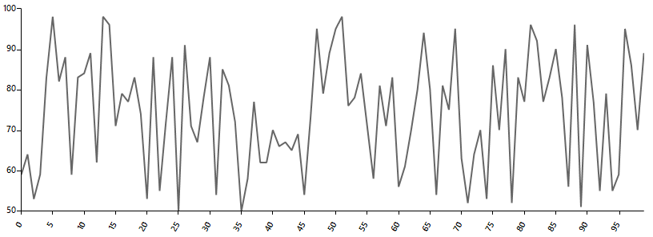

## Environment
 
|Product Version|Product|Author|
|----|----|----|
|2020.2.512|RadChartView for WinForms|[Desislava Yordanova](https://www.telerik.com/blogs/author/desislava-yordanova)|
 

## Description

This tutorial demonstrates how to simulate an EKG signal in **RadChartView**.



## Solution 

**RadChartView** supports [empty values]() in the series. In general, 'empty values' means missing Y value for a particular X value. This is appropriate for achieving blank parts within the chart. 
Using a timer, we will update the blank part in the line moving it forward.

#### Simulate an EKG signal

````C#

Random rnd = new Random();
FastLineSeries series = new FastLineSeries();
Dictionary<string, double?> categoryValuePairs = new Dictionary<string, double?>();
public RadForm1()
{
    InitializeComponent();                  
    
    for (int i = 0; i < 100; i++)
    {
        CategoricalDataPoint point = new CategoricalDataPoint(rnd.Next(50, 100), i);
        series.DataPoints.Add(point); 
        categoryValuePairs.Add(i.ToString(),point.Value);
    }
    radChartView1.Series.Add(series);
    LinearAxis verticalAxis = series.VerticalAxis as LinearAxis;
    verticalAxis.Minimum = 50;
    verticalAxis.Maximum = 100;
    CategoricalAxis categoricalAxis = series.HorizontalAxis as CategoricalAxis; 
    categoricalAxis.LabelFitMode = AxisLabelFitMode.Rotate;
    categoricalAxis.MajorTickInterval = 5;
    this.timer1.Interval = 100;
}

private void radButton1_Click(object sender, EventArgs e)
{
    if (!this.timer1.Enabled)
    {
        this.timer1.Start();
    }
    else
    { 
        this.timer1.Stop();
    }
}

int cnt = 0;

private void timer1_Tick(object sender, EventArgs e)
{
    cnt++;
    if (cnt >= series.DataPoints.Count - 5)
    {
        cnt = 0;
    }
    CategoricalDataPoint point = null;
    for (int i = 0; i < series.DataPoints.Count; i++)
    {
        point = (CategoricalDataPoint)series.DataPoints[i];
        if (i >= cnt && i < cnt + 5)
        {
            point.Value = null;
        }
        else
        {
            point.Value = categoryValuePairs[point.Category.ToString()];
        }
    }
}
    

````
````VB.NET

Private rnd As Random = New Random()
Private series As FastLineSeries = New FastLineSeries()
Private categoryValuePairs As Dictionary(Of String, Double?) = New Dictionary(Of String, Double?)()

Public Sub New()
    InitializeComponent()

    For i As Integer = 0 To 100 - 1
        Dim point As CategoricalDataPoint = New CategoricalDataPoint(rnd.[Next](50, 100), i)
        series.DataPoints.Add(point)
        categoryValuePairs.Add(i.ToString(), point.Value)
    Next

    RadChartView1.Series.Add(series)
    Dim verticalAxis As LinearAxis = TryCast(series.VerticalAxis, LinearAxis)
    verticalAxis.Minimum = 50
    verticalAxis.Maximum = 100
    Dim categoricalAxis As CategoricalAxis = TryCast(series.HorizontalAxis, CategoricalAxis)
    categoricalAxis.LabelFitMode = AxisLabelFitMode.Rotate
    categoricalAxis.MajorTickInterval = 5
    Me.Timer1.Interval = 100
End Sub

Private Sub RadButton1_Click(sender As Object, e As EventArgs) Handles RadButton1.Click
    If Not Me.Timer1.Enabled Then
        Me.Timer1.Start()
    Else
        Me.Timer1.[Stop]()
    End If
End Sub

Private cnt As Integer = 0

Private Sub timer1_Tick(ByVal sender As Object, ByVal e As EventArgs) Handles Timer1.Tick
    cnt += 1

    If cnt >= series.DataPoints.Count - 5 Then
        cnt = 0
    End If

    Dim point As CategoricalDataPoint = Nothing

    For i As Integer = 0 To series.DataPoints.Count - 1
        point = CType(series.DataPoints(i), CategoricalDataPoint)

        If i >= cnt AndAlso i < cnt + 5 Then
            point.Value = Nothing
        Else
            point.Value = categoryValuePairs(point.Category.ToString())
        End If
    Next
End Sub

    

````


# See Also

* [FastLine]()
* [Null Values Support]() 

