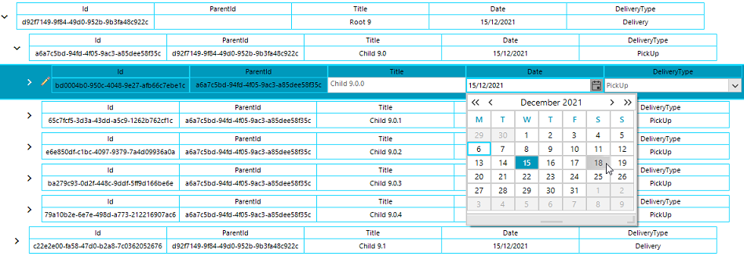

## Environment
 
|Product Version|Product|Author|
|----|----|----|
|2021.3.1123|RadTreeView for WinForms|[Desislava Yordanova](https://www.telerik.com/blogs/author/desislava-yordanova)|
 
## Description

This tutorial demonstrates how to simulate a TreeList control with load on demand hierarchy: 

 
## Solution 

The illustrated result is achieved with a RadTreeView by two main steps:

1. Create a [custom node element]() that contains a header container with the header cells and a data container with the data cells.
2. Build a [custom editor]() which allows editing the Title, Date, DeliveryType fields.

>note A complete C# and VB project is available [here](https://github.com/telerik/winforms-sdk/tree/master/TreeView/SelfRefLoadOnDemandGrid)

# See Also

* [Custom Nodes]()
* [Custom Editor]()
 

 

    
   
  
    
 
