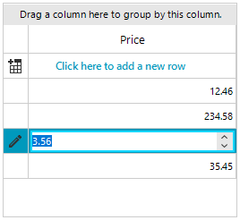

## Environment
 
|Product Version|Product|Author|
|----|----|----|
|2022.2.622|RadGridView for WinForms|[Desislava Yordanova](https://www.telerik.com/blogs/author/desislava-yordanova)|


## Description

The [GridViewDecimalColumn]() offers **DecimalPlaces** property which allows you to specify how many decimal places will be displayed in the cell. If you set **2** decimal places to be shown but the cells contain values with more decimal places, it is expected to be rounded to the decimal places. This is desired behavior. Consider the following setup:
 
````C#  

DataTable dt = new DataTable();
dt.Columns.Add("Price", typeof(decimal));
dt.Rows.Add(12.4678m);
dt.Rows.Add(234.581m);
dt.Rows.Add(3.566m);
dt.Rows.Add(35.459m);
this.radGridView1.DataSource = dt;

GridViewDecimalColumn decimalColumn = this.radGridView1.Columns["Price"] as GridViewDecimalColumn;
decimalColumn.DecimalPlaces = 2;
decimalColumn.FormatString = "{0:N2}";
         
````
````VB.NET

DataTable dt = new DataTable();
dt.Columns.Add("Price", typeof(decimal));
dt.Rows.Add(12.4678m);
dt.Rows.Add(234.581m);
dt.Rows.Add(3.566m);
dt.Rows.Add(35.459m);
this.radGridView1.DataSource = dt;

GridViewDecimalColumn decimalColumn = this.radGridView1.Columns["Price"] as GridViewDecimalColumn;
decimalColumn.DecimalPlaces = 2;
decimalColumn.FormatString = "{0:N2}";

````

It is expected the numeric values to be rounded up to 2 decimal places:


This article demonstrates a sample approach how to skip the rounding and trim the numeric values to display 2 decimal places.

## Solution

It is necessary to handle the **CellFormatting** event and manipulate the text for the cells in order to trim the numeric value. In addition to this, a custom **GridSpinEditor** is required to skip the rounding:



The end-user still can enter more decimal places than the specified value but the number will be trimmed without rounding:
 
 
````C#  

public RadForm1()
{
    InitializeComponent();

    this.radGridView1.CellFormatting += radGridView1_CellFormatting;
    this.radGridView1.EditorRequired += RadGridView1_EditorRequired;

    DataTable dt = new DataTable();
    dt.Columns.Add("Price", typeof(decimal));
    dt.Rows.Add(12.4678m);
    dt.Rows.Add(234.581m);
    dt.Rows.Add(3.566m);
    dt.Rows.Add(35.459m);
    this.radGridView1.DataSource = dt;

    GridViewDecimalColumn decimalColumn = this.radGridView1.Columns["Price"] as GridViewDecimalColumn;
    decimalColumn.DecimalPlaces = 2;
    decimalColumn.FormatString = "{0:N2}";

    this.radGridView1.AutoSizeColumnsMode = GridViewAutoSizeColumnsMode.Fill;
}

private void radGridView1_CellFormatting(object sender, CellFormattingEventArgs e)
{
    if (e.Column.HeaderText == "Price" && e.Row is GridViewDataRowInfo && e.CellElement.Value != null)
    {
        e.CellElement.Text = TrimValue(e.CellElement.Value,((GridViewDecimalColumn)e.Column).DecimalPlaces);
    }
}

public static string TrimValue(object input, int decimalPlaces)
{
    string internalValue = input + "";
    int decimalPointIndex = internalValue.IndexOf(".");
    if (decimalPointIndex > -1)
    { 
        StringBuilder sb = new StringBuilder();
        sb.Append(internalValue.Substring(0, decimalPointIndex));
        sb.Append(internalValue.Substring(decimalPointIndex, decimalPlaces + 1));
        return sb.ToString();
    }
    return internalValue;
}

private void RadGridView1_EditorRequired(object sender, EditorRequiredEventArgs e)
{
    if (e.EditorType == typeof(GridSpinEditor))
    {
        e.Editor = new CustomSpinEditor();
    }
}

public class CustomSpinEditor : GridSpinEditor
{
    protected override RadElement CreateEditorElement()
    {
        return new CustomSpinEditorElement();
    }

    public override object Value
    {
        get { return base.Value; }
        set
        {
            string internalValue = value + "";
            int decimalPointIndex = internalValue.IndexOf(".");
            if (decimalPointIndex > -1)
            {
                decimal trimmedValue = 0;
                GridCellElement cell = this.OwnerElement as GridCellElement;
                if (cell != null && decimal.TryParse(TrimValue(value, ((GridViewDecimalColumn)cell.ColumnInfo).DecimalPlaces), out trimmedValue))
                {
                    base.Value = trimmedValue;
                }

            }
            base.Value = value;
        }
    }

    public class CustomSpinEditorElement : RadSpinEditorElement
    {
        protected override string GetNumberText(decimal num)
        {
            return TrimValue(num, this.DecimalPlaces);
        }

        protected override void ValidateCore()
        {
            decimal trimmedValue = 0;
            string trimmedText = GetNumberText(this.internalValue);
            decimal newValue = 0;
            if (decimal.TryParse(trimmedText, out trimmedValue))
            {
                newValue = trimmedValue;
            }

            if (newValue != this.internalValue)
            {
                this.internalValue = newValue;
                this.TextBoxItem.Text = GetText(this.internalValue, this.Hexadecimal, this.ThousandsSeparator, this.DecimalPlaces);
            }
        }

        private string GetText(decimal num, bool hex, bool thousands, int decimalPlaces)
        {
            if (hex)
            {

                return string.Format("{0:X}", (long)num);
            }

            return num.ToString((thousands ? "N" : "F") + decimalPlaces.ToString(CultureInfo.CurrentCulture), CultureInfo.CurrentCulture);
        }
    }
}

         
````
````VB.NET

Public Sub New()
    InitializeComponent()
    AddHandler Me.RadGridView1.CellFormatting, AddressOf radGridView1_CellFormatting
    AddHandler Me.RadGridView1.EditorRequired, AddressOf RadGridView1_EditorRequired
    Dim dt As DataTable = New DataTable()
    dt.Columns.Add("Price", GetType(Decimal))
    dt.Rows.Add(12.4678D)
    dt.Rows.Add(234.581D)
    dt.Rows.Add(3.566D)
    dt.Rows.Add(35.459D)
    Me.RadGridView1.DataSource = dt
    Dim decimalColumn As GridViewDecimalColumn = TryCast(Me.RadGridView1.Columns("Price"), GridViewDecimalColumn)
    decimalColumn.DecimalPlaces = 2
    decimalColumn.FormatString = "{0:N2}"
    Me.RadGridView1.AutoSizeColumnsMode = GridViewAutoSizeColumnsMode.Fill
End Sub

Private Sub radGridView1_CellFormatting(ByVal sender As Object, ByVal e As CellFormattingEventArgs)
    If e.Column.HeaderText = "Price" AndAlso TypeOf e.Row Is GridViewDataRowInfo AndAlso e.CellElement.Value IsNot Nothing Then
        e.CellElement.Text = TrimValue(e.CellElement.Value, (CType(e.Column, GridViewDecimalColumn)).DecimalPlaces)
    End If
End Sub

Public Shared Function TrimValue(ByVal input As Object, ByVal decimalPlaces As Integer) As String
    Dim internalValue As String = input & ""
    Dim decimalPointIndex As Integer = internalValue.IndexOf(".")

    If decimalPointIndex > -1 Then
        Dim sb As StringBuilder = New StringBuilder()
        sb.Append(internalValue.Substring(0, decimalPointIndex))
        sb.Append(internalValue.Substring(decimalPointIndex, decimalPlaces + 1))
        Return sb.ToString()
    End If

    Return internalValue
End Function

Private Sub RadGridView1_EditorRequired(ByVal sender As Object, ByVal e As EditorRequiredEventArgs)
    If e.EditorType = GetType(GridSpinEditor) Then
        e.Editor = New CustomSpinEditor()
    End If
End Sub

Public Class CustomSpinEditor
    Inherits GridSpinEditor

    Protected Overrides Function CreateEditorElement() As RadElement
        Return New CustomSpinEditorElement()
    End Function

    Public Overrides Property Value As Object
        Get
            Return MyBase.Value
        End Get
        Set(ByVal value As Object)
            Dim internalValue As String = value & ""
            Dim decimalPointIndex As Integer = internalValue.IndexOf(".")

            If decimalPointIndex > -1 Then
                Dim trimmedValue As Decimal = 0
                Dim cell As GridCellElement = TryCast(Me.OwnerElement, GridCellElement)

                If cell IsNot Nothing AndAlso Decimal.TryParse(TrimValue(value, (CType(cell.ColumnInfo, GridViewDecimalColumn)).DecimalPlaces), trimmedValue) Then
                    MyBase.Value = trimmedValue
                End If
            End If

            MyBase.Value = value
        End Set
    End Property

    Public Class CustomSpinEditorElement
        Inherits RadSpinEditorElement

        Protected Overrides Function GetNumberText(ByVal num As Decimal) As String
            Return TrimValue(num, Me.DecimalPlaces)
        End Function

        Protected Overrides Sub ValidateCore()
            Dim trimmedValue As Decimal = 0
            Dim trimmedText As String = GetNumberText(Me.internalValue)
            Dim newValue As Decimal = 0

            If Decimal.TryParse(trimmedText, trimmedValue) Then
                newValue = trimmedValue
            End If

            If newValue <> Me.internalValue Then
                Me.internalValue = newValue
                Me.TextBoxItem.Text = GetText(Me.internalValue, Me.Hexadecimal, Me.ThousandsSeparator, Me.DecimalPlaces)
            End If
        End Sub

        Private Function GetText(ByVal num As Decimal, ByVal hex As Boolean, ByVal thousands As Boolean, ByVal decimalPlaces As Integer) As String
            If hex Then
                Return String.Format("{0:X}", CLng(num))
            End If

            Return num.ToString((If(thousands, "N", "F")) & decimalPlaces.ToString(CultureInfo.CurrentCulture), CultureInfo.CurrentCulture)
        End Function
    End Class
End Class

````

>note It is just a sample approach and it may not cover all possible cases. Feel free to modify and extend it in a way that suits your requirements best.


# See Also

* [GridViewDecimalColumn]()
