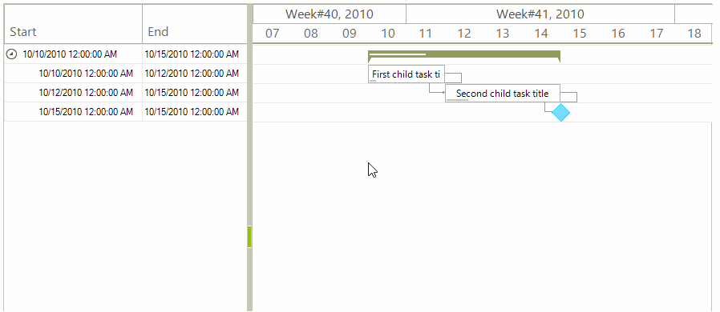

## Environment
<table>
	<tr>
		<td>Product Version</td>
		<td>2018.1 220</td>
	</tr>
	<tr>
		<td>Product</td>
		<td>RadGanttView for WinForms</td>
	</tr>
</table>


## Description

**RadGanttView** paints the task elements according the exact mouse location during a drag-and-drop or a resize operation. This way a task`s **Start** and **End** properties are updated gradually and the step can be even less than a second. The solution in this KB article will suggest a custom implementation showing how the tasks can snap to a full day and update with a single day at a time.

## Solution

The animation below demonstrates the end result with the snapping tasks.

>caption Figure 1: Snapping Task Element


The custom functionality will be achieved with the help of special drag-and-drop and mouse behavior classes.

1\. Inherit the **GanttViewDragDropService** class.
* Add two fields which will be used to save the drag start point and the currently snapped date.
* Override the **OnPreviewDragStart** and **OnStopped** methods. These methods will be used to set and reset the initial drag start point.
* Override the **SetHintWindowPosition** method. Here we need to implement our custom logic for calculating the snapped date and the bounds for the hint window. This window is painted under the mouse while dragging the task.
* Override the **OnPreviewDragDrop** method. The **Start** and **End** properties of the task will be updated here.

#### Custom Drag-and-Drop Implementation

{{source=..\SamplesCS\KnowledgeBase\RadGanttViewTimelineSnapping.cs region=DragAndDrop}} 
{{source=..\SamplesVB\KnowledgeBase\RadGanttViewTimelineSnapping.vb region=DragAndDrop}}
````C#
public class MyGanttViewDragDropService : GanttViewDragDropService
{
    private Point dragStartPoint;
    private DateTime snappedDate;
    public MyGanttViewDragDropService(RadGanttViewElement owner)
        : base(owner)
    { }
    protected override void SetHintWindowPosition(Point mousePt)
    {
        int dragDistance = mousePt.X - this.dragStartPoint.X;
        GanttViewDataItem dataItem = (((GanttGraphicalViewBaseTaskElement)this.Context).Parent as GanttGraphicalViewBaseItemElement).Data;
        DateTime startDate = dataItem.Start;
        DateTime newDate = startDate.AddTicks(this.Owner.GraphicalViewElement.OnePixelTime.Ticks * dragDistance);
        this.snappedDate = new DateTime((long)Math.Floor((decimal)(newDate.Ticks / TimeSpan.TicksPerDay)) * TimeSpan.TicksPerDay);
        RectangleF rectF = this.Owner.GraphicalViewElement.GetDrawRectangle(dataItem, snappedDate);
        Point rectLocation = Point.Round(rectF.Location);
        Point snapToDatePoint = this.Owner.GraphicalViewElement.PointToScreen(rectLocation);
        int mouseOffset = this.dragStartPoint.X - ((GanttGraphicalViewBaseTaskElement)this.Context).PointToScreen(new Point(0, 0)).X;
        Point newMousePt = new Point(snapToDatePoint.X + mouseOffset, mousePt.Y);
        base.SetHintWindowPosition(newMousePt);
    }
    protected override void OnPreviewDragDrop(RadDropEventArgs e)
    {
        GanttViewTaskElement taskElement = e.DragInstance as GanttViewTaskElement;
        if (taskElement != null)
        {
            GanttViewTaskItemElement taskItemElement = taskElement.Parent as GanttViewTaskItemElement;
            if (taskItemElement.Data.Start == this.snappedDate)
            {
                return;
            }
            TimeSpan duration = taskItemElement.Data.End - taskItemElement.Data.Start;
            taskItemElement.Data.Start = snappedDate;
            taskItemElement.Data.End = snappedDate + duration;
            this.CalculateLinkLines(taskItemElement.GraphicalViewElement, taskItemElement.Data);
            e.Handled = true;
        }
        base.OnPreviewDragDrop(e);
    }
    protected override void OnPreviewDragStart(PreviewDragStartEventArgs e)
    {
        this.dragStartPoint = Cursor.Position;
        base.OnPreviewDragStart(e);
    }
    protected override void OnStopped()
    {
        this.dragStartPoint = Point.Empty;
        base.OnStopped();
    }
    protected internal virtual void CalculateLinkLines(GanttViewGraphicalViewElement viewElement, GanttViewDataItem item)
    {
        foreach (GanttViewLinkDataItem link in viewElement.GanttViewElement.Links)
        {
            if (link.StartItem == item || link.EndItem == item)
            {
                viewElement.CalculateLinkLines(link, null);
            }
        }
    }
}

````
````VB.NET
Public Class MyGanttViewDragDropService
    Inherits GanttViewDragDropService
    Private dragStartPoint As Point
    Private snappedDate As DateTime
    Public Sub New(ByVal owner As RadGanttViewElement)
        MyBase.New(owner)
    End Sub
    Protected Overrides Sub SetHintWindowPosition(ByVal mousePt As Point)
        Dim dragDistance As Integer = mousePt.X - Me.dragStartPoint.X
        Dim dataItem As GanttViewDataItem = (TryCast((CType(Me.Context, GanttGraphicalViewBaseTaskElement)).Parent, GanttGraphicalViewBaseItemElement)).Data
        Dim startDate As DateTime = dataItem.Start
        Dim newDate As DateTime = startDate.AddTicks(Me.Owner.GraphicalViewElement.OnePixelTime.Ticks * dragDistance)
        Me.snappedDate = New DateTime(CLng(Math.Floor(CDec((newDate.Ticks / TimeSpan.TicksPerDay)))) * TimeSpan.TicksPerDay)
        Dim rectF As RectangleF = Me.Owner.GraphicalViewElement.GetDrawRectangle(dataItem, snappedDate)
        Dim rectLocation As Point = Point.Round(rectF.Location)
        Dim snapToDatePoint As Point = Me.Owner.GraphicalViewElement.PointToScreen(rectLocation)
        Dim mouseOffset As Integer = Me.dragStartPoint.X - (CType(Me.Context, GanttGraphicalViewBaseTaskElement)).PointToScreen(New Point(0, 0)).X
        Dim newMousePt As Point = New Point(snapToDatePoint.X + mouseOffset, mousePt.Y)
        MyBase.SetHintWindowPosition(newMousePt)
    End Sub
    Protected Overrides Sub OnPreviewDragDrop(ByVal e As RadDropEventArgs)
        Dim taskElement As GanttViewTaskElement = TryCast(e.DragInstance, GanttViewTaskElement)
        If taskElement IsNot Nothing Then
            Dim taskItemElement As GanttViewTaskItemElement = TryCast(taskElement.Parent, GanttViewTaskItemElement)
            If taskItemElement.Data.Start = Me.snappedDate Then
                Return
            End If
            Dim duration As TimeSpan = taskItemElement.Data.[End] - taskItemElement.Data.Start
            taskItemElement.Data.Start = snappedDate
            taskItemElement.Data.[End] = snappedDate + duration
            Me.CalculateLinkLines(taskItemElement.GraphicalViewElement, taskItemElement.Data)
            e.Handled = True
        End If
        MyBase.OnPreviewDragDrop(e)
    End Sub
    Protected Overrides Sub OnPreviewDragStart(ByVal e As PreviewDragStartEventArgs)
        Me.dragStartPoint = Cursor.Position
        MyBase.OnPreviewDragStart(e)
    End Sub
    Protected Overrides Sub OnStopped()
        Me.dragStartPoint = Point.Empty
        MyBase.OnStopped()
    End Sub
    Protected Friend Overridable Sub CalculateLinkLines(ByVal viewElement As GanttViewGraphicalViewElement, ByVal item As GanttViewDataItem)
        For Each link As GanttViewLinkDataItem In viewElement.GanttViewElement.Links
            If link.StartItem Is item OrElse link.EndItem Is item Then
                viewElement.CalculateLinkLines(link, Nothing)
            End If
        Next
    End Sub
End Class

````


{{endregion}} 

2\. Inherit the **BaseGanttViewBehavior** class.
* Override its **ProcessMouseMoveWhenResizingTask** method. Our custom logic responsible for calculating the tasks` new **Start** and **End** values will be executed in this method.

#### Custom Mouse Behavior Implementation

{{source=..\SamplesCS\KnowledgeBase\RadGanttViewTimelineSnapping.cs region=MouseBehavior}} 
{{source=..\SamplesVB\KnowledgeBase\RadGanttViewTimelineSnapping.vb region=MouseBehavior}}
````C#
public class CustomGanttViewBehavior : BaseGanttViewBehavior
{
    protected override void ProcessMouseMoveWhenResizingTask(GanttGraphicalViewBaseTaskElement element, MouseEventArgs e)
    {
        GanttViewDataItem data = ((GanttGraphicalViewBaseItemElement)element.Parent).Data;
        DateTime baseDate = this.IsResizingStart ? data.Start : data.End;
        Point mousePosition = this.GanttViewElement.GraphicalViewElement.PointFromControl(e.Location);
        int distanceFromLeftBorder = this.GanttViewElement.GraphicalViewElement.HorizontalScrollBarElement.Value + mousePosition.X;
        DateTime newDate = this.GanttViewElement.GraphicalViewElement.TimelineBehavior.AdjustedTimelineStart.AddSeconds(distanceFromLeftBorder * this.GanttViewElement.GraphicalViewElement.OnePixelTime.TotalSeconds).AddSeconds(1);
        if (newDate.Hour == 0 && newDate.Minute == 0 && newDate.Second == 0)
        {
            if (this.IsResizingStart)
            {
                DateTime maxStart = data.End.Subtract(new TimeSpan(this.GanttViewElement.GraphicalViewElement.OnePixelTime.Ticks * this.GanttViewElement.MinimumTaskWidth));
                if (newDate > maxStart)
                {
                    newDate = maxStart;
                }
                data.Start = newDate;
            }
            else if (this.IsResizingEnd)
            {
                DateTime minEnd = data.Start.Add(new TimeSpan(this.GanttViewElement.GraphicalViewElement.OnePixelTime.Ticks * this.GanttViewElement.MinimumTaskWidth));
                if (newDate < minEnd)
                {
                    newDate = minEnd;
                }
                data.End = newDate;
            }
        }
        this.ProcessScrolling(this.GanttViewElement.ElementTree.Control.PointToScreen(e.Location), false);
        foreach (GanttViewLinkDataItem link in this.GanttViewElement.Links)
        {
            if (link.StartItem == data || link.EndItem == data)
            {
                this.GanttViewElement.GraphicalViewElement.CalculateLinkLines(link, null);
            }
        }
        element.Parent.InvalidateMeasure(true);
        this.GanttViewElement.GraphicalViewElement.Invalidate();
    }
}

````
````VB.NET
Public Class CustomGanttViewBehavior
    Inherits BaseGanttViewBehavior
    Protected Overrides Sub ProcessMouseMoveWhenResizingTask(ByVal element As GanttGraphicalViewBaseTaskElement, ByVal e As MouseEventArgs)
        Dim data As GanttViewDataItem = (CType(element.Parent, GanttGraphicalViewBaseItemElement)).Data
        Dim baseDate As DateTime = If(Me.IsResizingStart, data.Start, data.[End])
        Dim mousePosition As Point = Me.GanttViewElement.GraphicalViewElement.PointFromControl(e.Location)
        Dim distanceFromLeftBorder As Integer = Me.GanttViewElement.GraphicalViewElement.HorizontalScrollBarElement.Value + mousePosition.X
        Dim newDate As DateTime = Me.GanttViewElement.GraphicalViewElement.TimelineBehavior.AdjustedTimelineStart.AddSeconds(distanceFromLeftBorder * Me.GanttViewElement.GraphicalViewElement.OnePixelTime.TotalSeconds).AddSeconds(1)
        If newDate.Hour = 0 AndAlso newDate.Minute = 0 AndAlso newDate.Second = 0 Then
            If Me.IsResizingStart Then
                Dim maxStart As DateTime = data.[End].Subtract(New TimeSpan(Me.GanttViewElement.GraphicalViewElement.OnePixelTime.Ticks * Me.GanttViewElement.MinimumTaskWidth))
                If newDate > maxStart Then
                    newDate = maxStart
                End If
                data.Start = newDate
            ElseIf Me.IsResizingEnd Then
                Dim minEnd As DateTime = data.Start.Add(New TimeSpan(Me.GanttViewElement.GraphicalViewElement.OnePixelTime.Ticks * Me.GanttViewElement.MinimumTaskWidth))
                If newDate < minEnd Then
                    newDate = minEnd
                End If
                data.[End] = newDate
            End If
        End If
        Me.ProcessScrolling(Me.GanttViewElement.ElementTree.Control.PointToScreen(e.Location), False)
        For Each link As GanttViewLinkDataItem In Me.GanttViewElement.Links
            If link.StartItem Is data OrElse link.EndItem Is data Then
                Me.GanttViewElement.GraphicalViewElement.CalculateLinkLines(link, Nothing)
            End If
        Next
        element.Parent.InvalidateMeasure(True)
        Me.GanttViewElement.GraphicalViewElement.Invalidate()
    End Sub
End Class

````


{{endregion}} 

3\. Instantiate the custom drag-drop service and mouse behavior classes and use them with your **RadGanttView** control.

#### Use the Custom Solution

{{source=..\SamplesCS\KnowledgeBase\RadGanttViewTimelineSnapping.cs region=InitialSetup}}
{{source=..\SamplesVB\KnowledgeBase\RadGanttViewTimelineSnapping.vb region=InitialSetup}}
````C#
public partial class RadGanttViewTimelineSnapping : Telerik.WinControls.UI.RadForm
{
    public RadGanttViewTimelineSnapping()
    {
        InitializeComponent();
        this.radGanttView1.GanttViewElement.GraphicalViewElement.TimelineStart = new DateTime(2010, 10, 7);
        this.radGanttView1.GanttViewElement.GraphicalViewElement.TimelineEnd = new DateTime(2010, 12, 10);
        DataTable tasks = new DataTable("Tasks");
        tasks.Columns.Add("Id", typeof(int));
        tasks.Columns.Add("ParentId", typeof(int));
        tasks.Columns.Add("Title", typeof(string));
        tasks.Columns.Add("Start", typeof(DateTime));
        tasks.Columns.Add("End", typeof(DateTime));
        tasks.Columns.Add("Progress", typeof(decimal));
        DataTable links = new DataTable("Links");
        links.Columns.Add("StartId", typeof(int));
        links.Columns.Add("EndId", typeof(int));
        links.Columns.Add("LinkType", typeof(int));
        DataSet data = new DataSet();
        data.Tables.Add(tasks);
        data.Tables.Add(links);
        tasks.Rows.Add(1, 0, "Summary task title", new DateTime(2010, 10, 10), new DateTime(2010, 10, 15), 30m);
        tasks.Rows.Add(2, 1, "First child task title", new DateTime(2010, 10, 10), new DateTime(2010, 10, 12), 10);
        tasks.Rows.Add(3, 1, "Second child task title", new DateTime(2010, 10, 12), new DateTime(2010, 10, 15), 20m);
        tasks.Rows.Add(4, 1, "Milestone", new DateTime(2010, 10, 15), new DateTime(2010, 10, 15), 0m);
        links.Rows.Add(2, 3, 1);
        links.Rows.Add(3, 4, 1);
        this.radGanttView1.GanttViewElement.TaskDataMember = "Tasks";
        this.radGanttView1.GanttViewElement.ChildMember = "Id";
        this.radGanttView1.GanttViewElement.ParentMember = "ParentId";
        this.radGanttView1.GanttViewElement.TitleMember = "Title";
        this.radGanttView1.GanttViewElement.StartMember = "Start";
        this.radGanttView1.GanttViewElement.EndMember = "End";
        this.radGanttView1.GanttViewElement.ProgressMember = "Progress";
        this.radGanttView1.GanttViewElement.LinkDataMember = "Links";
        this.radGanttView1.GanttViewElement.LinkStartMember = "StartId";
        this.radGanttView1.GanttViewElement.LinkEndMember = "EndId";
        this.radGanttView1.GanttViewElement.LinkTypeMember = "LinkType";
        this.radGanttView1.GanttViewElement.DataSource = data;
        this.radGanttView1.Columns.Add("Start");
        this.radGanttView1.Columns.Add("End");
        this.radGanttView1.GanttViewBehavior = new CustomGanttViewBehavior();
        this.radGanttView1.GanttViewElement.DragDropService = new MyGanttViewDragDropService(this.radGanttView1.GanttViewElement);
    }
}

````
````VB.NET
Public Sub New()
    InitializeComponent()
    Me.radGanttView1.GanttViewElement.GraphicalViewElement.TimelineStart = New DateTime(2010, 10, 7)
    Me.radGanttView1.GanttViewElement.GraphicalViewElement.TimelineEnd = New DateTime(2010, 12, 10)
    Dim tasks As DataTable = New DataTable("Tasks")
    tasks.Columns.Add("Id", GetType(Integer))
    tasks.Columns.Add("ParentId", GetType(Integer))
    tasks.Columns.Add("Title", GetType(String))
    tasks.Columns.Add("Start", GetType(DateTime))
    tasks.Columns.Add("End", GetType(DateTime))
    tasks.Columns.Add("Progress", GetType(Decimal))
    Dim links As DataTable = New DataTable("Links")
    links.Columns.Add("StartId", GetType(Integer))
    links.Columns.Add("EndId", GetType(Integer))
    links.Columns.Add("LinkType", GetType(Integer))
    Dim data As DataSet = New DataSet()
    data.Tables.Add(tasks)
    data.Tables.Add(links)
    tasks.Rows.Add(1, 0, "Summary task title", New DateTime(2010, 10, 10), New DateTime(2010, 10, 15), 30D)
    tasks.Rows.Add(2, 1, "First child task title", New DateTime(2010, 10, 10), New DateTime(2010, 10, 12), 10)
    tasks.Rows.Add(3, 1, "Second child task title", New DateTime(2010, 10, 12), New DateTime(2010, 10, 15), 20D)
    tasks.Rows.Add(4, 1, "Milestone", New DateTime(2010, 10, 15), New DateTime(2010, 10, 15), 0D)
    links.Rows.Add(2, 3, 1)
    links.Rows.Add(3, 4, 1)
    Me.radGanttView1.GanttViewElement.TaskDataMember = "Tasks"
    Me.radGanttView1.GanttViewElement.ChildMember = "Id"
    Me.radGanttView1.GanttViewElement.ParentMember = "ParentId"
    Me.radGanttView1.GanttViewElement.TitleMember = "Title"
    Me.radGanttView1.GanttViewElement.StartMember = "Start"
    Me.radGanttView1.GanttViewElement.EndMember = "End"
    Me.radGanttView1.GanttViewElement.ProgressMember = "Progress"
    Me.radGanttView1.GanttViewElement.LinkDataMember = "Links"
    Me.radGanttView1.GanttViewElement.LinkStartMember = "StartId"
    Me.radGanttView1.GanttViewElement.LinkEndMember = "EndId"
    Me.radGanttView1.GanttViewElement.LinkTypeMember = "LinkType"
    Me.radGanttView1.GanttViewElement.DataSource = data
    Me.radGanttView1.Columns.Add("Start")
    Me.radGanttView1.Columns.Add("End")
    Me.radGanttView1.GanttViewBehavior = New CustomGanttViewBehavior()
    Me.radGanttView1.GanttViewElement.DragDropService = New MyGanttViewDragDropService(Me.radGanttView1.GanttViewElement)
End Sub
Class

````


{{endregion}} 

# See Also
* [Indicate Special Days in RadGanttView](https://www.telerik.com/support/kb/winforms/ganttview-/details/indicate-special-days-in-radganttview)
* [Custom Data Cells]()
* [Custom Data Items]()
* [Custom Task Element]()