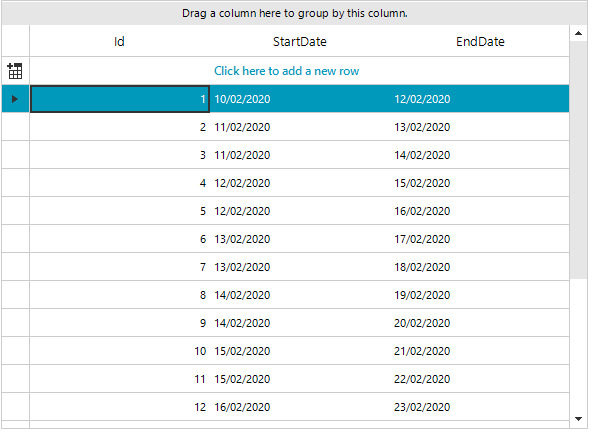

## Environment
 
|Product Version|Product|Author|
|----|----|----|
|2020.1.113|RadGridView for WinForms|[Nadya Karaivanova](https://www.telerik.com/blogs/author/nadya-karaivanova)|
 
## Description

This tutorial demonstrates how to sort rows in **RadGridView** when it is grouped by date.
 


## Solution 

By default, when you perform grouping, **RadGridView** sorts the created group rows alphabetically (see [Sorting Group Rows]() article). If you want to sort groups by another criteria it is suitable to use a **GroupComparer** class. Thus, you can parse each group key to DateTime format and compare the date instead of the string.

A full code snippet is illustrated below:
 

````C#
 public Form1()
        {
            InitializeComponent();

            DataTable dt = new DataTable();
            dt.Columns.Add("Id", typeof(int));
            dt.Columns.Add("StartDate", typeof(DateTime));
            dt.Columns.Add("EndDate", typeof(DateTime));
            DateTime date = new DateTime(2020, 2, 10);
            for (int i = 1; i < 20; i++)
            {
                dt.Rows.Add(i, date.AddHours(i * 12), date.AddDays(i + 1));
            }
            radGridView1.DataSource = dt;
            
            radGridView1.AutoSizeColumnsMode = GridViewAutoSizeColumnsMode.Fill;
            radGridView1.Columns[1].FormatString = "{0:dd/MM/yyyy}";
            radGridView1.Columns[2].FormatString = "{0:dd/MM/yyyy}";
            
            radGridView1.MasterTemplate.GroupPredicate = PerformGrouping;
            radGridView1.MasterTemplate.GroupComparer = new GroupComparer();
            
        }
        
        public class GroupComparer : IComparer<Group<GridViewRowInfo>>
        {
            public int Compare(Group<GridViewRowInfo> x, Group<GridViewRowInfo> y)
            {
                if (x.GetType().Name != y.GetType().Name)
                {
                    return x is DataItemGroup<GridViewRowInfo> ? 1 : -1;
                }
                
                DateTime parsedX;
                DateTime parsedY;
                int result;

                if (DateTime.TryParse(((object[])x.Key).First().ToString(), out parsedX) &&
                    DateTime.TryParse(((object[])y.Key).First().ToString(), out parsedY))
                {
                    result = parsedX.CompareTo(parsedY);
                    DataGroup xGroup = x as DataGroup;
                    if (xGroup != null && xGroup.GroupDescriptor.GroupNames.Count > 0)
                    {
                        if (xGroup.GroupDescriptor.GroupNames.First().Direction == ListSortDirection.Ascending)
                        {
                            return result;
                        }
                    }

                    result = -1 * result;
                    return result;
                }

                return x.Key.ToString().CompareTo(y.Key.ToString());
            }
        }

        private object PerformGrouping(GridViewRowInfo row, int level)
        {
            GroupDescriptor groupDescriptors = this.radGridView1.GroupDescriptors[level];
            object[] key = new object[groupDescriptors.GroupNames.Count];

            for (int k = 0; k < groupDescriptors.GroupNames.Count; k++)
            {
                SortDescriptor descriptor = groupDescriptors.GroupNames[k];
                int index = descriptor.PropertyIndex;

                if (index < 0)
                {
                    continue;
                }

                key[k] = this.GetItemKey(row, descriptor);
            }

            return key;
        }
        private object GetItemKey(GridViewRowInfo item, SortDescriptor descriptor)
        {
            int index = descriptor.PropertyIndex;
            object keyValue = item.Cells[index].Value;

            if (descriptor.PropertyName == "StartDate" || descriptor.PropertyName == "EndDate")
            {
                keyValue = ((DateTime)keyValue).ToShortDateString();
            }

            return keyValue;
        }
   
````
````VB.NET
Public Class RadForm1
    Public Sub New()
        InitializeComponent()
        Dim dt As DataTable = New DataTable()
        dt.Columns.Add("Id", GetType(Integer))
        dt.Columns.Add("StartDate", GetType(DateTime))
        dt.Columns.Add("EndDate", GetType(DateTime))
        Dim _date As DateTime = New DateTime(2020, 2, 10)

        For i As Integer = 1 To 20 - 1
            dt.Rows.Add(i, _date.AddHours(i * 12), _date.AddDays(i + 1))
        Next

        RadGridView1.DataSource = dt
        RadGridView1.AutoSizeColumnsMode = GridViewAutoSizeColumnsMode.Fill
        RadGridView1.Columns(1).FormatString = "{0:dd/MM/yyyy}"
        RadGridView1.Columns(2).FormatString = "{0:dd/MM/yyyy}"
        RadGridView1.MasterTemplate.GroupPredicate = AddressOf PerformGrouping
        RadGridView1.MasterTemplate.GroupComparer = New GroupComparer()
    End Sub

    Public Class GroupComparer
        Implements IComparer(Of Group(Of GridViewRowInfo))

        Public Function Compare(x As Group(Of GridViewRowInfo), y As Group(Of GridViewRowInfo)) As Integer Implements IComparer(Of Group(Of GridViewRowInfo)).Compare
            If x.[GetType]().Name <> y.[GetType]().Name Then
                Return If(TypeOf x Is DataItemGroup(Of GridViewRowInfo), 1, -1)
            End If

            Dim parsedX As DateTime
            Dim parsedY As DateTime
            Dim result As Integer

            If DateTime.TryParse((CType(x.Key, Object())).First().ToString(), parsedX) AndAlso DateTime.TryParse((CType(y.Key, Object())).First().ToString(), parsedY) Then
                result = parsedX.CompareTo(parsedY)
                Dim xGroup As DataGroup = TryCast(x, DataGroup)

                If xGroup IsNot Nothing AndAlso xGroup.GroupDescriptor.GroupNames.Count > 0 Then

                    If xGroup.GroupDescriptor.GroupNames.First().Direction = ListSortDirection.Ascending Then
                        Return result
                    End If
                End If

                result = -1 * result
                Return result
            End If

            Return x.Key.ToString().CompareTo(y.Key.ToString())
        End Function
    End Class

    Private Function PerformGrouping(ByVal row As GridViewRowInfo, ByVal level As Integer) As Object
        Dim groupDescriptors As GroupDescriptor = Me.RadGridView1.GroupDescriptors(level)
        Dim key As Object() = New Object(groupDescriptors.GroupNames.Count - 1) {}

        For k As Integer = 0 To groupDescriptors.GroupNames.Count - 1
            Dim descriptor As SortDescriptor = groupDescriptors.GroupNames(k)
            Dim index As Integer = descriptor.PropertyIndex

            If index < 0 Then
                Continue For
            End If

            key(k) = Me.GetItemKey(row, descriptor)
        Next

        Return key
    End Function

    Private Function GetItemKey(ByVal item As GridViewRowInfo, ByVal descriptor As SortDescriptor) As Object
        Dim index As Integer = descriptor.PropertyIndex
        Dim keyValue As Object = item.Cells(index).Value

        If descriptor.PropertyName = "StartDate" OrElse descriptor.PropertyName = "EndDate" Then
            keyValue = (CType(keyValue, DateTime)).ToShortDateString()
        End If

        Return keyValue
    End Function
End Class


````

