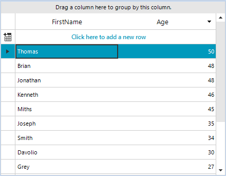
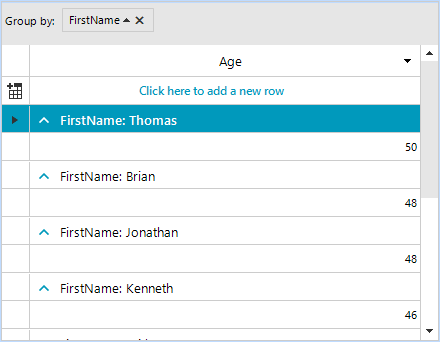

## Environment
 
|Product Version|Product|Author|
|----|----|----|
|2020.3.915|RadGridView for WinForms|[Nadya Karaivanova](https://www.telerik.com/blogs/author/nadya-karaivanova)|
 
## Description

By default, when you perform grouping, **RadGridView** sorts the created group rows alphabetically. A common requirement is to sort the groups by other criteria which is possible by creating a [custom GroupComparer](https://docs.telerik.com/devtools/winforms/controls/gridview/grouping/sorting-group-rows).

Let's say you have a list of emplyees displayed in **RadGridView** and you sort them by age descending in a way that the oldest employee is on top of the grid. 



Then, after grouping you should excpect the group with the oldest employee to be on top again. In this article I will demonstrate how you can sort the groups in a way to keep the group with oldest employee on top. 
 


## Solution 

It is necessary to create a class that implements the **IComparer** interface. In the **Compare** method, you have access to the groups and to the cells that contain the ages in each group. Thus, you can compare the groups by age and order them descending so the oldest emplyoee's group to be on top.

````C#
public partial class RadForm1 : Telerik.WinControls.UI.RadForm
{
    public RadForm1()
    {
        InitializeComponent();

        this.radGridView1.MasterTemplate.GroupComparer = new GroupComparer();

        DataTable dt = new DataTable();
        dt.Columns.Add("FirstName", typeof(string));
        dt.Columns.Add("Age", typeof(int));
        dt.Rows.Add("Davolio", 15);
        dt.Rows.Add("Davolio", 30);
        dt.Rows.Add("Miths", 45);
        dt.Rows.Add("Smith", 34);
        dt.Rows.Add("Adams", 18);
        dt.Rows.Add("Joseph", 35);
        dt.Rows.Add("Thomas", 50);
        dt.Rows.Add("Ashley", 25);
        dt.Rows.Add("Mark", 26);
        dt.Rows.Add("Kenneth", 46);
        dt.Rows.Add("Brian", 48);
        dt.Rows.Add("Jonathan", 48);
        dt.Rows.Add("Grey", 27);
        this.radGridView1.DataSource = dt;
        this.radGridView1.AutoSizeColumnsMode = GridViewAutoSizeColumnsMode.Fill;

        SortDescriptor sortDescriptor = new SortDescriptor();
        sortDescriptor.PropertyName = "Age";
        sortDescriptor.Direction = ListSortDirection.Descending;
        this.radGridView1.MasterTemplate.SortDescriptors.Add(sortDescriptor);

    }
}

public class GroupComparer : IComparer<Group<GridViewRowInfo>>
{
    public int Compare(Group<GridViewRowInfo> x, Group<GridViewRowInfo> y)
    {
        if (x.ItemCount == 0)
        {
            return -1;
        }

        if (y.ItemCount == 0)
        {
            return 1;
        }

        var row = x[0] as GridViewDataRowInfo;
        int xAge = (int)row.Cells["Age"].Value;

        row = y[0] as GridViewDataRowInfo;
        int yAge = (int)row.Cells["Age"].Value;

        return yAge.CompareTo(xAge);
    }
}


````
````VB.NET
Public Class RadForm1
    Public Sub New()
        InitializeComponent()
        Me.RadGridView1.MasterTemplate.GroupComparer = New GroupComparer()
        Dim dt As DataTable = New DataTable()
        dt.Columns.Add("FirstName", GetType(String))
        dt.Columns.Add("Age", GetType(Integer))
        dt.Rows.Add("Davolio", 15)
        dt.Rows.Add("Davolio", 30)
        dt.Rows.Add("Miths", 45)
        dt.Rows.Add("Smith", 34)
        dt.Rows.Add("Adams", 18)
        dt.Rows.Add("Joseph", 35)
        dt.Rows.Add("Thomas", 50)
        dt.Rows.Add("Ashley", 25)
        dt.Rows.Add("Mark", 26)
        dt.Rows.Add("Kenneth", 46)
        dt.Rows.Add("Brian", 48)
        dt.Rows.Add("Jonathan", 48)
        dt.Rows.Add("Grey", 27)
        Me.RadGridView1.DataSource = dt
        Me.RadGridView1.AutoSizeColumnsMode = GridViewAutoSizeColumnsMode.Fill
        Dim sortDescriptor As SortDescriptor = New SortDescriptor()
        sortDescriptor.PropertyName = "Age"
        sortDescriptor.Direction = ListSortDirection.Descending
        Me.RadGridView1.MasterTemplate.SortDescriptors.Add(sortDescriptor)
    End Sub
End Class
Public Class GroupComparer
    Implements IComparer(Of Group(Of GridViewRowInfo))

    Private Function IComparer_Compare(x As Group(Of GridViewRowInfo), y As Group(Of GridViewRowInfo)) As Integer Implements IComparer(Of Group(Of GridViewRowInfo)).Compare
        If x.ItemCount = 0 Then
            Return -1
        End If

        If y.ItemCount = 0 Then
            Return 1
        End If

        Dim row = TryCast(x(0), GridViewDataRowInfo)
        Dim xAge As Integer = CInt(row.Cells("Age").Value)
        row = TryCast(y(0), GridViewDataRowInfo)
        Dim yAge As Integer = CInt(row.Cells("Age").Value)
        Return yAge.CompareTo(xAge)
    End Function
End Class

````

