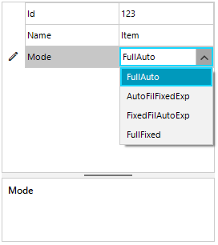
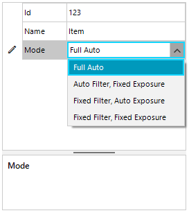

## Environment
 
|Product Version|Product|Author|
|----|----|----|
|2022.1.222|RadPropertyGrid for WinForms|[Desislava Yordanova](https://www.telerik.com/blogs/author/desislava-yordanova)|


## Description

RadPropertyGrid activates a **PropertyGridDropDownListEditor** for enum properties. The drop down items correspond to the actual names of the enum values. Let's consider the following setup:

````C# 

public RadForm1()
{
    InitializeComponent();

    this.radPropertyGrid1.SelectedObject = new Item(123,"Item", ExposureMode.FullAuto);
}

public class Item
{
    public int Id { get; set; }

    public string Name { get; set; }

    public ExposureMode Mode { get; set; }

    public Item(int id, string name, ExposureMode mode)
    {
        this.Id = id;
        this.Name = name;
        this.Mode = mode;
    }
}
 
public enum ExposureMode
{
    [Description("Full Auto")]
    FullAuto,
    [Description("Auto Filter, Fixed Exposure")]
    AutoFilFixedExp,
    [Description("Fixed Filter, Auto Exposure")]
    FixedFilAutoExp,
    [Description("Fixed Filter, Fixed Exposure")]
    FullFixed
} 
    
````
````VB.NET

Public Sub New()
    InitializeComponent()
    Me.RadPropertyGrid1.SelectedObject = New Item(123, "Item", ExposureMode.FullAuto)
End Sub

Public Class Item
    Public Property Id As Integer
    Public Property Name As String
    Public Property Mode As ExposureMode

    Public Sub New(ByVal id As Integer, ByVal name As String, ByVal mode As ExposureMode)
        Me.Id = id
        Me.Name = name
        Me.Mode = mode
    End Sub
End Class

Public Enum ExposureMode
    <Description("Full Auto")>
    FullAuto
    <Description("Auto Filter, Fixed Exposure")>
    AutoFilFixedExp
    <Description("Fixed Filter, Auto Exposure")>
    FixedFilAutoExp
    <Description("Fixed Filter, Fixed Exposure")>
    FullFixed
End Enum

````

The below screenshot illustrates how the items are presented when the editor is activated:
 


This article demonstrates a sample approach how to modify the displayed items in the drop down editor.

## Solution

To change the string representation of a value inside **RadPropertyGrid** one should use a [Type Converter](). This converter provides a way for a value of a property to be represented as a string and a string value (user input) to be converted to a property value of the desired type. Here is a generic EnumTypeConverter that will work with any Enum that has its values decorated with a Description attribute:

The achieved result is illustrated below:
 



````C# 

public RadForm1()
{
    InitializeComponent();

    this.radPropertyGrid1.SelectedObject = new Item(123,"Item", ExposureMode.FullAuto);
}

public class Item
{
    public int Id { get; set; }

    public string Name { get; set; }

    public ExposureMode Mode { get; set; }

    public Item(int id, string name, ExposureMode mode)
    {
        this.Id = id;
        this.Name = name;
        this.Mode = mode;
    }
}

[TypeConverter(typeof(EnumDescriptionTypeConverter<ExposureMode>))]
public enum ExposureMode
{
    [Description("Full Auto")]
    FullAuto,
    [Description("Auto Filter, Fixed Exposure")]
    AutoFilFixedExp,
    [Description("Fixed Filter, Auto Exposure")]
    FixedFilAutoExp,
    [Description("Fixed Filter, Fixed Exposure")]
    FullFixed
}

public class EnumDescriptionTypeConverter<T> : EnumConverter
{
    private Dictionary<string, T> lookupDescription;
    private Dictionary<T, string> lookupValue;

    public EnumDescriptionTypeConverter(Type type) : base(type)
    {
        this.lookupDescription = new Dictionary<string, T>();
        this.lookupValue = new Dictionary<T, string>();

        string[] names = Enum.GetNames(type);

        foreach (string name in names)
        {
            if (!string.IsNullOrEmpty(name))
            {
                FieldInfo field = type.GetField(name);

                if (field != null)
                {
                    DescriptionAttribute attr = Attribute.GetCustomAttribute(field, typeof(DescriptionAttribute)) as DescriptionAttribute;

                    if (attr != null)
                    {
                        T value = (T)Enum.Parse(type, name);
                        this.lookupDescription[attr.Description] = value;
                        this.lookupValue[value] = attr.Description;
                    }
                }
            }
        }
    }

    public override object ConvertTo(ITypeDescriptorContext context, CultureInfo culture, object value, Type destinationType)
    {
        if (destinationType == typeof(string))
        {
            T mode = (T)value;

            if (this.lookupValue.ContainsKey(mode))
            {
                return this.lookupValue[mode];
            }
        }

        return base.ConvertTo(context, culture, value, destinationType);
    }

    public override object ConvertFrom(ITypeDescriptorContext context, CultureInfo culture, object value)
    {
        string description = value as string;

        if (description != null)
        {
            return this.lookupDescription[description];
        }

        return base.ConvertFrom(context, culture, value);
    }
}      
    
````
````VB.NET

Public Sub New()
    InitializeComponent()
    Me.RadPropertyGrid1.SelectedObject = New Item(123, "Item", ExposureMode.FullAuto)
End Sub

Public Class Item
    Public Property Id As Integer
    Public Property Name As String
    Public Property Mode As ExposureMode

    Public Sub New(ByVal id As Integer, ByVal name As String, ByVal mode As ExposureMode)
        Me.Id = id
        Me.Name = name
        Me.Mode = mode
    End Sub
End Class

<TypeConverter(GetType(EnumDescriptionTypeConverter(Of ExposureMode)))>
Public Enum ExposureMode
    <Description("Full Auto")>
    FullAuto
    <Description("Auto Filter, Fixed Exposure")>
    AutoFilFixedExp
    <Description("Fixed Filter, Auto Exposure")>
    FixedFilAutoExp
    <Description("Fixed Filter, Fixed Exposure")>
    FullFixed
End Enum

Public Class EnumDescriptionTypeConverter(Of T)
    Inherits EnumConverter

    Private lookupDescription As Dictionary(Of String, T)
    Private lookupValue As Dictionary(Of T, String)

    Public Sub New(ByVal type As Type)
        MyBase.New(type)
        Me.lookupDescription = New Dictionary(Of String, T)()
        Me.lookupValue = New Dictionary(Of T, String)()
        Dim names As String() = [Enum].GetNames(type)

        For Each name As String In names

            If Not String.IsNullOrEmpty(name) Then
                Dim field As FieldInfo = type.GetField(name)

                If field IsNot Nothing Then
                    Dim attr As DescriptionAttribute = TryCast(Attribute.GetCustomAttribute(field, GetType(DescriptionAttribute)), DescriptionAttribute)

                    If attr IsNot Nothing Then
                        Dim value As T = CType([Enum].Parse(type, name), T)
                        Me.lookupDescription(attr.Description) = value
                        Me.lookupValue(value) = attr.Description
                    End If
                End If
            End If
        Next
    End Sub

    Public Overrides Function ConvertTo(ByVal context As ITypeDescriptorContext, ByVal culture As CultureInfo, ByVal value As Object, ByVal destinationType As Type) As Object
        If destinationType = GetType(String) Then
            Dim mode As T = CType(value, T)

            If Me.lookupValue.ContainsKey(mode) Then
                Return Me.lookupValue(mode)
            End If
        End If

        Return MyBase.ConvertTo(context, culture, value, destinationType)
    End Function

    Public Overrides Function ConvertFrom(ByVal context As ITypeDescriptorContext, ByVal culture As CultureInfo, ByVal value As Object) As Object
        Dim description As String = TryCast(value, String)

        If description IsNot Nothing Then
            Return Me.lookupDescription(description)
        End If

        Return MyBase.ConvertFrom(context, culture, value)
    End Function
End Class

````


# See Also

* [Type Converters]()