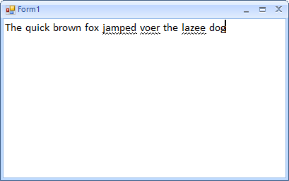

|Date Posted|Product|Author|
|----|----|----|
|April 25, 2014|RadRichTextBox|Georgi Georgiev| 

## How To
 
This article will demonstrate how to implement spellcheck as you type functionality in RadRichTextBox. Here is how our spell chcked RadRichTextBox will look like at the end:  
   
  

## Solution
 
First of all, we will need a derived class from **RadRichTextBox**:  
   
````C#
public class SpellCheckRichTextBox : RadRichTextBox
    { }

````
````VB.NET
Public Class SpellCheckRichTextBox
    Inherits RadRichTextBox
End Class

````  
   
Then we will need an instance of **RadSpellChecker** which will be used to check the words:  
   
````C#
protected override void CreateChildItems(Telerik.WinControls.RadElement parent)
{
    base.CreateChildItems(parent);
 
    this.spellChecker = new RadSpellChecker();
    this.controlSpellChecker = this.spellChecker.GetControlSpellChecker(typeof(RadRichTextBox));
    this.controlSpellChecker.CurrentControl = this;
}

````
````VB.NET
Protected Overrides Sub CreateChildItems(parent As Telerik.WinControls.RadElement)
    MyBase.CreateChildItems(parent)
 
    Me.spellChecker = New RadSpellChecker()
    Me.controlSpellChecker = Me.spellChecker.GetControlSpellChecker(GetType(RadRichTextBox))
    Me.controlSpellChecker.CurrentControl = Me
End Sub

````
    
Spell-checking will be performed when the *Space*key is pressed. We can override the **OnKeyDown** event and execute any spellchecking logic from there:  
   
````C#
protected override void OnKeyDown(KeyEventArgs e)
{
    if (e.KeyCode == Keys.Space)
    {
        this.SpellCheckCore(this.GetCurrentWord());
    }
 
    base.OnKeyDown(e);
}

````
````VB.NET
Protected Overrides Sub OnKeyDown(e As KeyEventArgs)
    If e.KeyCode = Keys.Space Then
        Me.SpellCheckCore(Me.GetCurrentWord())
    End If
 
    MyBase.OnKeyDown(e)
End Sub

````  
 
At this point, you are probably wondering what the **SpellCheckCore** and **GetCurrentWord** methods do. The **GetCurrentWord** method will get the word where the cursor is as a string by using the RadRichTextBox API:  
   
````C#
private string GetCurrentWord()
{
    DocumentPosition endPosition = new DocumentPosition(this.Document.CaretPosition);
    DocumentPosition startPosition = new DocumentPosition(endPosition);
    this.SelectCurrentWord(startPosition);
    string lastWord = this.Document.Selection.GetSelectedText();
    this.Document.Selection.Clear();
 
    return lastWord;
}

````
````VB.NET
Private Function GetCurrentWord() As String
    Dim endPosition As New DocumentPosition(Me.Document.CaretPosition)
    Dim startPosition As New DocumentPosition(endPosition)
    Me.SelectCurrentWord(startPosition)
    Dim lastWord As String = Me.Document.Selection.GetSelectedText()
    Me.Document.Selection.Clear()
 
    Return lastWord
End Function

````
   
On the other hand, the **SpellCheckCore** method will check whether a word is correct, and if it is not, it will be underlined. Also, if the word is a part of the **IgnoredWords** in the **SpellChecker**, it will be skipped:  
   
````C#
protected virtual void SpellCheckCore(string word)
{
    if (string.IsNullOrEmpty(word) || this.controlSpellChecker.IgnoredWords.ContainsWord(word))
    {
        return;
    }
 
    this.SelectCurrentWord(this.Document.CaretPosition);
 
    if (this.AutoReplaceOnSpellCheck)
    {
        string[] suggestions = (string[])this.ControlSpellChecker.SpellChecker.GetSuggestions(this.Document.Selection.GetSelectedText());
        if (suggestions.Length > 0)
        {
            this.Insert(suggestions[0]);
        }
    }
    else
    {
        if (!controlSpellChecker.SpellChecker.CheckWordIsCorrect(word))
        {
            this.ChangeUnderlineDecoration(Telerik.WinControls.RichTextBox.UI.UnderlineType.Wave);
            this.Document.Selection.Clear();
 
            this.ChangeUnderlineDecoration(Telerik.WinControls.RichTextBox.UI.UnderlineType.None);
        }
        else
        {
            this.ChangeUnderlineDecoration(Telerik.WinControls.RichTextBox.UI.UnderlineType.None);
            this.Document.Selection.Clear();
        }
    }
}


````
````VB.NET
Protected Overridable Sub SpellCheckCore(word As String)
    If String.IsNullOrEmpty(word) OrElse Me.controlSpellChecker.IgnoredWords.ContainsWord(word) Then
        Return
    End If
 
    Me.SelectCurrentWord(Me.Document.CaretPosition)
 
    If Me.AutoReplaceOnSpellCheck Then
        Dim suggestions As String() = DirectCast(Me.ControlSpellChecker.SpellChecker.GetSuggestions(Me.Document.Selection.GetSelectedText()), String())
        If suggestions.Length > 0 Then
            Me.Insert(suggestions(0))
        End If
    Else
        If Not controlSpellChecker.SpellChecker.CheckWordIsCorrect(word) Then
            Me.ChangeUnderlineDecoration(Telerik.WinControls.RichTextBox.UI.UnderlineType.Wave)
            Me.Document.Selection.Clear()
 
            Me.ChangeUnderlineDecoration(Telerik.WinControls.RichTextBox.UI.UnderlineType.None)
        Else
            Me.ChangeUnderlineDecoration(Telerik.WinControls.RichTextBox.UI.UnderlineType.None)
            Me.Document.Selection.Clear()
        End If
    End If
End Sub

```` 

The If statement, which checks the AutoReplaceOnSpellCheck property, is used to replace the current word, if it is incorrect with the first suggestion in the dictionary.
After our Control is capable of spellchecking while we are typing, we can implement a context menu to see a list of suggestions and use the Copy/Paste/Undo/Delete/SelectAll actions. Here is how the context menu can be built in a single method:

````C#
private RadDropDownMenu BuildContextMenu(SpanLayoutBox spanBox)
{
    RadDropDownMenu menu = new RadDropDownMenu();
    RadMenuItem menuItem;
 
    if (this.Document.Selection.IsEmpty && this.IsSpellCheckingEnabled && spanBox != null)
    {
        this.Document.CaretPosition.MoveToInline(spanBox, 0);
 
        string spanBoxTextAlphaNumericOnly = String.Concat(spanBox.Text.TakeWhile(c => char.IsLetterOrDigit(c)));
 
        if (spanBoxTextAlphaNumericOnly.Length > 0 && !this.ControlSpellChecker.SpellChecker.CheckWordIsCorrect(spanBoxTextAlphaNumericOnly))
        {
            string[] suggestions = (string[])this.ControlSpellChecker.SpellChecker.GetSuggestions(spanBox.Text);
 
            if (suggestions.Length <= 0)
            {
                menuItem = new RadMenuItem("(No Spelling Suggestions)");
                menuItem.Enabled = false;
                menu.Items.Add(menuItem);
            }
 
            foreach (string suggestion in suggestions)
            {
                menuItem = new RadMenuItem(suggestion);
                menuItem.Click += (object sender, EventArgs e) => { this.ReplaceCurrentWord(spanBox, (sender as RadMenuItem).Text); };
                menu.Items.Add(menuItem);
            }
 
            menu.Items.Add(new SeparatorElement());
 
            menuItem = new RadMenuItem("Add to Dictionary");
            menuItem.Click += (object sender, EventArgs e) => { this.ControlSpellChecker.SpellChecker.AddWord(spanBoxTextAlphaNumericOnly); };
            menu.Items.Add(menuItem);
 
            menu.Items.Add(new SeparatorElement());
        }
    }
 
    menuItem = new RadMenuItem("Undo");
    menuItem.Click += (object sender, EventArgs e) => { this.Undo(); };
    menu.Items.Add(menuItem);
 
    menu.Items.Add(new SeparatorElement());
 
    menuItem = new RadMenuItem("Cut");
    menuItem.Click += (object sender, EventArgs e) => { this.Cut(); };
    menu.Items.Add(menuItem);
 
    menuItem = new RadMenuItem("Copy");
    menuItem.Click += (object sender, EventArgs e) => { this.Copy(); };
    menu.Items.Add(menuItem);
 
    menuItem = new RadMenuItem("Paste");
    menuItem.Click += (object sender, EventArgs e) => { this.Paste(); };
 
    menu.Items.Add(menuItem);
 
    menuItem = new RadMenuItem("Delete");
    menuItem.Click += (object sender, EventArgs e) => { this.Delete(false); };
    menu.Items.Add(menuItem);
 
    menu.Items.Add(new SeparatorElement());
 
    menuItem = new RadMenuItem("Select All");
    menuItem.Click += (object sender, EventArgs e) => { this.Document.Selection.SelectAll(); };
    menu.Items.Add(menuItem);
 
    return menu;
}

````
````VB.NET
Private Function BuildContextMenu(spanBox As SpanLayoutBox) As RadDropDownMenu
        Dim menu As New RadDropDownMenu()
        Dim menuItem As RadMenuItem
 
        If Me.Document.Selection.IsEmpty AndAlso Me.IsSpellCheckingEnabled AndAlso spanBox IsNot Nothing Then
            Me.Document.CaretPosition.MoveToInline(spanBox, 0)
 
            Dim spanBoxTextAlphaNumericOnly As String = [String].Concat(spanBox.Text.TakeWhile(Function(c) Char.IsLetterOrDigit(c)))
 
            If spanBoxTextAlphaNumericOnly.Length > 0 AndAlso Not Me.ControlSpellChecker.SpellChecker.CheckWordIsCorrect(spanBoxTextAlphaNumericOnly) Then
                Dim suggestions As String() = DirectCast(Me.ControlSpellChecker.SpellChecker.GetSuggestions(spanBox.Text), String())
 
                If suggestions.Length <= 0 Then
                    menuItem = New RadMenuItem("(No Spelling Suggestions)")
                    menuItem.Enabled = False
                    menu.Items.Add(menuItem)
                End If
 
                For Each suggestion As String In suggestions
                    menuItem = New RadMenuItem(suggestion)
                    AddHandler menuItem.Click, Sub(sender As Object, e As EventArgs)
                                                   Me.ReplaceCurrentWord(spanBox, TryCast(sender, RadMenuItem).Text)
 
                                               End Sub
                    menu.Items.Add(menuItem)
                Next
 
                menu.Items.Add(New SeparatorElement())
 
                menuItem = New RadMenuItem("Add to Dictionary")
                AddHandler menuItem.Click, Sub(sender As Object, e As EventArgs)
                                               Me.ControlSpellChecker.SpellChecker.AddWord(spanBoxTextAlphaNumericOnly)
 
                                           End Sub
                menu.Items.Add(menuItem)
 
                menu.Items.Add(New SeparatorElement())
 
            End If
        End If
 
 
        menuItem = New RadMenuItem("Undo")
        AddHandler menuItem.Click, Sub(sender As Object, e As EventArgs)
                                       Me.Undo()
 
                                   End Sub
        menu.Items.Add(menuItem)
 
        menu.Items.Add(New SeparatorElement())
 
        menuItem = New RadMenuItem("Cut")
        AddHandler menuItem.Click, Sub(sender As Object, e As EventArgs)
                                       Me.Cut()
 
                                   End Sub
        menu.Items.Add(menuItem)
 
        menuItem = New RadMenuItem("Copy")
        AddHandler menuItem.Click, Sub(sender As Object, e As EventArgs)
                                       Me.Copy()
 
                                   End Sub
        menu.Items.Add(menuItem)
 
        menuItem = New RadMenuItem("Paste")
        AddHandler menuItem.Click, Sub(sender As Object, e As EventArgs)
                                       Me.Paste()
 
                                   End Sub
 
        menu.Items.Add(menuItem)
 
        menuItem = New RadMenuItem("Delete")
        AddHandler menuItem.Click, Sub(sender As Object, e As EventArgs)
                                       Me.Delete(False)
 
                                   End Sub
        menu.Items.Add(menuItem)
 
        menu.Items.Add(New SeparatorElement())
 
        menuItem = New RadMenuItem("Select All")
        AddHandler menuItem.Click, Sub(sender As Object, e As EventArgs)
                                       Me.Document.Selection.SelectAll()
 
                                   End Sub
        menu.Items.Add(menuItem)
 
        Return menu
    End Function

````

We can easily show it on Right Mouse Click:

````C#
protected override void OnMouseDown(System.Windows.Forms.MouseEventArgs e)
{
    if (e.Button == System.Windows.Forms.MouseButtons.Right)
    {
        SpanLayoutBox spanBox = this.Document.GetLayoutBoxByPosition(e.Location) as SpanLayoutBox;
        this.BuildContextMenu(spanBox).Show(this, e.Location);
    }
 
    base.OnMouseDown(e);
}

````
````VB.NET
Protected Overrides Sub OnMouseDown(e As System.Windows.Forms.MouseEventArgs)
    If e.Button = System.Windows.Forms.MouseButtons.Right Then
        Dim spanBox As SpanLayoutBox = TryCast(Me.Document.GetLayoutBoxByPosition(e.Location), SpanLayoutBox)
        Me.BuildContextMenu(spanBox).Show(Me, e.Location)
    End If
 
    MyBase.OnMouseDown(e)
End Sub

````


>note A complete solution in C# and VB.NET can be found [here](https://github.com/telerik/winforms-sdk/tree/master/RichTextBox%20(Deprecated)/RichTextBoxSpellchecking).