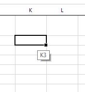

## Environment
 
|Product Version|Product|Author|
|----|----|----|
|2023.2.606|RadSpreadsheet for WinForms|[Dinko Krastev](https://www.telerik.com/blogs/author/dinko-krastev)|
 

## Description

For performance reasons, the cells in RadSpreadsheet are not separate elements and this prevents us from using the __ToolTipTextNeeded__ event like in other controls. 

## Solution 

To add a tooltip to a cell, we will need to subscribe to the __MouseMove__ event of the __ActiveWorksheetEditor__. In the event handler, we can create our own instance of a __RadToolTip__ and call its Show() method. Here is how you can get the cell under the mouse and show the tooltip: 




````C#
private RadWorksheetEditor editor = null;

public Form1()
{
	InitializeComponent();
	this.radSpreadsheet1.SpreadsheetElement.ActiveSheetEditorChanged += SpreadsheetElement_ActiveSheetEditorChanged;
}

private void SpreadsheetElement_ActiveSheetEditorChanged(object sender, EventArgs e)
{
	if (this.editor != null)
		this.editor.MouseMove -= Editor_MouseMove;

	this.editor = this.radSpreadsheet1.ActiveWorksheetEditor;

	if (this.editor != null)
		this.editor.MouseMove += Editor_MouseMove;
}

private RadToolTip toolTip = new RadToolTip();
private string lastCellName = "";

private void Editor_MouseMove(object sender, MouseEventArgs e)
{
	var activePresenter = this.radSpreadsheet1.ActiveWorksheetEditor.ActivePresenter as NormalWorksheetEditorPresenter;

	if (activePresenter != null)
	{
		Point point = activePresenter.PointFromControl(e.Location);
		CellIndex cellIndex = activePresenter.GetCellIndexFromViewPoint(point);
		string cellName = NameConverter.ConvertCellIndexToName(cellIndex);

		if (lastCellName != cellName)
		{
			toolTip.Show(cellName, Cursor.Position);
			lastCellName = cellName;
		}

		if (cellIndex != null && cellIndex.RowIndex == 0)
		{
			toolTip.Hide();
		}			
	}
}
    

````
````VB.NET

Private editor As RadWorksheetEditor = Nothing

Public Sub New()
	InitializeComponent()
  AddHandler  Me.radSpreadsheet1.SpreadsheetElement.ActiveSheetEditorChanged, AddressOf SpreadsheetElement_ActiveSheetEditorChanged
End Sub

Private Sub SpreadsheetElement_ActiveSheetEditorChanged(ByVal sender As Object, ByVal e As EventArgs)
	If Me.editor IsNot Nothing Then
		RemoveHandler Me.editor.MouseMove, AddressOf Editor_MouseMove
	End If

	Me.editor = Me.radSpreadsheet1.ActiveWorksheetEditor

	If Me.editor IsNot Nothing Then
	   AddHandler Me.editor.MouseMove, AddressOf Editor_MouseMove
	End If
End Sub

Private toolTip As RadToolTip = New RadToolTip()
Private lastCellName As String = ""

Private Sub Editor_MouseMove(ByVal sender As Object, ByVal e As MouseEventArgs)
	Dim activePresenter = TryCast(Me.radSpreadsheet1.ActiveWorksheetEditor.ActivePresenter, NormalWorksheetEditorPresenter)

	If activePresenter IsNot Nothing Then
		Dim point As Point = activePresenter.PointFromControl(e.Location)
		Dim cellIndex As CellIndex = activePresenter.GetCellIndexFromViewPoint(point)
		Dim cellName As String = NameConverter.ConvertCellIndexToName(cellIndex)

		If lastCellName <> cellName Then
			toolTip.Show(cellName, Cursor.Position)
			lastCellName = cellName
		End If

		If cellIndex IsNot Nothing AndAlso cellIndex.RowIndex = 0 Then
			toolTip.Hide()
		End If
	End If
End Sub


````


