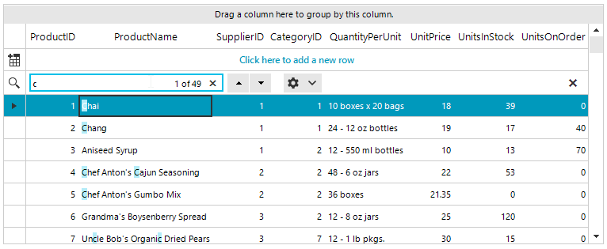
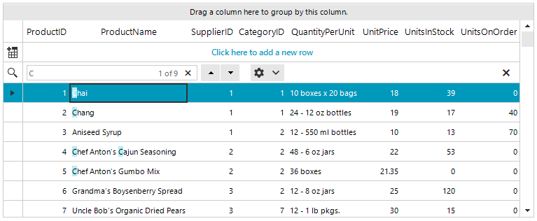

## Environment
 
|Product Version|Product|Author|
|----|----|----|
|2019.2.618|RadGridView for WinForms|[Desislava Yordanova](https://www.telerik.com/blogs/author/desislava-yordanova)|
 

## Description

By default, **RadGridView** searches for cell values that '*Contain*' the search criteria. 



This article demonstrates how to search only for the cells that '*StartsWith*' the search criteria.



## Solution 

All you need to do, is to create a custom **GridViewSearchRowInfo**. Subscribe to the **CreateRowInfo** event **at design** time and use the following code snippet:


````C#
public RadForm1()
{
    InitializeComponent();

    this.radGridView1.AllowSearchRow = true;

    this.radGridView1.CurrentRowChanging += RadGridView1_CurrentRowChanging;
}

private void RadGridView1_CurrentRowChanging(object sender, CurrentRowChangingEventArgs e)
{
    if (e.NewRow is GridViewSearchRowInfo)
    {
        e.Cancel = true;
    }
}


private void radGridView1_CreateRowInfo(object sender, GridViewCreateRowInfoEventArgs e)
{
    if (e.RowInfo is GridViewSearchRowInfo)
    {
         e.RowInfo = new CustomSearchRow(e.ViewInfo);
    }
}

public class CustomSearchRow : GridViewSearchRowInfo
{
    public CustomSearchRow(GridViewInfo viewInfo) : base(viewInfo)
    {
    }

    protected override bool MatchesSearchCriteria(string searchCriteria, GridViewRowInfo row, GridViewColumn col)
    {
        return (row.Cells[col.Name].Value + "").StartsWith(searchCriteria); 
    }
}
        

````
````VB.NET

Sub New()

    InitializeComponent()

    Me.RadGridView1.AllowSearchRow = True

    AddHandler Me.RadGridView1.CurrentRowChanging, AddressOf RadGridView1_CurrentRowChanging
End Sub

Private Sub RadGridView1_CurrentRowChanging(sender As Object, e As CurrentRowChangingEventArgs)
    If TypeOf e.NewRow Is GridViewSearchRowInfo Then
        e.Cancel = True
    End If
End Sub
    

 Private Sub RadGridView1_CreateRowInfo(sender As Object, e As Telerik.WinControls.UI.GridViewCreateRowInfoEventArgs) _
    Handles RadGridView1.CreateRowInfo
    If TypeOf e.RowInfo Is GridViewSearchRowInfo Then
        e.RowInfo = New CustomSearchRow(e.ViewInfo)
    End If
End Sub
Public Class CustomSearchRow
    Inherits GridViewSearchRowInfo

    Public Sub New(ByVal viewInfo As GridViewInfo)
        MyBase.New(viewInfo)
    End Sub

    Protected Overrides Function MatchesSearchCriteria(ByVal searchCriteria As String, ByVal row As GridViewRowInfo, _
                                                       ByVal col As GridViewColumn) As Boolean
        Return (row.Cells(col.Name).Value & "").StartsWith(searchCriteria)
    End Function
End Class
     

```` 
 

# See Also

* [Search Row]() 


    
   
  
    
 
