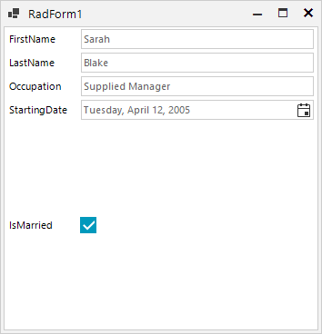

## Environment
 
|Product Version|Product|Author|
|----|----|----|
|2023.2.606|RadDataLayout for WinForms|[Dinko Krastev](https://www.telerik.com/blogs/author/desislava-yordanova)|


## Description

The last field's control in RadDataLayout is always generated with too much space compared to the gap between the other generated controls. The **IsMarried** field is stretched vertically and occupies the available space for RadDataLayout:



This article demonstrates how to deal with this space and make the editor control similar in height like the rest of the editors.

## Solution 

You can calculate the potential height considering the number of generated controls after setting the **DataSource** property. A possible solution for managing the RadDataLayout.LayoutControl.MaximumSize allows you to achieve the desired goal and move the last item up to the previous one. It is just necessary to assign an appropriate height and eliminate the scroll-bar: 

````C#
        public RadForm1()
        {
            InitializeComponent();
            this.radDataLayout1.DataSource = new Employee()
            {
                FirstName = "Sarah",
                LastName = "Blake",
                Occupation = "Supplied Manager",
                StartingDate = new DateTime(2005, 04, 12),
                IsMarried = true
            };
            int height = (this.radDataLayout1.LayoutControl.Controls.Count - 2) * 30;
            this.radDataLayout1.LayoutControl.MaximumSize = new Size(0, height);
        }

        public class Employee
        {
            public string FirstName { get; set; }
            public string LastName { get; set; }
            public string Occupation { get; set; }
            public DateTime StartingDate { get; set; }
            public bool IsMarried { get; set; }
        }      

````
````VB.NET

    Public Sub New()
        InitializeComponent()
        Me.RadDataLayout1.DataSource = New Employee() With {
            .FirstName = "Sarah",
            .LastName = "Blake",
            .Occupation = "Supplied Manager",
            .StartingDate = New DateTime(2005, 4, 12),
            .IsMarried = True
        }
        Dim height As Integer = (Me.RadDataLayout1.LayoutControl.Controls.Count - 2) * 30
        Me.RadDataLayout1.LayoutControl.MaximumSize = New Size(0, height)
    End Sub
    Protected Overrides Sub OnLoad(e As EventArgs)
        MyBase.OnLoad(e)
    End Sub

    Public Class Employee
        Public Property FirstName As String
        Public Property LastName As String
        Public Property Occupation As String
        Public Property StartingDate As DateTime
        Public Property IsMarried As Boolean
    End Class
    
````

The achieved result is illustrated below:


    
   
  
    
 
