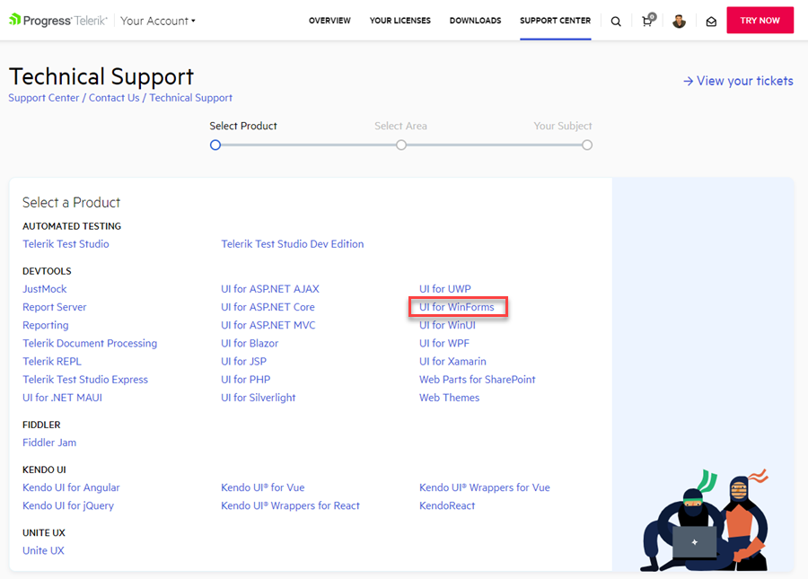
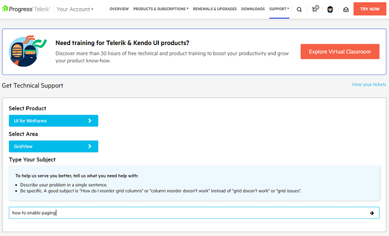
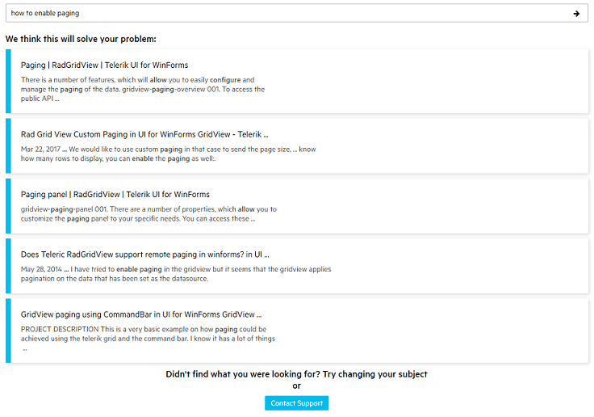
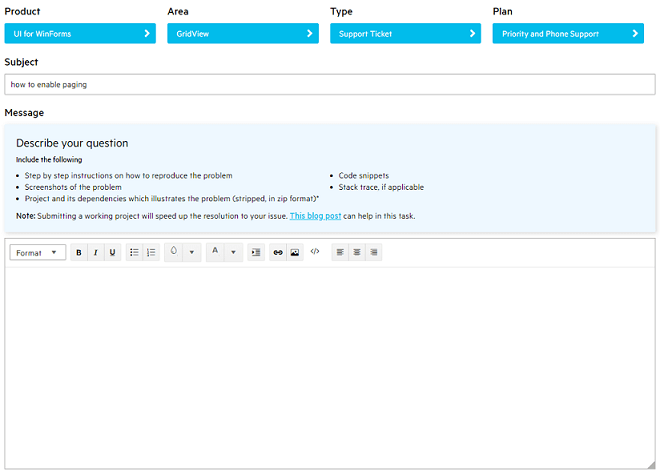
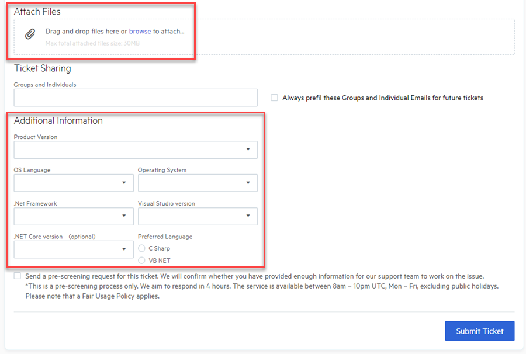

This tutorial will guide you through the process of contacting the Support team of the Telerik UI for WinForms product. It would be good to have some general tips in mind when submitting a ticket in order to start a productive discussion. The provided information is very essential for understanding the precise case that you have. It may significantly facilitate the investigation process or troubleshooting. So, always pay attention to the details you give to the support people because usually the case's resolution depends on it.  

Before proceeding further with submitting a ticket, there are some very simple things you can check right away to make sure you haven't missed something very simple.

There are several appropriate resources which our customers can use to find most of their answers quickly:

* [Online Documentation](): Reading documentation is never fun, but we have been refining our docs over the past years to provide better description, more code samples, and easier discoverability.

* [Knowledge Base](https://docs.telerik.com/devtools/winforms/knowledge-base): There are introduced different implementations of common problems/questions.

* [Forums](http://www.telerik.com/community/forums/winforms.aspx): I would like to note that the forum is reviewed not only by the community. Our support engineers answer the questions there as well.

* [Code Library](http://www.telerik.com/community/code-library/winforms.aspx): The community shares their specific implementation for a certain problem. 

* Demo application: We have introduced a considerable list of demos to help you. Not only does this showcase the capabilities of UI for WinForms, but it doubles as a invaluable resource of code and "how did they do that" samples. To access the Live Demo simply click on the Windows Start button and type WinForms Demo. If you are not able to find the Live Demos using that approach you can also download it directly from [here](https://telerik-winforms-demos.s3.amazonaws.com/TelerikWinFormsExamplesLauncher.exe).

You will be surprised at how many of your issues can be resolved by a quick read through all of these guides.

Telerik has an exceptional history of support. It is unparalleled in the industry. You usually have a 24 hour guaranteed response time on your ticket ([depending on product and package](https://www.telerik.com/purchase/support-plans)). That's fast considering you are getting direct access to an engineer, but every back and forth that you have with the support team takes up valuable time. You need to make the most of your ticket the first time. You need that first response from the team to contain your answer, not a request for more information.

Let's continue with a few steps how to contact the Telerik WinForms Support if none of the above listed resource helped you:

1. You can submit your support ticket after you [login in your Telerik.com account](https://www.telerik.com/account/support-tickets). Then, select the product **UI for WinForms**:

	

2. Pick up the **RadControl** for which you need assistance, e.g. **RadGridView**:

	

3. Try to search for a possible solution for your inquiry, e.g. *"how to enable paging"*

	

4. Have a look at the found results. You may find a suitable solution for your question:

	

5. If you are still not discovering what you are looking for, then our Support engineers would gladly assist you. Here comes the important part - what exactly to be included in the support ticket so that the agent that will be assigned to this thread to understand what you are trying to achieve.

	

	

## General Tips when Submitting a Support Ticket

The trick of obtaining a "one response resolution", is to give as much information as you can about your issue in your ticket when you initially submit it. If you are able to do this, it will pay huge dividends for you in terms of success in getting your questions answered in the first 1 to 2 exchanges. Here is how it works:

* Give a suitable **Subject** for the ticket - it should summarize what you are tying to accomplish or what error message you get. 

* Have in mind that the support agent is out of the scope of your project and the specific implementation that you have in it. Hence, some information that may seem obvious for you, it may be unknown for the support engineer. That is why strive to provide as much details as possible to describe the precise case.

* Specify clearly ordered steps to follow.

* Provide screen shots and explanations of the expected and actual state of the application. An alternative option is to provide a screen recording of the issue. Download [Jing](http://www.techsmith.com/jing.html) for free, upload the recording to their server, and provide the link.

* In case of obtaining an error message, copy/paste the entire message and/or provide a screen shot of it.
	
* A sample project, demonstrating the exact undesired behavior that you are facing, may save a lot of days and efforts on both sides. That is why it is always greatly appreciated if you simulate the problematic behavior in a runnable project. Then, we would be able to make an adequate analysis of the precise case and think about a suitable solution. This is the most important thing you can do to clearly demonstrate your issue. Replicating your issue is no doubt the most time consuming part, but it's going to play the biggest role in your success at demonstrating your issue clearly the first time. It often feels easier to copy and paste the relevant portions of your code into the ticket. The problem with this approach is that the pieces have to be reviewed by somebody who doesn't know what the entire project is supposed to look like or accomplish. 

>note Total attached files size should be smaller than 20MB.
	
>important In case you decide to provide your original project, you can be certain that it will be used only for investigation purposes of this case and your privacy will be respected. Confidentiality is also described in our product EULA - See Section 11 of the [WinForms EULA](http://www.telerik.com/purchase/license-agreement/winforms-dlw-s) and Article V Section 11 of the DevCraft Complete and DevCraft Ultimate EULAs.

* Specify the **Version** you are using since it will facilitate reproducing the issue. It is possible that a fix is available in a newer version.

* The **.Net Framework** is also important as there may have some differences between the full framework and .NET Core/.NET 5.

>important In case of multiple, unrelated questions please open a separate thread for each question with the appropriate Product (RadGridView for WinForms) and avoid mixing different subjects in the same thread. This will also give you the opportunity to track the different cases easily in your account. 

Last, but not least, do not forget that [we are always here to help you](https://www.telerik.com/best-tech-support). We are only successful when you are successful. We will stick with you as long as it takes to get your ticket resolved. We want you to help you be as productive as possible. 

 
 

