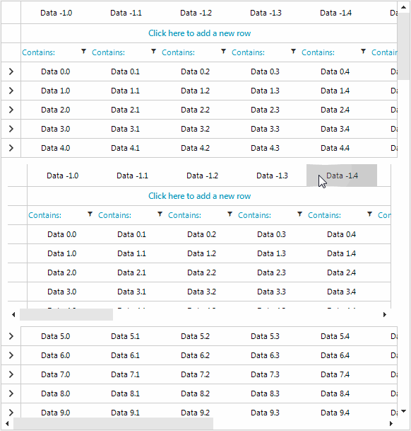

## Environment
 
|Product Version|Product|Author|
|----|----|----|
|2018.3.1016|RadGridView/RadVirtualGrid for WinForms|[Desislava Yordanova](https://www.telerik.com/blogs/author/desislava-yordanova)|
 

## Description

When you have a hierarchical level in one of the grid controls (**RadGridView** or **RadVirtualGrid**), if the width of the respective level is not enough to fit its columns, a horizontal scrollbar is shown. It scrolls only the columns belonging to the respective template. This help article demonstrates a sample approach how to synchronize the scrollbars from the master and child template as it is demonstrated in the animated gif: 



## Solution 

Subscribe to the TableElement.HScrollBar.**ValueChanged** event in order to detect when the user scrolls the horizontal scrollbar and store its value. Then, apply the respective ratio to the hierarchical scrollbar by using the formatting event for the related grid control. 

The two code snippets below show a sample approach how to achieve the scrollbars' synchronization in **RadGridView** and **RadVirtualGrid** respectively: 

#### Synchronize horizontal scrollbars in RadVirtualGrid

````C#

        public RadForm1()
        {
            InitializeComponent();
            this.radVirtualGrid1.CellValueNeeded += radVirtualGrid1_CellValueNeeded;
            this.radVirtualGrid1.QueryHasChildRows += radVirtualGrid1_QueryHasChildRows;
            this.radVirtualGrid1.ColumnCount = 10;
            this.radVirtualGrid1.RowCount = 100;
            this.radVirtualGrid1.RowExpanding += radVirtualGrid1_RowExpanding;
            this.radVirtualGrid1.TableElement.HScrollBar.ValueChanged += HScrollBar_ValueChanged;
            this.radVirtualGrid1.CellFormatting += radVirtualGrid1_CellFormatting;
        }

        private void radVirtualGrid1_CellFormatting(object sender, Telerik.WinControls.UI.VirtualGridCellElementEventArgs e)
        {
            VirtualGridHeaderCellElement cell = e.CellElement as VirtualGridHeaderCellElement;
            if (cell != null && cell.ViewInfo.HierarchyLevel > 0)
            {
                RadScrollBarElement sc = cell.TableElement.FindDescendant<RadScrollBarElement>();
                if (sc != null)
                {
                    sc.ScrollParameterChanged -= sc_ScrollParameterChanged;
                    sc.ScrollParameterChanged += sc_ScrollParameterChanged;
                    sc.Value = System.Convert.ToInt32(mainScrollBarRatio * (sc.Maximum - sc.LargeChange + 1));
                }
            }
        }

        private void sc_ScrollParameterChanged(object sender, EventArgs e)
        {
            RadScrollBarElement sc = sender as RadScrollBarElement;
            if (sc != null)
            {
                int expectedValue = System.Convert.ToInt32(mainScrollBarRatio * (sc.Maximum - sc.LargeChange + 1));
                if (sc.Value != expectedValue)
                {
                    sc.Value = expectedValue;
                    Console.WriteLine(sc.Value);
                }
            }
        }

        private double mainScrollBarRatio = 0.0F;
        private double childScrollBarRatio = 0.0F;

        private int hValue = 0;
        private int vValue = 0;
        private bool isRefreshing = false;

        private void HScrollBar_ValueChanged(object sender, EventArgs e)
        {
            mainScrollBarRatio = System.Convert.ToDouble(this.radVirtualGrid1.TableElement.HScrollBar.Value) / (this.radVirtualGrid1.TableElement.HScrollBar.Maximum -
                                                                                                                this.radVirtualGrid1.TableElement.HScrollBar.LargeChange + 1);

            if (!isRefreshing)
            {
                isRefreshing = true;
                hValue = this.radVirtualGrid1.TableElement.HScrollBar.Value;
                vValue = this.radVirtualGrid1.TableElement.VScrollBar.Value;
                this.radVirtualGrid1.TableElement.SynchronizeRows();
                this.radVirtualGrid1.TableElement.HScrollBar.Value = hValue;
                this.radVirtualGrid1.TableElement.VScrollBar.Value = vValue;
                isRefreshing = false;
            }
        }

        private void radVirtualGrid1_RowExpanding(object sender, Telerik.WinControls.UI.VirtualGridRowExpandingEventArgs e)
        {
            e.ChildViewInfo.ColumnCount = 20;
            e.ChildViewInfo.RowCount = 5;
        }

        private void radVirtualGrid1_QueryHasChildRows(object sender, Telerik.WinControls.UI.VirtualGridQueryHasChildRowsEventArgs e)
        {
            if (e.ViewInfo.HierarchyLevel == 0)
            {
                e.HasChildRows = true;
            }
            else
            {
                e.HasChildRows = false;
            }
        }

        private void radVirtualGrid1_CellValueNeeded(object sender, Telerik.WinControls.UI.VirtualGridCellValueNeededEventArgs e)
        {
            e.Value = "Data " + e.RowIndex + "." + e.ColumnIndex;
        }

       
````
````VB.NET

     Public Sub New()
        InitializeComponent()
        AddHandler Me.RadVirtualGrid1.CellValueNeeded, AddressOf radVirtualGrid1_CellValueNeeded
        AddHandler Me.RadVirtualGrid1.QueryHasChildRows, AddressOf radVirtualGrid1_QueryHasChildRows
        Me.RadVirtualGrid1.ColumnCount = 10
        Me.RadVirtualGrid1.RowCount = 100
        AddHandler Me.RadVirtualGrid1.RowExpanding, AddressOf radVirtualGrid1_RowExpanding
        AddHandler Me.RadVirtualGrid1.TableElement.HScrollBar.ValueChanged, AddressOf HScrollBar_ValueChanged
        AddHandler Me.RadVirtualGrid1.CellFormatting, AddressOf radVirtualGrid1_CellFormatting
    End Sub

    Private Sub radVirtualGrid1_CellFormatting(ByVal sender As Object, ByVal e As Telerik.WinControls.UI.VirtualGridCellElementEventArgs)
        Dim cell As VirtualGridHeaderCellElement = TryCast(e.CellElement, VirtualGridHeaderCellElement)

        If cell IsNot Nothing AndAlso cell.ViewInfo.HierarchyLevel > 0 Then
            Dim sc As RadScrollBarElement = cell.TableElement.FindDescendant(Of RadScrollBarElement)()

            If sc IsNot Nothing Then
                RemoveHandler sc.ScrollParameterChanged, AddressOf sc_ScrollParameterChanged
                AddHandler sc.ScrollParameterChanged, AddressOf sc_ScrollParameterChanged
                sc.Value = System.Convert.ToInt32(mainScrollBarRatio * (sc.Maximum - sc.LargeChange + 1))
            End If
        End If
    End Sub

    Private Sub sc_ScrollParameterChanged(ByVal sender As Object, ByVal e As EventArgs)
        Dim sc As RadScrollBarElement = TryCast(sender, RadScrollBarElement)

        If sc IsNot Nothing Then
            Dim expectedValue As Integer = System.Convert.ToInt32(mainScrollBarRatio * (sc.Maximum - sc.LargeChange + 1))

            If sc.Value <> expectedValue Then
                sc.Value = expectedValue
                Console.WriteLine(sc.Value)
            End If
        End If
    End Sub

    Private mainScrollBarRatio As Double = 0.0F
    Private childScrollBarRatio As Double = 0.0F
    Private hValue As Integer = 0
    Private vValue As Integer = 0
    Private isRefreshing As Boolean = False

    Private Sub HScrollBar_ValueChanged(ByVal sender As Object, ByVal e As EventArgs)
        mainScrollBarRatio = System.Convert.ToDouble(Me.RadVirtualGrid1.TableElement.HScrollBar.Value) / (Me.RadVirtualGrid1.TableElement.HScrollBar.Maximum - Me.RadVirtualGrid1.TableElement.HScrollBar.LargeChange + 1)

        If Not isRefreshing Then
            isRefreshing = True
            hValue = Me.RadVirtualGrid1.TableElement.HScrollBar.Value
            vValue = Me.RadVirtualGrid1.TableElement.VScrollBar.Value
            Me.RadVirtualGrid1.TableElement.SynchronizeRows()
            Me.RadVirtualGrid1.TableElement.HScrollBar.Value = hValue
            Me.RadVirtualGrid1.TableElement.VScrollBar.Value = vValue
            isRefreshing = False
        End If
    End Sub

    Private Sub radVirtualGrid1_RowExpanding(ByVal sender As Object, ByVal e As Telerik.WinControls.UI.VirtualGridRowExpandingEventArgs)
        e.ChildViewInfo.ColumnCount = 20
        e.ChildViewInfo.RowCount = 5
    End Sub

    Private Sub radVirtualGrid1_QueryHasChildRows(ByVal sender As Object, ByVal e As Telerik.WinControls.UI.VirtualGridQueryHasChildRowsEventArgs)
        If e.ViewInfo.HierarchyLevel = 0 Then
            e.HasChildRows = True
        Else
            e.HasChildRows = False
        End If
    End Sub

    Private Sub radVirtualGrid1_CellValueNeeded(ByVal sender As Object, ByVal e As Telerik.WinControls.UI.VirtualGridCellValueNeededEventArgs)
        e.Value = "Data " & e.RowIndex & "." & e.ColumnIndex
    End Sub      

````

Here is the relevant code for **RadGridView**:

#### Synchronize horizontal scrollbars in RadGridView

````C#

        private void RadForm1_Load(object sender, EventArgs e)
        {
            this.productsTableAdapter.Fill(this.nwindDataSet.Products);
            this.categoriesTableAdapter.Fill(this.nwindDataSet.Categories);
            
            radGridView1.AutoGenerateHierarchy = true;
            radGridView1.DataSource = this.nwindDataSet;
            radGridView1.DataMember = "Categories";
            radGridView1.ViewCellFormatting += radGridView1_ViewCellFormatting;
            radGridView1.MasterTemplate.BestFitColumns(BestFitColumnMode.AllCells);
            radGridView1.MasterTemplate.Templates.First().BestFitColumns(BestFitColumnMode.AllCells);
            radGridView1.TableElement.HScrollBar.ValueChanged += HScrollBar_ValueChanged;
        }

        private double mainScrollBarRatio = 0.0F;
        private double childScrollBarRatio = 0.0F;

        private int hValue = 0;
        private int vValue = 0;

        private bool isRefreshing = false;

        private void HScrollBar_ValueChanged(object sender, EventArgs e)
        {
            mainScrollBarRatio = System.Convert.ToDouble(radGridView1.TableElement.HScrollBar.Value) /
                (radGridView1.TableElement.HScrollBar.Maximum - radGridView1.TableElement.HScrollBar.LargeChange + 1);

            if (!isRefreshing)
            {
                isRefreshing = true;
                hValue = radGridView1.TableElement.HScrollBar.Value;
                vValue = radGridView1.TableElement.VScrollBar.Value;
                this.radGridView1.MasterTemplate.Refresh();
                radGridView1.TableElement.HScrollBar.Value = hValue;
                radGridView1.TableElement.VScrollBar.Value = vValue;
                isRefreshing = false;
            }
        }

        private void radGridView1_ViewCellFormatting(object sender, CellFormattingEventArgs e)
        {
            GridDetailViewCellElement detailCell = e.CellElement as GridDetailViewCellElement;
            if (detailCell != null)
            {
                RadScrollBarElement sc = detailCell.Children[0].Children[1] as RadScrollBarElement;
                if (sc != null)
                {
                    sc.ScrollParameterChanged -= sc_ScrollParameterChanged;
                    sc.ScrollParameterChanged += sc_ScrollParameterChanged;

                    sc.ValueChanged -= sc_ValueChanged;
                    sc.ValueChanged += sc_ValueChanged;

                    isRefreshing = true;
                    sc.Value = System.Convert.ToInt32(mainScrollBarRatio * (sc.Maximum - sc.LargeChange + 1));
                    isRefreshing = false;
                    sc.PositionOffset = new SizeF(-10000, 0);
                    sc.Margin = new Padding(0, 0, 0, -20);
                }
            }
        }

        private void sc_ScrollParameterChanged(object sender, EventArgs e)
        {
            RadScrollBarElement sc = sender as RadScrollBarElement;
            if (sc != null)
            {
                sc.Margin = new Padding(0, 0, 0, -20);
                sc.PositionOffset = new SizeF(-10000, 0);
                int expectedValue = System.Convert.ToInt32(mainScrollBarRatio * (sc.Maximum - sc.LargeChange + 1));
                if (sc.Value != expectedValue)
                {
                    isRefreshing = true;
                    sc.Value = expectedValue;
                    isRefreshing = false;
                }
            }
        }

        private void sc_ValueChanged(object sender, EventArgs e)
        {
            RadScrollBarElement sc = sender as RadScrollBarElement;
            double ratio = System.Convert.ToDouble(sc.Value) / (sc.Maximum - sc.LargeChange + 1);

            if (!isRefreshing)
            {
                this.radGridView1.MasterTemplate.EventDispatcher.SuspendNotifications();
                radGridView1.TableElement.HScrollBar.Value = (int)((radGridView1.TableElement.HScrollBar.Maximum -
                                                                    radGridView1.TableElement.HScrollBar.LargeChange + 1) * ratio);
                this.radGridView1.MasterTemplate.EventDispatcher.ResumeNotifications();
            }
        }
       
````
````VB.NET

      Private Sub Form1_Load(sender As Object, e As EventArgs) Handles MyBase.Load
        Me.ProductsTableAdapter.Fill(Me.NwindDataSet.Products)
        Me.CategoriesTableAdapter.Fill(Me.NwindDataSet.Categories)
        RadGridView1.AutoGenerateHierarchy = True
        RadGridView1.DataSource = Me.NwindDataSet
        RadGridView1.DataMember = "Categories"

        RadGridView1.MasterTemplate.BestFitColumns(BestFitColumnMode.AllCells)
        RadGridView1.MasterTemplate.Templates.First().BestFitColumns(BestFitColumnMode.AllCells)
        AddHandler RadGridView1.TableElement.HScrollBar.ValueChanged, AddressOf HScrollBar_ValueChanged

    End Sub

    Private mainScrollBarRatio As Double = 0.0F
    Private childScrollBarRatio As Double = 0.0F

    Private hValue As Integer = 0
    Private vValue As Integer = 0

    Private isRefreshing As Boolean = False

    Private Sub HScrollBar_ValueChanged(sender As Object, e As EventArgs)
        mainScrollBarRatio = CDbl(RadGridView1.TableElement.HScrollBar.Value) / _
        (RadGridView1.TableElement.HScrollBar.Maximum - RadGridView1.TableElement.HScrollBar.LargeChange + 1)

        If Not isRefreshing Then
            isRefreshing = True
            hValue = RadGridView1.TableElement.HScrollBar.Value
            vValue = RadGridView1.TableElement.VScrollBar.Value
            Me.RadGridView1.MasterTemplate.Refresh()
            RadGridView1.TableElement.HScrollBar.Value = hValue
            RadGridView1.TableElement.VScrollBar.Value = vValue
            isRefreshing = False
        End If
    End Sub

    Private Sub RadGridView1_ViewCellFormatting(sender As Object, e As CellFormattingEventArgs) Handles RadGridView1.ViewCellFormatting
        Dim detailCell As GridDetailViewCellElement = TryCast(e.CellElement, GridDetailViewCellElement)
        If detailCell IsNot Nothing Then
            Dim sc As RadScrollBarElement = TryCast(detailCell.Children(0).Children(1), RadScrollBarElement)
            If sc IsNot Nothing Then
                RemoveHandler sc.ScrollParameterChanged, AddressOf sc_ScrollParameterChanged
                AddHandler sc.ScrollParameterChanged, AddressOf sc_ScrollParameterChanged

                RemoveHandler sc.ValueChanged, AddressOf sc_ValueChanged
                AddHandler sc.ValueChanged, AddressOf sc_ValueChanged

                isRefreshing = True
                sc.Value = CInt(mainScrollBarRatio * (sc.Maximum - sc.LargeChange + 1))
                isRefreshing = False
                sc.PositionOffset = New SizeF(-10000, 0)
                sc.Margin = New Padding(0, 0, 0, -20)
            End If
        End If
    End Sub

    Private Sub sc_ScrollParameterChanged(sender As Object, e As EventArgs)
        Dim sc As RadScrollBarElement = TryCast(sender, RadScrollBarElement)
        If sc IsNot Nothing Then
            sc.Margin = New Padding(0, 0, 0, -20)
            sc.PositionOffset = New SizeF(-10000, 0)
            Dim expectedValue As Integer = CInt(mainScrollBarRatio * (sc.Maximum - sc.LargeChange + 1))
            If sc.Value <> expectedValue Then
                isRefreshing = True
                sc.Value = expectedValue
                isRefreshing = False
            End If
        End If
    End Sub

    Private Sub sc_ValueChanged(sender As Object, e As EventArgs)
        Dim sc As RadScrollBarElement = TryCast(sender, RadScrollBarElement)
        Dim ratio As Double = CDbl(sc.Value) / (sc.Maximum - sc.LargeChange + 1)

        If Not isRefreshing Then
            Me.RadGridView1.MasterTemplate.EventDispatcher.SuspendNotifications()
            RadGridView1.TableElement.HScrollBar.Value = (RadGridView1.TableElement.HScrollBar.Maximum _
            - RadGridView1.TableElement.HScrollBar.LargeChange + 1) * ratio
            Me.RadGridView1.MasterTemplate.EventDispatcher.ResumeNotifications()
        End If
    End Sub
    

````

>note Since we force refreshing the grid control when scrolling, it may affect the scrolling performance depending on the number of columns that you have.


