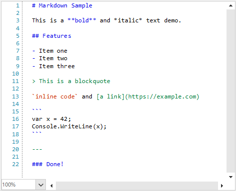

## Environment

|Product Version|Product|Author|
|----|----|----|
|2026.3.812|RadSyntaxEditor for WinForms|[Desislava Yordanova](https://www.telerik.com/blogs/author/desislava-yordanova)|

## Description

**RadSyntaxEditor** provides built-in taggers for common programming languages such as C#, VB.NET, JavaScript, JSON, SQL, and XML. However, when working with markup languages such as **Markdown**, you can implement custom syntax highlighting to style headings, bold text, italics, inline code, links, blockquotes, and lists.

This approach provides a viewer-style presentation of Markdown source text in RadSyntaxEditor with syntax highlighting. It does not render Markdown as a formatted HTML or rich-text document.

## Solution

Create a class that inherits from TaggerBase<ClassificationTag>. The tagger examines the text in each requested snapshot span, matches Markdown syntax with regular expressions, and returns classification tag spans for the matching text.

#### Example 1: Creating a custom MarkdownTagger

````C#
using System;
using System.Collections.Generic;
using System.Text.RegularExpressions;
using Telerik.WinControls.UI;
using Telerik.WinForms.SyntaxEditor.Core.Tagging;
using Telerik.WinForms.SyntaxEditor.Core.Text;
using System.Drawing;
using Telerik.WinForms.Controls.SyntaxEditor.UI;

    public class MarkdownTagger : TaggerBase<ClassificationTag>
    {
        private static readonly Regex HeadingPattern = new(@"^#{1,6}\s", RegexOptions.Compiled);
        private static readonly Regex BoldPattern = new(@"\*\*.+?\*\*|__.+?__", RegexOptions.Compiled);
        private static readonly Regex ItalicPattern = new(@"(?<!\*)\*(?!\*).+?(?<!\*)\*(?!\*)|(?<!_)_(?!_).+?(?<!_)_(?!_)", RegexOptions.Compiled);
        private static readonly Regex CodePattern = new(@"`[^`]+`", RegexOptions.Compiled);
        private static readonly Regex LinkPattern = new(@"\[.+?\]\(.+?\)", RegexOptions.Compiled);
        private static readonly Regex BlockquotePattern = new(@"^>\s", RegexOptions.Compiled);
        private static readonly Regex ListPattern = new(@"^(\s*[-*+]|\s*\d+\.)\s", RegexOptions.Compiled);
        private static readonly Regex HorizontalRulePattern = new(@"^(---|\*\*\*|___)\s*$", RegexOptions.Compiled);
        private static readonly Regex CodeBlockPattern = new(@"^```", RegexOptions.Compiled);

        public MarkdownTagger(ITextDocumentEditor editor) : base(editor)
        {
        }

        public override IEnumerable<TagSpan<ClassificationTag>> GetTags(NormalizedSnapshotSpanCollection spans)
        {
            foreach (var span in spans)
            {
                var snapshot = span.Snapshot;
                var startLine = snapshot.GetLineFromPosition(span.Start);
                var endLine = snapshot.GetLineFromPosition(span.End);

                bool inCodeBlock = false;

                for (int i = startLine.LineNumber; i <= endLine.LineNumber; i++)
                {
                    var line = snapshot.GetLineFromLineNumber(i);
                    var lineText = line.GetText();

                    // Toggle fenced code block
                    if (CodeBlockPattern.IsMatch(lineText))
                    {
                        yield return CreateTagSpan(snapshot, line.Span, ClassificationTypes.Keyword);
                        inCodeBlock = !inCodeBlock;
                        continue;
                    }

                    if (inCodeBlock)
                    {
                        yield return CreateTagSpan(snapshot, line.Span, ClassificationTypes.StringLiteral);
                        continue;
                    }

                    // Headings
                    if (HeadingPattern.IsMatch(lineText))
                    {
                        yield return CreateTagSpan(snapshot, line.Span, ClassificationTypes.Keyword);
                        continue;
                    }

                    // Horizontal rules
                    if (HorizontalRulePattern.IsMatch(lineText))
                    {
                        yield return CreateTagSpan(snapshot, line.Span, ClassificationTypes.Comment);
                        continue;
                    }

                    // Blockquotes
                    if (BlockquotePattern.IsMatch(lineText))
                    {
                        yield return CreateTagSpan(snapshot, line.Span, ClassificationTypes.Comment);
                        continue;
                    }

                    // List markers
                    var listMatch = ListPattern.Match(lineText);
                    if (listMatch.Success)
                    {
                        yield return CreateTagSpan(snapshot,
                            new Span(line.Span.Start, listMatch.Length), ClassificationTypes.Keyword);
                    }

                    // Inline patterns
                    foreach (var tagSpan in MatchInline(snapshot, line, lineText, BoldPattern, ClassificationTypes.Keyword))
                        yield return tagSpan;

                    foreach (var tagSpan in MatchInline(snapshot, line, lineText, ItalicPattern, ClassificationTypes.Identifier))
                        yield return tagSpan;

                    foreach (var tagSpan in MatchInline(snapshot, line, lineText, CodePattern, ClassificationTypes.StringLiteral))
                        yield return tagSpan;

                    foreach (var tagSpan in MatchInline(snapshot, line, lineText, LinkPattern, ClassificationTypes.Comment))
                        yield return tagSpan;
                }
            }
        }

        private static IEnumerable<TagSpan<ClassificationTag>> MatchInline(
            TextSnapshot snapshot, TextSnapshotLine line, string lineText,
            Regex pattern, ClassificationType classificationType)
        {
            foreach (Match match in pattern.Matches(lineText))
            {
                yield return CreateTagSpan(snapshot,
                    new Span(line.Span.Start + match.Index, match.Length), classificationType);
            }
        }

        private static TagSpan<ClassificationTag> CreateTagSpan(
            TextSnapshot snapshot, Span span, ClassificationType classificationType)
        {
            return new TagSpan<ClassificationTag>(
                new TextSnapshotSpan(snapshot, span),
                new ClassificationTag(classificationType));
        }
    }
````

The tagger uses the built-in ClassificationTypes values. The editor can use the corresponding classification format definitions to render the resulting colors.

Register the tagger after assigning the document to the editor. The following example creates a Markdown document, inserts sample content, and registers the custom tagger:

#### Example 2: Registering the MarkdownTagger

````C#
    public partial class MarkdownForm : RadForm
    {
        public MarkdownForm()
        {
            InitializeComponent();
            this.radSyntaxEditor1.Document = new TextDocument();
            this.radSyntaxEditor1.Document.Insert(0, "# Markdown Sample\n\nThis is a **bold** and *italic* text demo.\n\n## Features\n\n- Item one\n- Item two\n- Item three\n\n> This is a blockquote\n\n`inline code` and [a link](https://example.com)\n\n```\nvar x = 42;\nConsole.WriteLine(x);\n```\n\n---\n\n### Done!");
            this.radSyntaxEditor1.TaggersRegistry.RegisterTagger(new MarkdownTagger(this.radSyntaxEditor1.SyntaxEditorElement));
        }
    }
````

The tagger applies the following classifications:

* Headings, list markers, and bold text use ClassificationTypes.Keyword.
* Italic text uses ClassificationTypes.Identifier.
* Inline code and fenced code blocks use ClassificationTypes.StringLiteral.
* Links, blockquotes, and horizontal rules use ClassificationTypes.Comment.

This example is a lightweight syntax highlighter. It does not parse the complete CommonMark specification, and nested or escaped Markdown expressions may require additional parsing rules.

#### Figure 1: Markdown syntax highlighted in RadSyntaxEditor



## See Also

* [Custom Taggers]()
* [Word Taggers]()
* [Custom Language]()
* [Adding Execution Line Highlighting in RadSyntaxEditor]()
* [Add New Keyword to Existing Tagger]()
