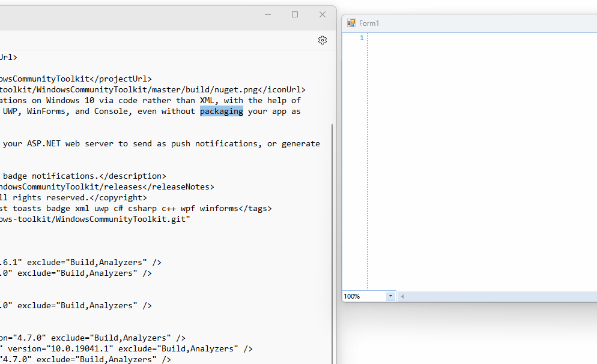

## Environment
|Product Version|Product|Author|
|----|----|----|
|2023.3.1114|RadTreeView for WinForms|[Dinko Krastev](https://www.telerik.com/blogs/author/dinko-krastev)|

## Description
In the following tutorial, we will demonstrate how to drag-drop text from an external source while moving the cursor to the desired drop position.



## Solution
To achieve this, you can follow the steps below:

1. Set the `AllowDrop` property of the `RadSyntaxEditor` control to `true`.
2. Handle the `DragOver` event of the `RadSyntaxEditor` control and set the `Effect` property of the `DragEventArgs` to `DragDropEffects.All`. This allows the control to accept the dragged text.
3. In the `DragOver` event handler, move the cursor to the desired drop position by focusing the `RadSyntaxEditor` control and using the `MoveToPosition()` method.
4. Handle the `DragDrop` event of the `RadSyntaxEditor` control and insert the dropped text at the current cursor position using the `Insert()` method of the `SyntaxEditorElement.Document` property.

Here is an example implementation:


````C#

public partial class Form1 : Form
{
    public Form1()
    {
        InitializeComponent();
        this.radSyntaxEditor1.AllowDrop = true;
        this.radSyntaxEditor1.DragOver += radSyntaxEditor1_DragOver;
        this.radSyntaxEditor1.DragDrop += radSyntaxEditor1_DragDrop;
    }

    private void radSyntaxEditor1_DragDrop(object sender, DragEventArgs e)
    {
        string txt = e.Data.GetData(DataFormats.Text).ToString();
        this.radSyntaxEditor1.SyntaxEditorElement.Document.Insert(GetCaretPostion().Index, txt);
    }

    private void radSyntaxEditor1_DragOver(object sender, DragEventArgs e)
    {
        e.Effect = DragDropEffects.All;
        this.radSyntaxEditor1.SyntaxEditorElement.CaretPosition.MoveToPosition(GetCaretPostion());
        this.radSyntaxEditor1.Focus();
    }

    private CaretPosition GetCaretPostion()
    {
        Point pt = this.radSyntaxEditor1.SyntaxEditorElement.PointFromScreen(MousePosition);
        CaretPosition caretPosition = this.radSyntaxEditor1.SyntaxEditorElement.GetPositionFromControlPoint(pt);
        return caretPosition;
    }
}


````
````VB.NET

Public Partial Class Form1
    Inherits Form

    Public Sub New()
        InitializeComponent()
        Me.radSyntaxEditor1.AllowDrop = True
        AddHandler Me.radSyntaxEditor1.DragOver, AddressOf radSyntaxEditor1_DragOver
        AddHandler Me.radSyntaxEditor1.DragDrop, AddressOf radSyntaxEditor1_DragDrop
    End Sub

    Private Sub radSyntaxEditor1_DragDrop(ByVal sender As Object, ByVal e As DragEventArgs)
        Dim txt As String = e.Data.GetData(DataFormats.Text).ToString()
        Me.radSyntaxEditor1.SyntaxEditorElement.Document.Insert(GetCaretPostion().Index, txt)
    End Sub

    Private Sub radSyntaxEditor1_DragOver(ByVal sender As Object, ByVal e As DragEventArgs)
        e.Effect = DragDropEffects.All
        Me.radSyntaxEditor1.SyntaxEditorElement.CaretPosition.MoveToPosition(GetCaretPostion())
        Me.radSyntaxEditor1.Focus()
    End Sub

    Private Function GetCaretPostion() As CaretPosition
        Dim pt As Point = Me.radSyntaxEditor1.SyntaxEditorElement.PointFromScreen(MousePosition)
        Dim caretPosition As CaretPosition = Me.radSyntaxEditor1.SyntaxEditorElement.GetPositionFromControlPoint(pt)
        Return caretPosition
    End Function
End Class


````


Make sure to add empty space in the control before dragging and dropping the text to have room for the drop operation.

