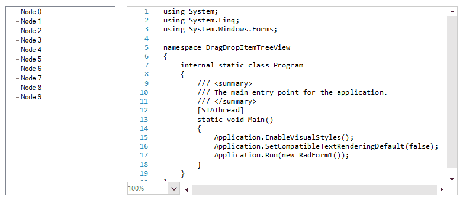

## Environment
|Product Version|Product|Author|
|----|----|----|
|2023.1.314|RadSyntaxEditor for WinForms|[Dinko Krastev](https://www.telerik.com/blogs/author/dinko-krastev)|


## Description

In this example, we will demonstrate how to drag-drop native TreeView nodes and insert text in __RadSyntaxEditor__ on the drop mouse location.



## Solution 

To make this work, first, we need to allow the drop by setting the AllowDrop property to true. Then we can subscribe to the OLE Drag-Drop events: __ItemDrag__ of the TreeView, __DragOver__ and __DragDrop__ of the RadSyntaxEditor. In the ItemDrag and DragOver, we need to allow the drop by using DragDropEffects.All enumeration. So what's left is to get the drag node text and insert it at the current mouse location over the RadSyntaxEditor document.


````C#
public RadForm1()
{
    InitializeComponent();
	this.radSyntaxEditor1.AllowDrop = true;
	this.treeView1.ItemDrag += new ItemDragEventHandler(treeView1_ItemDrag);
	this.radSyntaxEditor1.DragOver += RadSyntaxEditor1_DragOver;
	this.radSyntaxEditor1.DragDrop += RadSyntaxEditor1_DragDrop;
}

private void treeView1_ItemDrag(object sender, ItemDragEventArgs e)
{
    if (e.Button == MouseButtons.Left)
    {
        DoDragDrop(e.Item, DragDropEffects.All);
    }
}
private void RadSyntaxEditor1_DragOver(object sender, DragEventArgs e)
{
    e.Effect = DragDropEffects.All;
}

private void RadSyntaxEditor1_DragDrop(object sender, DragEventArgs e)
{
    TreeNode draggedNode = (TreeNode)e.Data.GetData(typeof(TreeNode));
    if (draggedNode != null)
    {
        var text = draggedNode.Text;        
		Point pt = this.radSyntaxEditor1.SyntaxEditorElement.PointFromScreen(MousePosition);
		CaretPosition caretPosition = this.radSyntaxEditor1.SyntaxEditorElement.GetPositionFromControlPoint(pt);
		this.radSyntaxEditor1.SyntaxEditorElement.Document.Insert(caretPosition.Index, text);
        
    }
}


````
````VB.NET

Public Sub New()
	InitializeComponent()
	Me.radSyntaxEditor1.AllowDrop = True
	AddHandler Me.treeView1.ItemDrag, AddressOf treeView1_ItemDrag
	AddHandler Me.radSyntaxEditor1.DragOver, AddressOf RadSyntaxEditor1_DragOver
	AddHandler Me.radSyntaxEditor1.DragDrop, AddressOf RadSyntaxEditor1_DragDrop
End Sub

Private Sub treeView1_ItemDrag(ByVal sender As Object, ByVal e As ItemDragEventArgs)
	If e.Button = MouseButtons.Left Then
		DoDragDrop(e.Item, DragDropEffects.All)
	End If
End Sub

Private Sub RadSyntaxEditor1_DragOver(ByVal sender As Object, ByVal e As DragEventArgs)
	e.Effect = DragDropEffects.All
End Sub

Private Sub RadSyntaxEditor1_DragDrop(ByVal sender As Object, ByVal e As DragEventArgs)
	Dim draggedNode As TreeNode = CType(e.Data.GetData(GetType(TreeNode)), TreeNode)

	If draggedNode IsNot Nothing Then
		Dim text = draggedNode.Text		
		Dim pt As Point = Me.radSyntaxEditor1.SyntaxEditorElement.PointFromScreen(MousePosition)
		Dim caretPosition As CaretPosition = Me.radSyntaxEditor1.SyntaxEditorElement.GetPositionFromControlPoint(pt)
		Me.radSyntaxEditor1.SyntaxEditorElement.Document.Insert(caretPosition.Index, text)
		
	End If
End Sub


````


 

