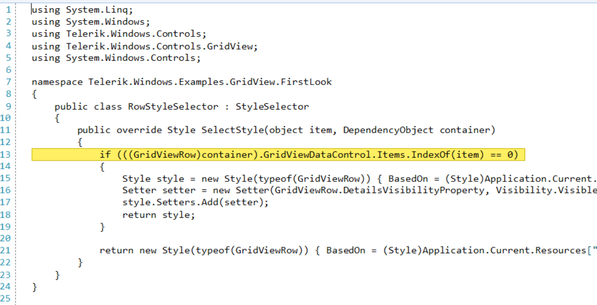

## Environment

|Product Version|Product|Author|
|----|----|----|
|2025.1.415|RadSyntaxEditor for WinForms|[Dinko Krastev](https://www.telerik.com/blogs/author/dinko-krastev)|

## Description

When building code editors or debugging tools, it is common to highlight the currently executing line with a distinct background color, text foreground, and a border&mdash;similar to the yellow execution indicator in Visual Studio. This article demonstrates how to create a custom execution line highlight in **RadSyntaxEditor** by combining a **LineHighlightTagger** for the background with a custom **ClassificationTag** tagger for the text foreground.

>note This approach is purely visual. It only simulates the appearance of an execution line indicator. It does not actually execute or evaluate the code on that line.



## Solution

The approach uses two taggers working together:

* A **LineHighlightTagger** that applies a yellow background and border to the target line.
* A custom **ExecutionLineTagger** (inheriting **TaggerBase&lt;ClassificationTag&gt;**) that changes the text foreground color on that line.

#### Step 1: Create the ExecutionLineTagger class

````C#
public class ExecutionLineTagger : TaggerBase<ClassificationTag>
{
    public static readonly ClassificationType LineForegroundType =
        new ClassificationType("LineForeground");

    private IEnumerable<int> targetLines = Enumerable.Empty<int>();

    public ExecutionLineTagger(RadSyntaxEditorElement editor)
        : base(editor) { }

    public override IEnumerable<TagSpan<ClassificationTag>> GetTags(NormalizedSnapshotSpanCollection spans)
    {
        if (!targetLines.Any())
            yield break;

        TextSnapshot snapshot = this.Document.CurrentSnapshot;
        foreach (TextSnapshotSpan snapshotSpan in spans)
        {
            int lineNumber = snapshot.GetLineFromPosition(snapshotSpan.Start).LineNumber;
            if (targetLines.Contains(lineNumber))
            {
                yield return new TagSpan<ClassificationTag>(
                    snapshotSpan,
                    new ClassificationTag(LineForegroundType));
            }
        }
    }

    public void SetLines(IEnumerable<int> lines)
    {
        this.targetLines = lines;
        this.CallOnTagsChanged(this.Document.CurrentSnapshot.Span);
    }
}
````

#### Step 2: Register the text format definitions and taggers

````C#
// Register the foreground format definition for the execution line text
radSyntaxEditor1.SyntaxEditorElement.TextFormatDefinitions.AddLast(
    ExecutionLineTagger.LineForegroundType,
    new TextFormatDefinition(new SolidBrush(Color.Black)));

// Register the background and border format definition
radSyntaxEditor1.SyntaxEditorElement.TextFormatDefinitions.AddLast(
    "ExecutionLine",
    new TextFormatDefinition(
        null,
        new SolidBrush(Color.FromArgb(255, 255, 239, 98)),
        null,
        new Telerik.WinForms.Controls.SyntaxEditor.UI.Pen(
            new SolidBrush(Color.FromArgb(255, 200, 180, 0)), 1)));

// Create and register the LineHighlightTagger for the background
var highlightTagger = new LineHighlightTagger(
    radSyntaxEditor1.SyntaxEditorElement,
    new TextFormatDefinitionKey("ExecutionLine"));
highlightTagger.HighlightMode = LineHighlightMode.LineStartToTextEnd;

// Create and register the ExecutionLineTagger for the foreground
var foregroundTagger = new ExecutionLineTagger(radSyntaxEditor1.SyntaxEditorElement);

radSyntaxEditor1.SyntaxEditorElement.TaggersRegistry.RegisterTagger(highlightTagger);
radSyntaxEditor1.SyntaxEditorElement.TaggersRegistry.RegisterTagger(foregroundTagger);

// Highlight a specific line (e.g., line 12)
highlightTagger.HighlightLines(new List<int> { 12 });
foregroundTagger.SetLines(new List<int> { 12 });
````

#### Updating the Execution Line Dynamically

To move the execution line indicator as the user steps through code, call **HighlightLines** and **SetLines** with the new target line number:

````C#
int executionLine = 10; // the new execution line
highlightTagger.HighlightLines(new List<int> { executionLine });
foregroundTagger.SetLines(new List<int> { executionLine });
````

## See Also

* [RadSyntaxEditor]()
* [Taggers]()
