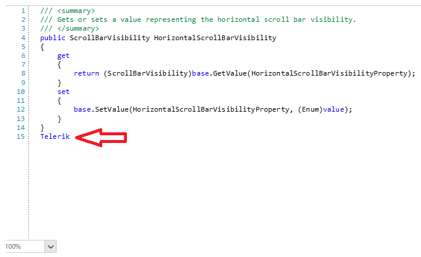

## Environment
|Product Version|Product|Author|
|----|----|----|
|2023.1.314|RadGridView for WinForms|[Dinko Krastev](https://www.telerik.com/blogs/author/dinko-krastev)|


## Description

The RadSyntaxEditor control provides a set of predefined taggers to style specific words in the document. In this article, we will demonstrate how we can add keywords to a predefined tagger without creating a custom tagger from scratch. In the following image, you can observe how the __Telerik__ word is marked by the tagger.



## Solution 

You can create a custom class that inherits the desired tagger. Then you can override the GetWordsToClassificationTypes() method and modify the Dictionary return from the base class. This method will be called multiple times, so you will need to add a check if the given key already exists. For this tutorial, we are going to extend the __CSharpTagger__ and we will add "Telerik" keyword which will be marked by the tagger.


````C#

public class MyTagger : CSharpTagger
{        
        public MyTagger(RadSyntaxEditorElement editor)
        : base(editor)
    {
    }

    protected override Dictionary<string, ClassificationType> GetWordsToClassificationTypes()
    {
        Dictionary<string, ClassificationType> baseTypes = base.GetWordsToClassificationTypes();
        if(!baseTypes.ContainsKey("Telerik"))
        {
            baseTypes.Add("Telerik", ClassificationTypes.Keyword); // or any other ClassificationTypes
        }
        return baseTypes;
    }
}


````
````VB.NET

Public Class MyTagger
    Inherits CSharpTagger

    Public Sub New(ByVal editor As RadSyntaxEditorElement)
        MyBase.New(editor)
    End Sub

    Protected Overrides Function GetWordsToClassificationTypes() As Dictionary(Of String, ClassificationType)
        Dim baseTypes As Dictionary(Of String, ClassificationType) = MyBase.GetWordsToClassificationTypes()

        If Not baseTypes.ContainsKey("Telerik") Then
            baseTypes.Add("Telerik", ClassificationTypes.Keyword)
        End If

        Return baseTypes
    End Function
End Class


````


What's left is to register the extended predefined tagger.


````C#

MyTagger myCSharpTagger = new MyTagger(this.editor.SyntaxEditorElement);
editor.TaggersRegistry.RegisterTagger(myCSharpTagger);


````
````VB.NET

Dim myCSharpTagger As MyTagger = New MyTagger(Me.editor.SyntaxEditorElement)
editor.TaggersRegistry.RegisterTagger(myCSharpTagger)


````


 

