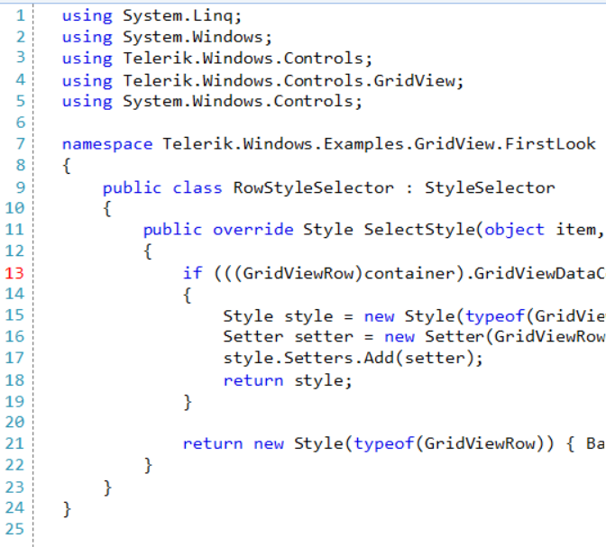

## Environment

|Product Version|Product|Author|
|----|----|----|
|2025.1.415|RadSyntaxEditor for WinForms|[Dinko Krastev](https://www.telerik.com/blogs/author/dinko-krastev)|

## Description

By default, the **RadSyntaxEditor** line number margin displays all line numbers in the same color. This article demonstrates how to create a custom line number margin that highlights the current line number with a different color so that users can easily identify which line the caret is on.



## Solution

To achieve this, create a custom class that inherits from **LineNumberMargin** and override its **UpdateUIOverride** method. Inside the override, compare each line number block's vertical position with the caret position to determine which line is the current one and change its foreground color accordingly.

#### Step 1: Create the custom HighlightedLineNumberMargin class

````C#
public class HighlightedLineNumberMargin : LineNumberMargin
{
    private Brush currentLineBrush;
    private int currentLineNumber = -1;

    public HighlightedLineNumberMargin(RadSyntaxEditorElement syntaxEditor)
        : base(syntaxEditor)
    {
        this.currentLineBrush = new SolidBrush(System.Drawing.Color.Black);
        this.Editor.CaretPosition.PositionChanged += this.OnCaretPositionChanged;
    }

    public Brush CurrentLineBrush
    {
        get { return this.currentLineBrush; }
        set { this.currentLineBrush = value; }
    }

    private void OnCaretPositionChanged(object sender, EventArgs e)
    {
        int newLine = this.Editor.CaretPosition.LineNumber;
        if (newLine != this.currentLineNumber)
        {
            this.currentLineNumber = newLine;
            this.UpdateUI();
        }
    }

    protected override void UpdateUIOverride(UIUpdateContext updateContext)
    {
        base.UpdateUIOverride(updateContext);

        var caretPos = this.Editor.GetPointFromPosition(this.Editor.CaretPosition);

        foreach (UIElement child in this.Canvas.Children)
        {
            TextBlock block = child as TextBlock;
            if (block == null)
                continue;

            double blockY = Canvas.GetTop(block);
            bool isCurrentLine = Math.Abs(blockY - caretPos.Y) < 1.0;
            block.Foreground = isCurrentLine ? this.CurrentLineBrush : this.NumbersBrush;
        }
        this.Invalidate();
    }

    protected override void DisposeManagedResources()
    {
        if (this.Editor != null)
        {
            this.Editor.CaretPosition.PositionChanged -= this.OnCaretPositionChanged;
        }
        base.DisposeManagedResources();
    }
}
````

#### Step 2: Replace the default line number margin with the custom one

````C#
// Remove the default line number margin
var defaultMargin = radSyntaxEditor1.SyntaxEditorElement.Margins.ScrollableLeft
    .OfType<LineNumberMargin>().FirstOrDefault();
if (defaultMargin != null)
{
    radSyntaxEditor1.SyntaxEditorElement.Margins.ScrollableLeft.Remove(defaultMargin);
}

// Add the custom margin with the desired highlight color
var highlightedMargin = new HighlightedLineNumberMargin(radSyntaxEditor1.SyntaxEditorElement);
highlightedMargin.CurrentLineBrush = new SolidBrush(Color.Red);
radSyntaxEditor1.SyntaxEditorElement.Margins.ScrollableLeft.Insert(0, highlightedMargin);
````

The current line number will now be rendered in the specified **CurrentLineBrush** color (red in this example), while all other line numbers retain their default appearance.

## See Also

* [RadSyntaxEditor]()
* [Taggers]()
* [Margins]()
