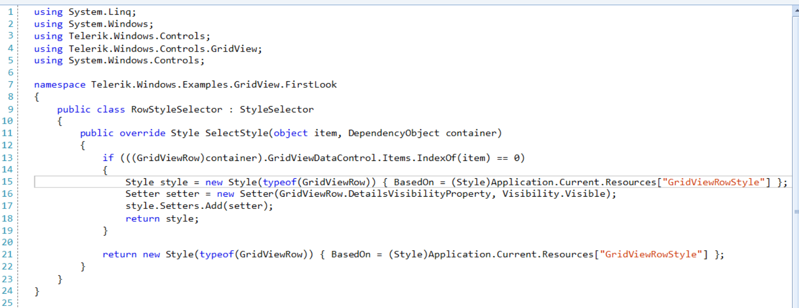

## Environment

|Product Version|Product|Author|
|----|----|----|
|2025.1.415|RadSyntaxEditor for WinForms|[Dinko Krastev](https://www.telerik.com/blogs/author/dinko-krastev)|

## Description

By default, the **TextBorderUILayer** in **RadSyntaxEditor** draws a border only around the text content of a line. This article demonstrates how to extend the border so that it spans the full width of the editor viewport, creating a selected line border indicator that follows the caret position. This effect is useful for visually emphasizing the selected line.



## Solution

The implementation requires three custom classes:

* A **CurrentLineBorderTagger** that produces **TextBorderTag** spans for the current line.
* A **SelectedLineBorderUILayer** that overrides the default border rendering to stretch the border across the entire viewport width.
* A **CustomUILayersBuilder** that replaces the default **TextBorder** layer with the custom one.

#### Step 1: Create the CurrentLineBorderTagger class

````C#
public class CurrentLineBorderTagger : TaggerBase<TextBorderTag>
{
    public static readonly ITextFormatDefinitionKey CurrentLineBorderDefinition =
        new TextFormatDefinitionKey("CurrentLineBorder");

    private int currentLine = -1;

    public CurrentLineBorderTagger(RadSyntaxEditorElement editor)
        : base(editor) { }

    public override IEnumerable<TagSpan<TextBorderTag>> GetTags(NormalizedSnapshotSpanCollection spans)
    {
        if (currentLine < 0)
            yield break;

        TextSnapshot snapshot = this.Document.CurrentSnapshot;
        foreach (TextSnapshotSpan snapshotSpan in spans)
        {
            int lineNumber = snapshot.GetLineFromPosition(snapshotSpan.Start).LineNumber;
            if (lineNumber == currentLine)
            {
                var lineSpan = new Telerik.WinForms.SyntaxEditor.Core.Text.Span(
                    snapshotSpan.Start, snapshotSpan.GetText().Length);
                yield return new TagSpan<TextBorderTag>(
                    new TextSnapshotSpan(snapshot, lineSpan),
                    new TextBorderTag(CurrentLineBorderDefinition));
            }
        }
    }

    public void SetCurrentLine(int line)
    {
        if (this.currentLine == line)
        {
            return;
        }

        this.currentLine = line;
        this.CallOnTagsChanged(this.Document.CurrentSnapshot.Span);
    }
}
````

#### Step 2: Create the SelectedLineBorderUILayer class

````C#
public class SelectedLineBorderUILayer : TextBorderUILayer
{
    protected override FrameworkElement GetLinePartUIElement(
        TextBorderTag tag,
        Telerik.WinForms.SyntaxEditor.Core.Text.Span span,
        UIUpdateContext updateContext)
    {
        var element = base.GetLinePartUIElement(tag, span, updateContext);
        if (element is Border border)
        {
            border.Width = Math.Max(border.Width, updateContext.Viewport.Width);
        }
        return element;
    }

    protected override void ArrangeLinePartUIElement(
        FrameworkElement uiElement,
        Telerik.WinForms.SyntaxEditor.Core.Text.Span span,
        UIUpdateContext updateContext)
    {
        Rect rect = updateContext.Editor.GetLinePartBoundingRectangle(span);
        Canvas.SetLeft(uiElement, 0);
        Canvas.SetTop(uiElement, rect.Top);
    }
}
````

#### Step 3: Create the CustomUILayersBuilder class

````C#
public class CustomUILayersBuilder : UILayersBuilder
{
    public override void BuildUILayers(UILayerStack uiLayers)
    {
        base.BuildUILayers(uiLayers);
        uiLayers.Remove(PredefinedUILayers.TextBorder);
        uiLayers.AddFirst(new SelectedLineBorderUILayer());
    }
}
````

#### Step 4: Wire everything together

````C#
// Set the custom UI layers builder
radSyntaxEditor1.SyntaxEditorElement.UILayersBuilder = new CustomUILayersBuilder();

// Register the border format definition
radSyntaxEditor1.SyntaxEditorElement.TextFormatDefinitions.AddLast(
    CurrentLineBorderTagger.CurrentLineBorderDefinition,
    new TextFormatDefinition(
        new Telerik.WinForms.Controls.SyntaxEditor.UI.Pen(
            new SolidBrush(Color.FromArgb(255, 200, 200, 200)), 1)));

// Create and register the border tagger
var borderTagger = new CurrentLineBorderTagger(radSyntaxEditor1.SyntaxEditorElement);
radSyntaxEditor1.SyntaxEditorElement.TaggersRegistry.RegisterTagger(borderTagger);

// Update the border position when the caret moves
radSyntaxEditor1.SyntaxEditorElement.CaretPosition.PositionChanged += (s, e) =>
{
    int line = radSyntaxEditor1.SyntaxEditorElement.CaretPosition.LineNumber;
    borderTagger.SetCurrentLine(line);
};
````

The selected line will now be enclosed in a grey border that spans the full width of the editor, following the caret as the user navigates through the document.

## See Also

* [RadSyntaxEditor]()
* [Taggers]()
