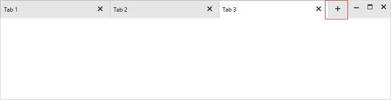
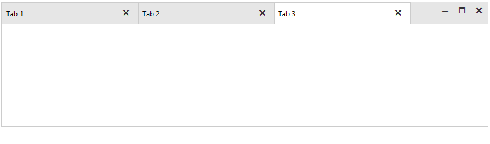
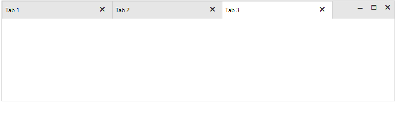

## Environment
<table>
	<tr>
		<td>Product Version</td>
		<td>2022.1.118</td>
	</tr>
	<tr>
		<td>Product</td>
		<td>RadTabbedForm for WinForms</td>
	</tr>
</table>


## Description

RadTabbedFormControl offers the **ShowNewTabButton** property which controls whether the new tab button will be visible.



If you disable the **ShowNewTabButton** property to hide the button, note that when you pop out a window, the button will be visible for the window:



This article demonstrates how to handle this case.

## Solution

When you pop out a window, a new **RadTabbedFormControl** is created. Hence, its **ShowNewTabButton** property is set **true** by default. It is necessary to subscribe to the TadTabbedFormControl.TabbedFormControlElement.ItemDragService.**TabbedFormShown** event. The **TabbedFormShownEventArgs** gives you access to the newly created **TabbedForm**. Then, handle its **TabbedFormControlCreating** event and disable the button for the newly create **RadTabbedFormControl**:


````C#            
public partial class RadTabbedForm1 : Telerik.WinControls.UI.RadTabbedForm
{
    public RadTabbedForm1()
    {
        InitializeComponent();

        this.AllowAero = false;
        this.radTabbedFormControl1.ShowNewTabButton = false;
        this.radTabbedFormControl1.TabbedFormControlElement.ItemDragService.TabbedFormShown += ItemDragService_TabbedFormShown;
    }

    private void ItemDragService_TabbedFormShown(object sender, TabbedFormShownEventArgs e)
    {
        e.TabbedForm.TabbedFormControlCreating -= TabbedForm_TabbedFormControlCreating;
        e.TabbedForm.TabbedFormControlCreating += TabbedForm_TabbedFormControlCreating;
    }

    private void TabbedForm_TabbedFormControlCreating(object sender, TabbedFormControlCreatingEventArgs e)
    {
        e.TabbedFormControl.ShowNewTabButton = false;
    }
}

````
````VB.NET

Public Class RadTabbedForm1
    Public Sub New()
        InitializeComponent()
        Me.AllowAero = False
        Me.RadTabbedFormControl1.ShowNewTabButton = False
        AddHandler Me.RadTabbedFormControl1.TabbedFormControlElement.ItemDragService.TabbedFormShown,
            AddressOf ItemDragService_TabbedFormShown
    End Sub

    Private Sub ItemDragService_TabbedFormShown(ByVal sender As Object, ByVal e As TabbedFormShownEventArgs)
        RemoveHandler e.TabbedForm.TabbedFormControlCreating, AddressOf TabbedForm_TabbedFormControlCreating
        AddHandler e.TabbedForm.TabbedFormControlCreating, AddressOf TabbedForm_TabbedFormControlCreating
    End Sub

    Private Sub TabbedForm_TabbedFormControlCreating(ByVal sender As Object, ByVal e As TabbedFormControlCreatingEventArgs)
        e.TabbedFormControl.ShowNewTabButton = False
    End Sub
End Class

````




# See Also
* [Getting Started - TabbedForm]()
