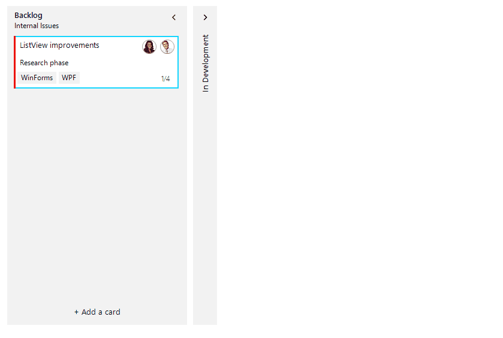

## Environment
|Product Version|Product|Author|
|----|----|----|
|2021.3.914|RadTaskBoard|[Desislava Yordanova](https://www.telerik.com/blogs/author/desislava-yordanova)|

## Description

When using a [RadTaskBoard](), a common requirement is to add task cards or update already existing task cards with the help of an edit dialog.

## Solution

Each column element in **RadTaskBoard** has a button at the bottom for adding new task cards to this particular column. **RadTaskBoardColumnElement** offers the **TaskCardAdding** event which allows you to define default values for the new task card of a certain column element. The **TaskCardAdding** event is also an appropriate place to show a custom dialog and present the end user an appropriate UI for filling in the necessary information. Just make sure that such a dialog is modal and its information is used when assigning the TaskCardAddingEventArgs.**TaskCard**.

When right-clicking a task, it is possible to show a context menu with "Edit task card" menu item that triggers a custom constructed edit dialog. This dialog can also be shown when double clicking a task card. 
 
A complete solution providing a C# and VB.NET project is available [here](https://github.com/telerik/winforms-sdk/tree/master/TaskBoard/TaskBoardEditDialog). Note that this is just a sample approach and it may not cover all possible cases. Feel free to modify and extend it in a way which suits your requirements best.

# See Also

* [RadTaskBoard]()
* [Adding Task Cards]()

