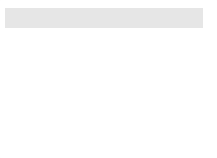
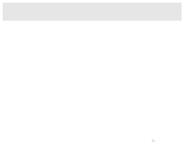

## Environment
<table>
	<tr>
		<td>Product Version</td>
		<td>2018.3 911</td>
	</tr>
	<tr>
		<td>Product</td>
		<td>RadTextBoxControl for WinForms</td>
	</tr>
</table>


## Description

**RadTextBoxControl** supports [auto-complete]() functionality which can automatically complete the input string by comparing the prefix being entered to the prefix of all strings in the maintained source. You just should set the **AutoCompleteMode** property to the desired mode.However, a common scenario is to show not only the items which text starts with the specified input but to display these ones that contain the text. This article shows how to complete the items that contain the entered text.

>caption Default "Starts With" Auto-complete functionality



## Solution 

It is necessary to override the default auto-complete logic in the **AutoCompleteFilterOverride** method of the **RadTextBoxListElement** that is hosted in the **RadTextBoxControlElement** and change it to search for items that contain the pattern. This can be achieved by creating a derivative of the **RadTextBoxControl** which custom implementation is demonstrated below:


>caption "Contains" Auto-complete functionality



````C#
        public class CustomTextBoxControl : RadTextBoxControl
        {
            public override string ThemeClassName
            {
                get
                {
                    return typeof(RadTextBoxControl).FullName;
                }
            }

            protected override RadTextBoxControlElement CreateTextBoxElement()
            {
                return new CustomTextBoxControlElement();
            }
        }

        public class CustomTextBoxControlElement : RadTextBoxControlElement
        {
            protected override Type ThemeEffectiveType
            {
                get
                {
                    return typeof(RadTextBoxControlElement);
                }
            }

            protected override RadTextBoxListElement CreateListElement()
            {
                return new CustomTextBoxListElement();
            }
        }

        public class CustomTextBoxListElement : RadTextBoxListElement
        {
            protected override bool AutoCompleteFilterOverride(RadListDataItem item)
            {
                string itemText = (item.Text ?? string.Empty).ToUpperInvariant();
                return itemText.Contains(this.PatternText.ToUpperInvariant());
            }
        }


````
````VB.NET
    Public Class CustomTextBoxControl
        Inherits RadTextBoxControl

        Public Overrides Property ThemeClassName As String
            Get
                Return GetType(RadTextBoxControl).FullName
            End Get
            Set(value As String)
                MyBase.ThemeClassName = value
            End Set
        End Property

        Protected Overrides Function CreateTextBoxElement() As RadTextBoxControlElement
            Return New CustomTextBoxControlElement()
        End Function
    End Class

    Public Class CustomTextBoxControlElement
        Inherits RadTextBoxControlElement

        Protected Overrides ReadOnly Property ThemeEffectiveType As Type
            Get
                Return GetType(RadTextBoxControlElement)
            End Get
        End Property

        Protected Overrides Function CreateListElement() As RadTextBoxListElement
            Return New CustomTextBoxListElement()
        End Function
    End Class

    Public Class CustomTextBoxListElement
        Inherits RadTextBoxListElement

        Protected Overrides Function AutoCompleteFilterOverride(ByVal item As RadListDataItem) As Boolean
            Dim itemText As String = (If(item.Text, String.Empty)).ToUpperInvariant()
            Return itemText.Contains(Me.PatternText.ToUpperInvariant())
        End Function
    End Class


````

