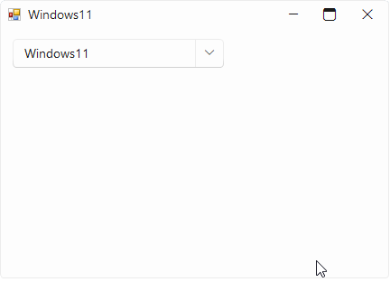

## Environment
 
|Product Version|Product|Author|
|----|----|----|
|2023.1.117|RadDropDownList for WinForms|[Desislava Yordanova](https://www.telerik.com/blogs/author/desislava-yordanova)|
 
## Description

This tutorial demonstrates how to create a theme picker inheriting RadDropDownList.
 


## Solution 

We will define a class **ThemeHelper** to store all the themes and their respective colors: 

#### ThemeHelper

````C#

    public class ThemeHelper
    {
        public static SortedDictionary<string, IList<Color>> themesColors;

        public static SortedDictionary<string, IList<Color>> ThemesColors
        {
            get
            {
                if (themesColors == null)
                {
                    themesColors = new SortedDictionary<string, IList<Color>>
                    {
                        {
                                "Windows11",
                                CreateColorListByHEX("#FFFFFF", "#EBEBEB", "#0078D4")
                        },
                        {
                                "VisualStudio2022Light",
                                CreateColorListByHEX("#F5CC84", "#F7F9FE", "#AAC0FF")
                        },
                        {
                                "Office2019Light",
                                CreateColorListByHEX("#106EBE", "#F1F1F1", "#2F96ED")
                        },
                        {
                                "Office2019Gray",
                                CreateColorListByHEX("#106EBE", "#CBCBCB", "#2F96ED")
                        },
                        {
                                "Office2019Dark",
                                CreateColorListByHEX("#106EBE", "#3C3C3C", "#2F96ED")
                        },
                        {
                                "Crystal",
                                CreateColorListByHEX("#FF1C83FF", "#FFCDCDCD", "#FF0060CF")
                        },
                        {
                                "CrystalDark",
                                CreateColorListByHEX("#FF1C83FF", "#FF3A3A3A", "#FF0060CF")
                        },
                        {
                                "Fluent",
                                CreateColorListByHEX("#009BC0", "#E8EAEB", "#15DAFF")
                        },
                        {
                                "FluentDark",
                                CreateColorListByHEX("#009BC0", "#333333", "#15DAFF")
                        },
                        {
                                "Office2013Dark",
                                CreateColorListByHEX("#676767", "#B1D6F0", "#F3F3F3")
                        },
                        {
                                "Office2013Light",
                                CreateColorListByHEX("#F0F0F0", "#B1D6F0", "#FFFFFF")
                        },
                        {
                                "Windows8",
                                CreateColorListByHEX("#FFFFFF", "#44ADDF", "#D6D6D6")
                        },
                        {
                                "VisualStudio2012Dark",
                                CreateColorListByHEX("#252526", "#3399FF", "#F1F1F1")
                        },
                        {
                                "VisualStudio2012Light",
                                CreateColorListByHEX("#FFFFFF", "#3399FF", "#D8D8DD")
                        },
                        {
                                "TelerikMetro",
                                CreateColorListByHEX("#A7AE84", "#90B808", "#FFFFFF")
                        },
                        {
                                "TelerikMetroBlue",
                                CreateColorListByHEX("#83BADE", "#1BA1E2", "#FFFFFF")
                        },
                        {
                                "TelerikMetroTouch",
                                CreateColorListByHEX("#A7AE84", "#90B808", "#FFFFFF")
                        },
                        {
                                "Office2010Black",
                                CreateColorListByHEX("#929292", "#F5BF41", "#5C5C5C")
                        },
                        {
                                "Office2010Silver",
                                CreateColorListByHEX("#4B4E61", "#F5BF41", "#E1E4E8")
                        },
                        {
                                "Office2010Blue",
                                CreateColorListByHEX("#4677B3", "#F5BF41", "#CADDF0")
                        },
                        {
                                "ControlDefault",
                                CreateColorListByHEX("#0D3683", "#FFD67E", "#D5E5FB")
                        },
                        {
                                "Aqua",
                                CreateColorListByHEX("#8B8B8B", "#EDEDED", "#2D89DC")
                        },
                        {
                                "Breeze",
                                CreateColorListByHEX("#4B4C4D", "#3297FE", "#D3E7FC")
                        },
                        {
                                "Desert",
                                CreateColorListByHEX("#DDDDD0", "#EEA43F", "#49B7C5")
                        },
                        {
                                "HighContrastBlack",
                                CreateColorListByHEX("#000000", "#008000", "#800080")
                        },
                        {
                                "Office2007Black",
                                CreateColorListByHEX("#686868", "#EEAB6B", "#CACACA")
                        },
                        {
                                "Office2007Silver",
                                CreateColorListByHEX("#DCE0E7", "#EEAB6B", "#CACACA")
                        },
                        {
                                "Windows7",
                                CreateColorListByHEX("#FFFFFF", "#86AEE1", "#D5D5D5")
                        },
                        {
                                "Material",
                                CreateColorListByHEX("#3F51B5", "#E0E0E0", "#FF9100")
                        },
                        {
                                "MaterialPink",
                                CreateColorListByHEX("#E91E63", "#E0E0E0", "#448AFF")
                        },
                        {
                                "MaterialTeal",
                                CreateColorListByHEX("#009688", "#E0E0E0", "#FF5252")
                        },
                        {
                                "MaterialBlueGrey",
                                CreateColorListByHEX("#607D8B", "#E0E0E0", "#69F0AE")
                        }
                    };
                }

                return themesColors;
            }
        }

        public static void LoadThemeAssembly(string themeName)
        {
            switch (themeName)
            {
                case "Aqua": new AquaTheme(); break; 
                case "Crystal": new CrystalTheme(); break;
                case "CrystalDark": new CrystalDarkTheme(); break;
                case "Desert": new DesertTheme(); break;
                case "Fluent": new FluentTheme(); break;
                case "FluentDark": new FluentDarkTheme(); break;
                case "HighContrastBlack": new HighContrastBlackTheme(); break;
                case "Material": new MaterialTheme(); break;
                case "MaterialBlueGrey": new MaterialBlueGreyTheme(); break;
                case "MaterialPink": new MaterialPinkTheme(); break;
                case "MaterialTeal": new MaterialTealTheme(); break;
                case "Office2007Black": new Office2007BlackTheme(); break;
                case "Office2007Silver": new Office2007SilverTheme(); break;
                case "Office2010Black": new Office2010BlackTheme(); break;
                case "Office2010Silver": new Office2010SilverTheme(); break;
                case "Office2010Blue": new Office2010BlueTheme(); break;
                case "Office2013Dark": new Office2013DarkTheme(); break;
                case "Office2013Light": new Office2013LightTheme(); break;
                case "Office2019Dark": new Office2019DarkTheme(); break;
                case "Office2019Gray": new Office2019GrayTheme(); break;
                case "Office2019Light": new Office2019LightTheme(); break;
                case "TelerikMetro": new TelerikMetroTheme(); break;
                case "TelerikMetroBlue": new TelerikMetroBlueTheme(); break;
                case "TelerikMetroTouch": new TelerikMetroTouchTheme(); break;
                case "VisualStudio2012Dark": new VisualStudio2012DarkTheme(); break;
                case "VisualStudio2012Light": new VisualStudio2012LightTheme(); break;
                case "VisualStudio2022Light": new VisualStudio2022LightTheme(); break;
                case "Windows7": new Windows7Theme(); break;
                case "Windows8": new Windows8Theme(); break;
                case "Breeze": new BreezeTheme(); break;
                case "Windows11": new Windows11Theme(); break;
                default:
                    break;
            }
    
        }

        private static IList<Color> CreateColorListByHEX(params string[] colorStrings)
        {
            List<Color> colors = new List<Color>();
            foreach (string colorString in colorStrings)
            {
                colors.Add(ColorTranslator.FromHtml(colorString));
            }

            return colors;
        }

        public static List<string> AllThemes
        {
            get
            {
                return ThemeHelper.ThemesColors.Keys.ToList();
            }
        }
    }

````
````VB.NET

Public Class ThemeHelper
    Public Shared _themesColors As SortedDictionary(Of String, IList(Of Color))

    Public Shared ReadOnly Property ThemesColors As SortedDictionary(Of String, IList(Of Color))
        Get

            If ThemesColors Is Nothing Then
                ThemesColors = New SortedDictionary(Of String, IList(Of Color)) From {
                    {"Windows11", CreateColorListByHEX("#FFFFFF", "#EBEBEB", "#0078D4")},
                    {"VisualStudio2022Light", CreateColorListByHEX("#F5CC84", "#F7F9FE", "#AAC0FF")},
                    {"Office2019Light", CreateColorListByHEX("#106EBE", "#F1F1F1", "#2F96ED")},
                    {"Office2019Gray", CreateColorListByHEX("#106EBE", "#CBCBCB", "#2F96ED")},
                    {"Office2019Dark", CreateColorListByHEX("#106EBE", "#3C3C3C", "#2F96ED")},
                    {"Crystal", CreateColorListByHEX("#FF1C83FF", "#FFCDCDCD", "#FF0060CF")},
                    {"CrystalDark", CreateColorListByHEX("#FF1C83FF", "#FF3A3A3A", "#FF0060CF")},
                    {"Fluent", CreateColorListByHEX("#009BC0", "#E8EAEB", "#15DAFF")},
                    {"FluentDark", CreateColorListByHEX("#009BC0", "#333333", "#15DAFF")},
                    {"Office2013Dark", CreateColorListByHEX("#676767", "#B1D6F0", "#F3F3F3")},
                    {"Office2013Light", CreateColorListByHEX("#F0F0F0", "#B1D6F0", "#FFFFFF")},
                    {"Windows8", CreateColorListByHEX("#FFFFFF", "#44ADDF", "#D6D6D6")},
                    {"VisualStudio2012Dark", CreateColorListByHEX("#252526", "#3399FF", "#F1F1F1")},
                    {"VisualStudio2012Light", CreateColorListByHEX("#FFFFFF", "#3399FF", "#D8D8DD")},
                    {"TelerikMetro", CreateColorListByHEX("#A7AE84", "#90B808", "#FFFFFF")},
                    {"TelerikMetroBlue", CreateColorListByHEX("#83BADE", "#1BA1E2", "#FFFFFF")},
                    {"TelerikMetroTouch", CreateColorListByHEX("#A7AE84", "#90B808", "#FFFFFF")},
                    {"Office2010Black", CreateColorListByHEX("#929292", "#F5BF41", "#5C5C5C")},
                    {"Office2010Silver", CreateColorListByHEX("#4B4E61", "#F5BF41", "#E1E4E8")},
                    {"Office2010Blue", CreateColorListByHEX("#4677B3", "#F5BF41", "#CADDF0")},
                    {"ControlDefault", CreateColorListByHEX("#0D3683", "#FFD67E", "#D5E5FB")},
                    {"Aqua", CreateColorListByHEX("#8B8B8B", "#EDEDED", "#2D89DC")},
                    {"Breeze", CreateColorListByHEX("#4B4C4D", "#3297FE", "#D3E7FC")},
                    {"Desert", CreateColorListByHEX("#DDDDD0", "#EEA43F", "#49B7C5")},
                    {"HighContrastBlack", CreateColorListByHEX("#000000", "#008000", "#800080")},
                    {"Office2007Black", CreateColorListByHEX("#686868", "#EEAB6B", "#CACACA")},
                    {"Office2007Silver", CreateColorListByHEX("#DCE0E7", "#EEAB6B", "#CACACA")},
                    {"Windows7", CreateColorListByHEX("#FFFFFF", "#86AEE1", "#D5D5D5")},
                    {"Material", CreateColorListByHEX("#3F51B5", "#E0E0E0", "#FF9100")},
                    {"MaterialPink", CreateColorListByHEX("#E91E63", "#E0E0E0", "#448AFF")},
                    {"MaterialTeal", CreateColorListByHEX("#009688", "#E0E0E0", "#FF5252")},
                    {"MaterialBlueGrey", CreateColorListByHEX("#607D8B", "#E0E0E0", "#69F0AE")}
                }
            End If

            Return ThemesColors
        End Get
    End Property

    Public Shared Sub LoadThemeAssembly(ByVal themeName As String)
        Dim theme
        Select Case themeName
            Case "Aqua"
                theme = New AquaTheme()
            Case "Crystal"
                theme = New CrystalTheme()
            Case "CrystalDark"
                theme = New CrystalDarkTheme()
            Case "Desert"
                theme = New DesertTheme()
            Case "Fluent"
                theme = New FluentTheme()
            Case "FluentDark"
                theme = New FluentDarkTheme()
            Case "HighContrastBlack"
                theme = New HighContrastBlackTheme()
            Case "Material"
                theme = New MaterialTheme()
            Case "MaterialBlueGrey"
                theme = New MaterialBlueGreyTheme()
            Case "MaterialPink"
                theme = New MaterialPinkTheme()
            Case "MaterialTeal"
                theme = New MaterialTealTheme()
            Case "Office2007Black"
                theme = New Office2007BlackTheme()
            Case "Office2007Silver"
                theme = New Office2007SilverTheme()
            Case "Office2010Black"
                theme = New Office2010BlackTheme()
            Case "Office2010Silver"
                theme = New Office2010SilverTheme()
            Case "Office2010Blue"
                theme = New Office2010BlueTheme()
            Case "Office2013Dark"
                theme = New Office2013DarkTheme()
            Case "Office2013Light"
                theme = New Office2013LightTheme()
            Case "Office2019Dark"
                theme = New Office2019DarkTheme()
            Case "Office2019Gray"
                theme = New Office2019GrayTheme()
            Case "Office2019Light"
                theme = New Office2019LightTheme()
            Case "TelerikMetro"
                theme = New TelerikMetroTheme()
            Case "TelerikMetroBlue"
                theme = New TelerikMetroBlueTheme()
            Case "TelerikMetroTouch"
                theme = New TelerikMetroTouchTheme()
            Case "VisualStudio2012Dark"
                theme = New VisualStudio2012DarkTheme()
            Case "VisualStudio2012Light"
                theme = New VisualStudio2012LightTheme()
            Case "VisualStudio2022Light"
                theme = New VisualStudio2022LightTheme()
            Case "Windows7"
                theme = New Windows7Theme()
            Case "Windows8"
                theme = New Windows8Theme()
            Case "Breeze"
                theme = New BreezeTheme()
            Case "Windows11"
                theme = New Windows11Theme()
            Case Else
        End Select
    End Sub

    Private Shared Function CreateColorListByHEX(ParamArray colorStrings As String()) As IList(Of Color)
        Dim colors As List(Of Color) = New List(Of Color)()

        For Each colorString As String In colorStrings
            colors.Add(ColorTranslator.FromHtml(colorString))
        Next

        Return colors
    End Function

    Public Shared ReadOnly Property AllThemes As List(Of String)
        Get
            Return ThemeHelper.themesColors.Keys.ToList()
        End Get
    End Property
End Class

````

>note Make sure that **Using** (C#)/**Imports** (VB.NET) is added to **Telerik.WinControls.Themes**.

Created a derivative of **RadDropDownList** with predefined items for the available themes. Once a theme item is selected, the respective theme is applied to the form:

#### ThemePicker

````C#

    public class ThemePicker : RadDropDownList
    {
        List<string> registeredThemes = new List<string>();
        public override string ThemeClassName
        {
            get
            {
                return typeof(RadDropDownList).FullName;
            }
        }

        protected override void OnLoad(Size desiredSize)
        {
            base.OnLoad(desiredSize);
            this.Items.Clear();
            foreach (KeyValuePair<string, IList<Color>> pair in ThemeHelper.ThemesColors)
            {
                string themeName = pair.Key;

                this.AddThemeItem(themeName, pair.Value);
            }
            this.SelectedIndex = 6; 
        }

        protected override void OnSelectedIndexChanged(object sender, int newIndex)
        {
            base.OnSelectedIndexChanged(sender, newIndex);
            if (newIndex > -1)
            {
                string newThemeName = this.Items[newIndex].Text;
                if (!registeredThemes.Contains(newThemeName))
                {

                    ThemeHelper.LoadThemeAssembly(newThemeName);
                    registeredThemes.Add(newThemeName);
                }
                Form f = this.FindForm();
                if (f != null)
                {
                    ThemeResolutionService.ApplyThemeToControlTree(f, newThemeName);
                }
            }
        } 

        private void AddThemeItem(string text, IList<Color> colors)
        {
            RadListDataItem item = new RadListDataItem(text);
            Image image = this.CreateBitmapFromColors(colors);

            item.Image = image;
            item.TextImageRelation = TextImageRelation.TextBeforeImage;
            item.ImageAlignment = ContentAlignment.MiddleRight;
            this.Items.Add(item);
        }


        private Image CreateBitmapFromColors(IList<Color> colors)
        {
            int cellWidth = 14;
            Bitmap bitmap = new Bitmap(colors.Count * cellWidth + 2, cellWidth + 2);
            using (Graphics g = Graphics.FromImage(bitmap))
            {
                Rectangle colorRect = new Rectangle(1, 1, cellWidth, cellWidth);
                foreach (Color color in colors)
                {
                    using (SolidBrush brush = new SolidBrush(color))
                    {
                        g.FillRectangle(brush, colorRect);
                    }

                    colorRect.X += cellWidth;
                }

                Rectangle fullRect = new Rectangle(0, 0, bitmap.Width, bitmap.Height);
                fullRect.Width -= 1;
                fullRect.Height -= 1;
                g.DrawRectangle(Pens.DarkGray, fullRect);
            }

            return bitmap;
        }
    }

````
````VB.NET

Public Class ThemePicker
    Inherits RadDropDownList

    Private registeredThemes As List(Of String) = New List(Of String)()
    Public Overrides Property ThemeClassName As String
        Get
            Return GetType(RadDropDownList).FullName
        End Get
        Set(value As String)
            MyBase.ThemeClassName = value
        End Set
    End Property

    Protected Overrides Sub OnLoad(ByVal desiredSize As Size)
        MyBase.OnLoad(desiredSize)
        Me.Items.Clear()
        For Each pair As KeyValuePair(Of String, IList(Of Color)) In ThemeHelper.ThemesColors
            Dim themeName As String = pair.Key
            Me.AddThemeItem(themeName, pair.Value)
        Next

        Me.SelectedIndex = 6
    End Sub

    Protected Overrides Sub OnSelectedIndexChanged(ByVal sender As Object, ByVal newIndex As Integer)
        MyBase.OnSelectedIndexChanged(sender, newIndex)

        If newIndex > -1 Then
            Dim newThemeName As String = Me.Items(newIndex).Text

            If Not registeredThemes.Contains(newThemeName) Then
                ThemeHelper.LoadThemeAssembly(newThemeName)
                registeredThemes.Add(newThemeName)
            End If

            Dim f As Form = Me.FindForm()

            If f IsNot Nothing Then
                ThemeResolutionService.ApplyThemeToControlTree(f, newThemeName)
            End If
        End If
    End Sub

    Private Sub AddThemeItem(ByVal text As String, ByVal colors As IList(Of Color))
        Dim item As RadListDataItem = New RadListDataItem(text)
        Dim image As Image = Me.CreateBitmapFromColors(colors)
        item.Image = image
        item.TextImageRelation = TextImageRelation.TextBeforeImage
        item.ImageAlignment = ContentAlignment.MiddleRight
        Me.Items.Add(item)
    End Sub

    Private Function CreateBitmapFromColors(ByVal colors As IList(Of Color)) As Image
        Dim cellWidth As Integer = 14
        Dim bitmap As Bitmap = New Bitmap(colors.Count * cellWidth + 2, cellWidth + 2)

        Using g As Graphics = Graphics.FromImage(bitmap)
            Dim colorRect As Rectangle = New Rectangle(1, 1, cellWidth, cellWidth)

            For Each color As Color In colors

                Using brush As SolidBrush = New SolidBrush(color)
                    g.FillRectangle(brush, colorRect)
                End Using

                colorRect.X += cellWidth
            Next

            Dim fullRect As Rectangle = New Rectangle(0, 0, bitmap.Width, bitmap.Height)
            fullRect.Width -= 1
            fullRect.Height -= 1
            g.DrawRectangle(Pens.DarkGray, fullRect)
        End Using

        Return bitmap
    End Function
End Class

````

>note It is necessary to refer all the theme assemblies from the Telerik UI for WinForms suite in order to apply properly the theme. 


