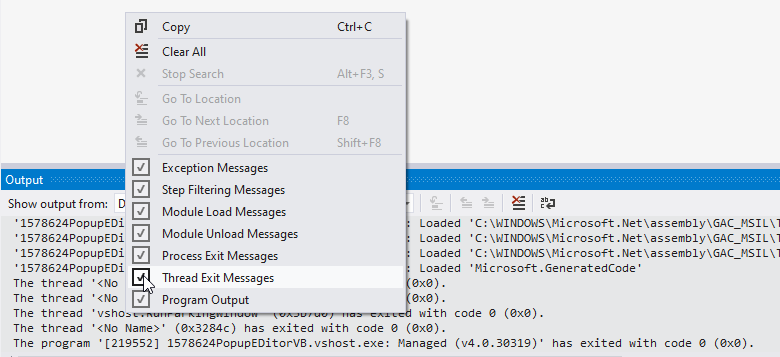

## Environment
 
|Product Version|Product|Author|
|----|----|----|
|2022.2.622|RadDropDownList for WinForms|[Desislava Yordanova](https://www.telerik.com/blogs/author/desislava-yordanova)|

## Description

Every time when a RadDropDownList is opened, the following message appears into the debug Output window: 
"*The thread 0x588c has exited with code 0 (0x0).*" where the **0x588c** changes every time.
 
## Solution

By default, RadDropDownList comes with enabled drop down animation. For the smooth execution of the animation, it is being performed on another thread. Thus, the main UI thread is not frozen while the animation is performing. This explains the observed messages in the Output window. This is just an indication about the thread exiting and you shouldn't be bothered about it. Note that these messages can be turned off:

You are also free to disable the animation in order to eliminate the messages. Simply set the RadDropDownList.**DropDownAnimationEnabled** property to false. 

# See Also

* [Animation Effects]() 
