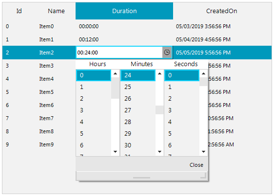

## Environment
 
|Product Version|Product|Author|
|----|----|----|
|2019.1.219|RadListView for WinForms|[Desislava Yordanova](https://www.telerik.com/blogs/author/desislava-yordanova)|
 

## Description

If you have a *TimeSpan* property displayed in a column in *DetailsView*, you may want to activate an appropriate editor to manipulate the *TimeSpan* value. 
 


## Solution 

**RadListView** offers the **EditorRequired** event where you can specify what editor to be used for the respective property. Telerik UI for WinForms offers a [RadTimeSpanPicker]() control which provides full control over picking a specific time span and duration using the built-in components for days, hours, minutes, seconds and milliseconds. You can create a [custom editor]() that uses internally a **RadTimeSpanPickerElement**. The RadListView.**EditorInitialized** event is fired when the editor is already initialized. This is the appropriate place specify the *TimeSpan* format:

#### ListViewTimeSpanEditor implementation

````C#

        public RadForm1()
        {
            InitializeComponent();

            DataTable dt = new DataTable();
            dt.Columns.Add("Id", typeof(int));
            dt.Columns.Add("Name", typeof(string));
            dt.Columns.Add("Duration", typeof(TimeSpan));
            dt.Columns.Add("CreatedOn", typeof(DateTime));

            for (int i = 0; i < 10; i++)
            {
                dt.Rows.Add(i, "Item" + i, TimeSpan.FromMinutes(i * 12), DateTime.Now.AddDays(i).AddHours(i));
            }

            this.radListView1.DataSource = dt;
            this.radListView1.ViewType = Telerik.WinControls.UI.ListViewType.DetailsView;

            this.radListView1.EditorRequired += radListView1_EditorRequired;
            this.radListView1.EditorInitialized += radListView1_EditorInitialized;
        }

        private void radListView1_EditorInitialized(object sender, ListViewItemEditorInitializedEventArgs e)
        {
            ListViewTimeSpanEditor editor = e.Editor as ListViewTimeSpanEditor;
            if (editor != null)
            {
                RadTimeSpanPickerElement element = editor.EditorElement as RadTimeSpanPickerElement;
                element.Format = "HH:mm:ss";
            }
        }

        private void radListView1_EditorRequired(object sender, ListViewItemEditorRequiredEventArgs e)
        {
            if (e.ListViewElement.CurrentColumn.FieldName == "Duration")
            {
                e.EditorType = typeof(ListViewTimeSpanEditor);
            }
        }

        public class ListViewTimeSpanEditor : BaseInputEditor
        {
            public override object Value
            {
                get
                {
                    RadTimeSpanPickerElement editor = (RadTimeSpanPickerElement)this.EditorElement;
                    return editor.Value;
                }
                set
                {
                    RadTimeSpanPickerElement editor = (RadTimeSpanPickerElement)this.EditorElement;

                    editor.Value = value;
                }
            }

            public override void BeginEdit()
            {
                base.BeginEdit();

                RadTimeSpanPickerElement element = this.EditorElement as RadTimeSpanPickerElement;
                element.MaskedEditBox.TextBoxItem.HostedControl.Focus();
                element.ValueChanged += new EventHandler(RadTimeSpanPickerElement_ValueChanged);
            }

            void RadTimeSpanPickerElement_ValueChanged(object sender, EventArgs e)
            {
                this.OnValueChanged();
            }

            public override bool EndEdit()
            {
                ((RadTimeSpanPickerElement)this.EditorElement).ValueChanged -= RadTimeSpanPickerElement_ValueChanged;
                return base.EndEdit();
            }

            protected override RadElement CreateEditorElement()
            {
                return new RadTimeSpanPickerElement();
            }

            public override Type DataType
            {
                get
                {
                    return typeof(TimeSpan);
                }
            }
        }
      
       
````
````VB.NET

      Public Sub New()
        InitializeComponent()
        Dim dt As DataTable = New DataTable()
        dt.Columns.Add("Id", GetType(Integer))
        dt.Columns.Add("Name", GetType(String))
        dt.Columns.Add("Duration", GetType(TimeSpan))
        dt.Columns.Add("CreatedOn", GetType(DateTime))

        For i As Integer = 0 To 10 - 1
            dt.Rows.Add(i, "Item" & i, TimeSpan.FromMinutes(i * 12), DateTime.Now.AddDays(i).AddHours(i))
        Next

        Me.RadListView1.DataSource = dt
        Me.RadListView1.ViewType = Telerik.WinControls.UI.ListViewType.DetailsView
        AddHandler Me.RadListView1.EditorRequired, AddressOf radListView1_EditorRequired
        AddHandler Me.RadListView1.EditorInitialized, AddressOf radListView1_EditorInitialized
    End Sub

    Private Sub radListView1_EditorInitialized(ByVal sender As Object, ByVal e As ListViewItemEditorInitializedEventArgs)
        Dim editor As ListViewTimeSpanEditor = TryCast(e.Editor, ListViewTimeSpanEditor)

        If editor IsNot Nothing Then
            Dim element As RadTimeSpanPickerElement = TryCast(editor.EditorElement, RadTimeSpanPickerElement)
            element.Format = "HH:mm:ss"
        End If
    End Sub

    Private Sub radListView1_EditorRequired(ByVal sender As Object, ByVal e As ListViewItemEditorRequiredEventArgs)
        If e.ListViewElement.CurrentColumn.FieldName = "Duration" Then
            e.EditorType = GetType(ListViewTimeSpanEditor)
        End If
    End Sub

    Public Class ListViewTimeSpanEditor
        Inherits BaseInputEditor

        Public Overrides Property Value As Object
            Get
                Dim editor As RadTimeSpanPickerElement = CType(Me.EditorElement, RadTimeSpanPickerElement)
                Return editor.Value
            End Get
            Set(ByVal value As Object)
                Dim editor As RadTimeSpanPickerElement = CType(Me.EditorElement, RadTimeSpanPickerElement)
                editor.Value = value
            End Set
        End Property

        Public Overrides Sub BeginEdit()
            MyBase.BeginEdit()
            Dim element As RadTimeSpanPickerElement = TryCast(Me.EditorElement, RadTimeSpanPickerElement)
            element.MaskedEditBox.TextBoxItem.HostedControl.Focus()
            AddHandler element.ValueChanged, AddressOf RadTimeSpanPickerElement_ValueChanged
        End Sub

        Private Sub RadTimeSpanPickerElement_ValueChanged(ByVal sender As Object, ByVal e As EventArgs)
            Me.OnValueChanged()
        End Sub

        Public Overrides Function EndEdit() As Boolean
            RemoveHandler (CType(Me.EditorElement, RadTimeSpanPickerElement)).ValueChanged, AddressOf RadTimeSpanPickerElement_ValueChanged
            Return MyBase.EndEdit()
        End Function

        Protected Overrides Function CreateEditorElement() As RadElement
            Return New RadTimeSpanPickerElement()
        End Function

        Public Overrides ReadOnly Property DataType As Type
            Get
                Return GetType(TimeSpan)
            End Get
        End Property
    End Class 
    
````

## See Also 

* [RadTimeSpanPicker]()
* [Custom Editors]()