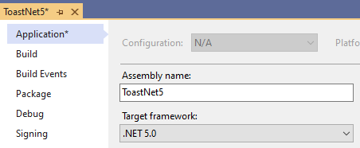
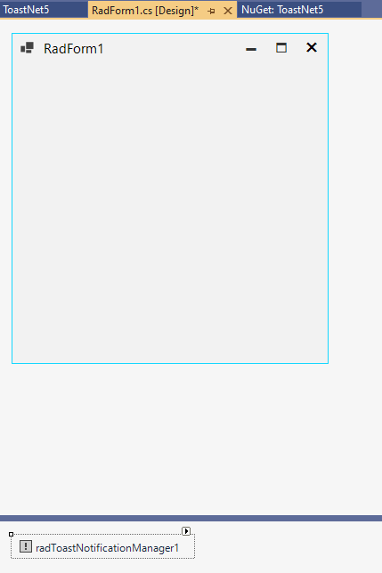

## Environment
 
|Product Version|Product|Author|
|----|----|----|
|2021.2.615|UI for WinForms|[Desislava Yordanova](https://www.telerik.com/blogs/author/desislava-yordanova)|
 
## Description

This tutorial aims to show how to use [ToastNotification]() in a .NET 5/.NET 6 application.

## Solution

The **UI.for.WinForms.RadToastNotification** NuGet has a depedency to the **Microsoft.Toolkit.Uwp.Notifications** and in .NET 5/.NET 6 this forces projects utilizing the toast notification system to target Windows systems after a particular version. In order to install the package please use a target framework with [OS binding](https://docs.microsoft.com/en-us/dotnet/standard/frameworks#net-5-os-specific-tfms) specfying the following version: `windows10.0.17763`.

Please follow the steps:

1\. Select the Target Framework to be .NET 5 (or .NET 6):

 

2\. Install the **UI.for.WinForms.RadToastNotification** NuGet:


 
3\. Double click the project file and update the TargetFramework. Your project should also targets **net5.0-windows10.0.17763**:

````xml
<Project Sdk="Microsoft.NET.Sdk">

  <PropertyGroup>
    <OutputType>WinExe</OutputType>
    <TargetFramework>net5.0-windows10.0.17763</TargetFramework>
    <UseWindowsForms>true</UseWindowsForms>
    <GenerateAssemblyInfo>false</GenerateAssemblyInfo>
    <ApplicationManifest>app.manifest</ApplicationManifest>
  </PropertyGroup>
  

  <ProjectExtensions><VisualStudio><UserProperties ShouldAddDPIScalingManifest="True" /></VisualStudio></ProjectExtensions>
  

  <ItemGroup>
    <PackageReference Include="UI.for.WinForms.RadToastNotification" Version="2021.2.615" />
  </ItemGroup>   

</Project>

````

>important For .NET 6, the required TargetFramework is **net6.0-windows10.0.17763**.

>important Please make sure that the **UI.for.WinForms.AllControls** Nuget is not installed at the same time as the **UI.for.WinForms.RadToastNotification** NuGet.

4\. Then, you can drag the RadToastNotificationManager from the toolbox and drop it on the components tray:



# See Also

* [ToastNotification]() 

