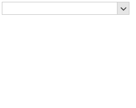

## Environment
|Product Version|Product|Author|
|----|----|----|
|2022.3.913|RadCheckedDropDownList for WinForms|[Desislava Yordanova](https://www.telerik.com/blogs/author/desislava-yordanova)|

## Description

A common requirement is to order the tokens based on the Items collection instead of the order in which they are toggled.

>caption Default order

 

## Solution

To control the tokens' order, it is necessary to subscribe to the CheckedDropDownListElement.AutoCompleteEditableAreaElement.AutoCompleteTextBox.**TextChanged** event and manage the text: 
 
````C#

public RadForm1()
{
    InitializeComponent();

    this.radCheckedDropDownList1.Items.Add("One");
    this.radCheckedDropDownList1.Items.Add("Two");
    this.radCheckedDropDownList1.Items.Add("Three");
    this.radCheckedDropDownList1.Items.Add("Four");
    this.radCheckedDropDownList1.Items.Add("Five");
    this.radCheckedDropDownList1.Items.Add("Six");
     
    this.radCheckedDropDownList1.CheckedDropDownListElement.AutoCompleteEditableAreaElement.AutoCompleteTextBox.TextChanged 
        += radCheckedDropDownList1_TextChanged;
}

private void radCheckedDropDownList1_TextChanged(object sender, EventArgs e)
{
    this.radCheckedDropDownList1.CheckedDropDownListElement.AutoCompleteEditableAreaElement.AutoCompleteTextBox.TextChanged 
        -= radCheckedDropDownList1_TextChanged;
    StringBuilder sb = new StringBuilder();
    foreach (RadCheckedListDataItem item in this.radCheckedDropDownList1.Items )
    {
        if (!item.Checked)
        {
            continue;
        }
        sb.Append(item.Text + ";");
    }
    this.radCheckedDropDownList1.CheckedDropDownListElement.AutoCompleteEditableAreaElement.AutoCompleteTextBox.Text = sb.ToString();
    this.radCheckedDropDownList1.CheckedDropDownListElement.AutoCompleteEditableAreaElement.AutoCompleteTextBox.TextChanged 
        += radCheckedDropDownList1_TextChanged;
}

````
````VB.NET

Public Sub New()
    InitializeComponent()
    Me.radCheckedDropDownList1.Items.Add("One")
    Me.radCheckedDropDownList1.Items.Add("Two")
    Me.radCheckedDropDownList1.Items.Add("Three")
    Me.radCheckedDropDownList1.Items.Add("Four")
    Me.radCheckedDropDownList1.Items.Add("Five")
    Me.radCheckedDropDownList1.Items.Add("Six")
    AddHandler Me.RadCheckedDropDownList1.CheckedDropDownListElement.AutoCompleteEditableAreaElement.AutoCompleteTextBox.TextChanged,
        AddressOf radCheckedDropDownList1_TextChanged
End Sub

Private Sub radCheckedDropDownList1_TextChanged(ByVal sender As Object, ByVal e As EventArgs)
    RemoveHandler Me.RadCheckedDropDownList1.CheckedDropDownListElement.AutoCompleteEditableAreaElement.AutoCompleteTextBox.TextChanged,
        AddressOf radCheckedDropDownList1_TextChanged
    Dim sb As StringBuilder = New StringBuilder()

    For Each item As RadCheckedListDataItem In Me.radCheckedDropDownList1.Items

        If Not item.Checked Then
            Continue For
        End If

        sb.Append(item.Text & ";")
    Next

    Me.radCheckedDropDownList1.CheckedDropDownListElement.AutoCompleteEditableAreaElement.AutoCompleteTextBox.Text = sb.ToString()
    AddHandler Me.RadCheckedDropDownList1.CheckedDropDownListElement.AutoCompleteEditableAreaElement.AutoCompleteTextBox.TextChanged,
        AddressOf radCheckedDropDownList1_TextChanged
End Sub

````

 

