## Environment
|Product Version|Product|Author|
|----|----|----|
|2023.1.117|UI for WinForms|[Desislava Yordanova](https://www.telerik.com/blogs/author/desislava-yordanova)|

## Description

When you drag a control from the toolbox and drop it onto the form in a .NET Framework project, it is possible to observe the following error: 

>caption Failed to create component

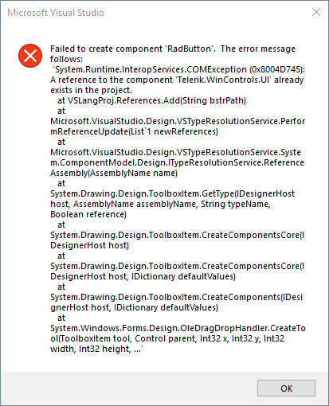

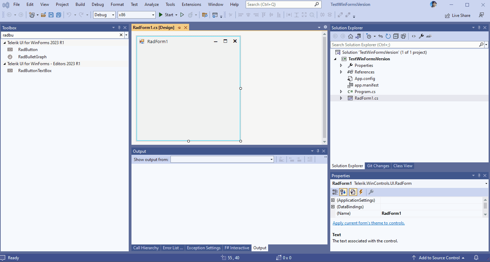

This article gives more details why this may happen and how to deal with the error.

## Solution

Let's consider that we have a single version, **R1 2023 SP1 (version 2023.1.314)**, installed on the machine:

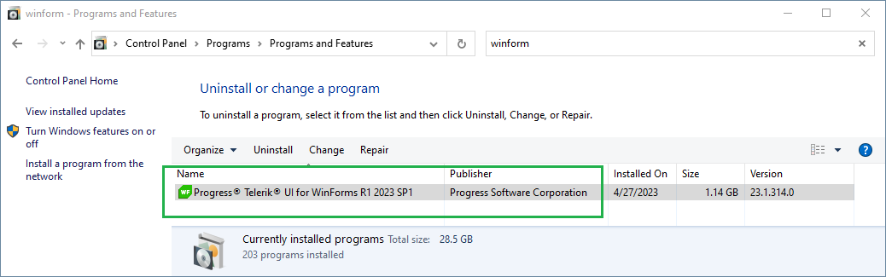

This means that in the installation folder of the Telerik UI for WinForms suite we will have the same version:

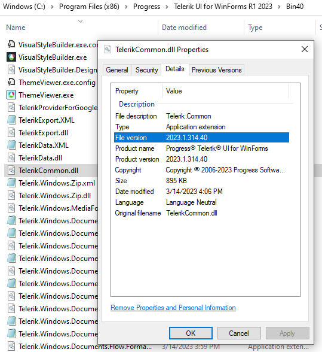

Telerik UI for WinForms controls are automatically added to Visual Studio's Toolbox during the [installation]() process when using **.NET 2.0 (up to 4.8) Framework** in your project. This means that the Toolbox population relies on the Telerik WinForms version available in the Global Assembly Cache:

>caption Toolbox Version

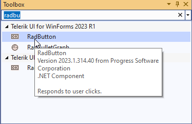

Then, while creating a new Telerik WinForms project, the VS template gives you the possibility to choose a version for the project which may not be only the installed one:

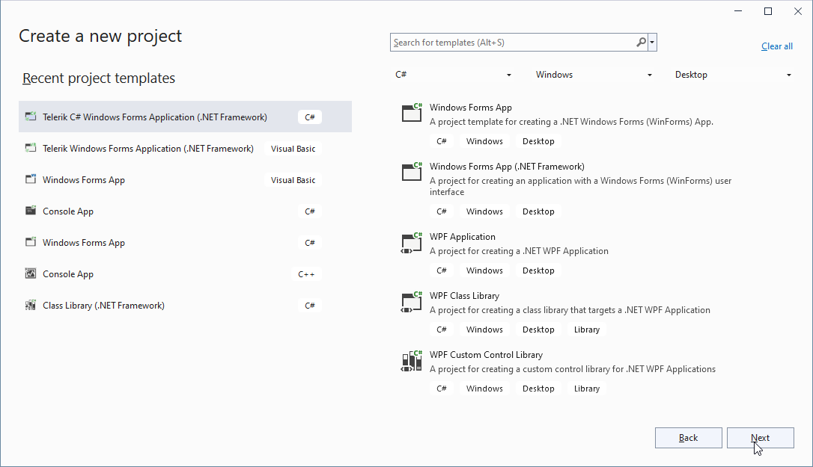

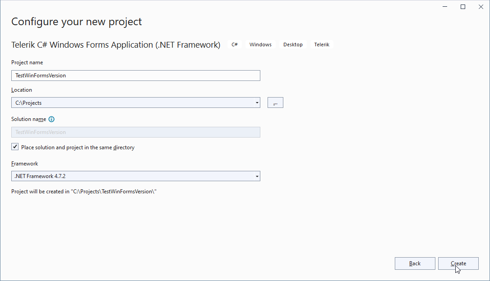

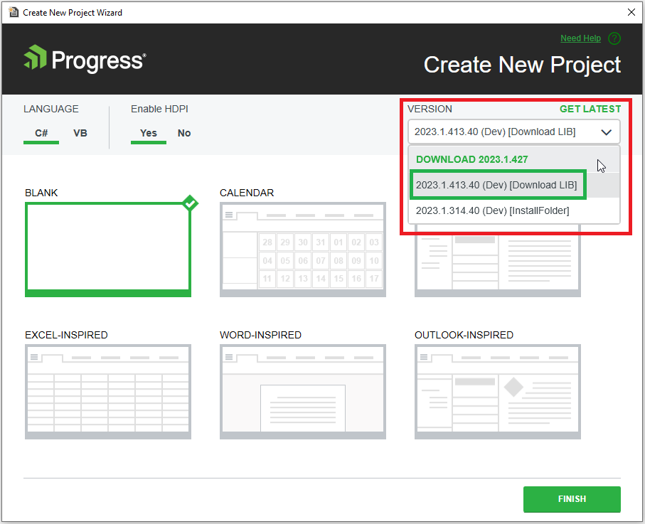

Navigate to **%AppData%** and then select **Telerik\Updates**. You are expected to see all versions that have been downloaded by VS extensions.

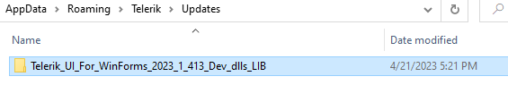

That is why the second option (**2023.1.413**) in the Version drop down is available:

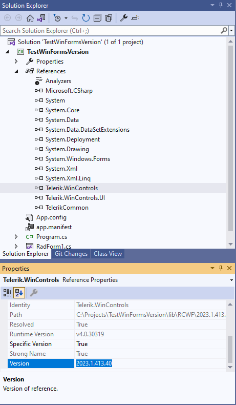 

Now, we face a situation in which the Toolbox version is different than the version of the referred assemblies in the project. That is why when a control is dragged from the toolbox and dropped onto the form, the error is observed.

The possible solution is to unify the Toolbox version and the version of the assemblies referred in your project. You can do this by using one of the following approaches:

1. [Toolbox configurator]() - setup the Toolbox with the same version (**2023.1.413**).

	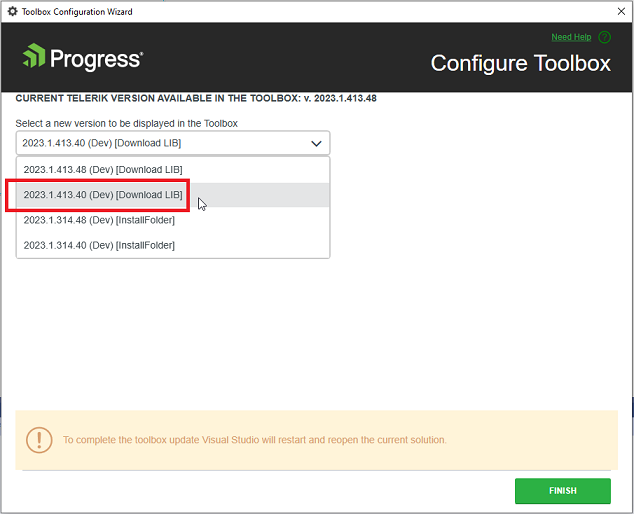 

2. Remove all references and add them anew by using the DLLs from your installation: [Updating Assemblies in a Project]()
Delete the license.licx file. After that, you should rebuild your project, close Visual Studio and open it again to make sure that no references are kept in the memory by Visual Studio. 
>note Ensure that no old versions are available in GAC: [Examine the GAC and remove old assemblies]().
>