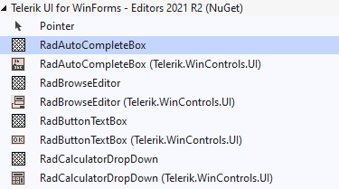
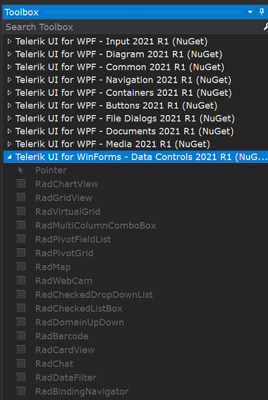

## Environment
 
|Product Version|Product|Author|
|----|----|----|
|2021.2.511|UI for WinForms|[Desislava Yordanova](https://www.telerik.com/blogs/author/desislava-yordanova)|
 
## Description

Usually, when [designing a .NET Core project](), the controls in the toolbox are resolved via the installed in the project NuGet package: [Toolbox Version](). However, in some cases you may see duplicated or disabled controls in the toolbox or experience any errors when dragging a control from the toolbox and drop it onto the form.

>caption 1. Duplicated controls in the Toolbox

>caption 2. Disabled controls in the Toolbox

This article aims to explain the possible reason for this and how to handle it accordingly.

## Solution 

Since in such projects the controls in the toolbox are resolved via the installed in the project NuGet package, Visual Studio also checks for a NuGet fallback folder and it tries to load the toolbox from there. 

When you don't have a Telerik UI for WinForms NuGet installed in the project, Visual Studio tries to load the controls from the fallback folder which is located inside the installation folder of the controls, usually here: 
**C:\Program Files (x86)\Progress\ToolboxNuGetPackages**. This feature in Visual Studio is not yet working entirely correctly and that's why you may see the controls disabled.

You can resolve the issue by manually installing a Telerik UI for WinForms NuGet inside your project. Please refer to the following article: [NET Core Toolbox Version]().
 
In order to remove the duplicated controls, the ones without the icons, you will need to remove the fallback NuGet folder. Please open the C:\Program Files (x86)\NuGet\Config folder and delete the Telerik UI for WinForms.config.

# See Also

* [Toolbox Version]()
* [Design Time]() 

