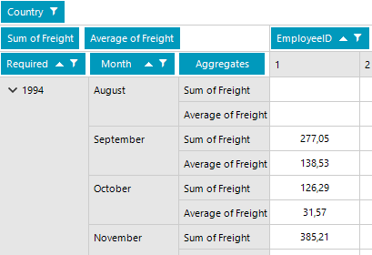
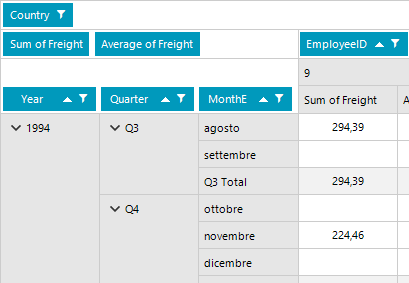

## Environment
 
|Product Version|Product|Author|
|----|----|----|
|2021.3.914|RadPivotGrid for WinForms|[Desislava Yordanova](https://www.telerik.com/blogs/author/desislava-yordanova)|
 
## Description

When a group description is added in RadPivotGrid for a DateTime field, the month names are displayed in English by default:



A common requirement is to keep the month names in the same language as the culture applied to the application.
 
## Solution 

The [LocalDataSourceProvider]() offers **Culture** property which allows you to translate the month names for the DateTime group descriptions as well:

````C#
dataProvider.Culture = new System.Globalization.CultureInfo("it-IT");

````
````VB.NET
dataProvider.Culture = New System.Globalization.CultureInfo("it-IT")

````


  

# See Also

* [Localization]() 


    
   
  
    
 
