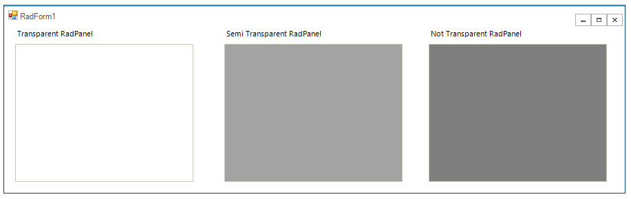
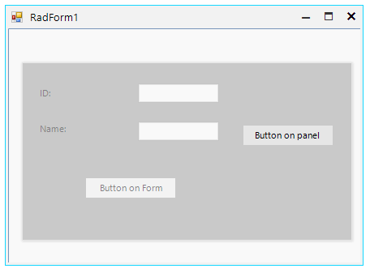

## Environment
 
|Product Version|Product|Author|
|----|----|----|
|2020.2.512|RadPanel for WinForms|[Nadya Karaivanova](https://www.telerik.com/blogs/author/nadya-karaivanova)|
 
## Description

A common requirement is to achieve transperancy effect in Winforms control. 

> Windows Forms controls do not support true transparency. The background of a transparent Windows Forms control is painted by its parent. More information is available [here](https://docs.microsoft.com/en-us/dotnet/framework/winforms/controls/how-to-give-your-control-a-transparent-background).

This is why if you want to achieve some transparency effect on the control you should simulate it.

## Solution 

If your requirement is to achieve a transparent **RadForm** it is suitable to use [TransparancyKey](https://docs.microsoft.com/en-us/dotnet/api/system.windows.forms.form.transparencykey?view=netcore-3.1) property. It gets or sets the color that will represent transparent areas of the form.

````C#
public RadForm1()
{
    InitializeComponent();
    this.BackColor = Color.Red;
    this.TransparencyKey = this.BackColor;
}

````
````VB.NET
Public Sub New()
    InitializeComponent()
    Me.BackColor = Color.Red
    Me.TransparencyKey = Me.BackColor
End Sub

````


 If your requirement is to achieve transparency effect on contols there are two approaches that you can use. The first approach is to specify the [alpha](https://docs.microsoft.com/en-us/dotnet/api/system.drawing.color.fromargb?redirectedfrom=MSDN&view=netcore-3.1#System_Drawing_Color_FromArgb_System_Int32_System_Int32_System_Int32_System_Int32_) component of the Color. One of the overloads of the Color.FromArgb method reates a Color structure from the four ARGB component that includes alpha, red, green, and blue values. The alpha component has valid values from 0 to 255 that indicates the opacity/transparency effect.

The following example demonstrated three different transparency effects in **RadPanel**:

````C#
public RadForm1()
{
    InitializeComponent();

    // transparent
    this.radPanel1.BackColor = Color.FromArgb(0, 127, 124, 127);

    //semi transparent
    this.radPanel2.BackColor = Color.FromArgb(120, 127, 127, 127);

    // not transparent
    this.radPanel3.BackColor = Color.FromArgb(255, 127, 127, 127);
}
   
````
````VB.NET
Public Sub New()
    InitializeComponent()
    
    ' transparent
    Me.radPanel1.BackColor = Color.FromArgb(0, 127, 124, 127)

    ' semi transparent
    Me.radPanel2.BackColor = Color.FromArgb(120, 127, 127, 127)

    ' not transparent
    Me.radPanel3.BackColor = Color.FromArgb(255, 127, 127, 127)
End Sub

````




The second approach is to create associate panel and assign a custom image to the **BackgroundImage** property. Then, add the associate panel to the Controls collection by using the **SetChildIndex** and **BringToFront** methods:


````C#
public RadForm1()
{
    InitializeComponent();
    this.radPanel1.BackColor = Color.FromArgb(120, 127, 127, 127);
}

protected override void OnLoad(EventArgs e)
{
    base.OnLoad(e);
    this.AddAssociateCoverPanel();
}
public void AddAssociateCoverPanel()
{
    RadPanel associatedPanel = new RadPanel();
    associatedPanel.Size = this.ClientSize;
    associatedPanel.Location = new Point(0, 0);
    Bitmap controlImage = new Bitmap(this.ClientSize.Width, this.ClientSize.Height);
    this.DrawToBitmap(controlImage, new Rectangle(Point.Empty, this.ClientSize));
    SolidBrush semiTransBrush = new SolidBrush(Color.FromArgb(128, 255, 255, 255));
    Graphics g = Graphics.FromImage(controlImage);
    g.FillRectangle(semiTransBrush, new Rectangle(Point.Empty, controlImage.Size));
    associatedPanel.BackgroundImage = controlImage;
    RadButton button = new RadButton();
    button.ThemeName = this.ThemeName;
    button.Text = "Button on panel";
    button.Location = new Point(290, 120);
    associatedPanel.Controls.Add(button);
    this.Controls.Add(associatedPanel);
    this.Controls.SetChildIndex(associatedPanel, 0);
    associatedPanel.BringToFront();
}
   
````
````VB.NET
Class SurroundingClass
    Public Sub New()
        InitializeComponent()
        Me.radPanel1.BackColor = Color.FromArgb(120, 127, 127, 127)
    End Sub

    Protected Overrides Sub OnLoad(ByVal e As EventArgs)
        MyBase.OnLoad(e)
        Me.AddAssociateCoverPanel()
    End Sub

    Public Sub AddAssociateCoverPanel()
        Dim associatedPanel As RadPanel = New RadPanel()
        associatedPanel.Size = Me.ClientSize
        associatedPanel.Location = New Point(0, 0)
        Dim controlImage As Bitmap = New Bitmap(Me.ClientSize.Width, Me.ClientSize.Height)
        Me.DrawToBitmap(controlImage, New Rectangle(Point.Empty, Me.ClientSize))
        Dim semiTransBrush As SolidBrush = New SolidBrush(Color.FromArgb(128, 255, 255, 255))
        Dim g As Graphics = Graphics.FromImage(controlImage)
        g.FillRectangle(semiTransBrush, New Rectangle(Point.Empty, controlImage.Size))
        associatedPanel.BackgroundImage = controlImage
        Dim button As RadButton = New RadButton()
        button.ThemeName = Me.ThemeName
        button.Text = "Button on panel"
        button.Location = New Point(290, 120)
        associatedPanel.Controls.Add(button)
        Me.Controls.Add(associatedPanel)
        Me.Controls.SetChildIndex(associatedPanel, 0)
        associatedPanel.BringToFront()
    End Sub
End Class

````




