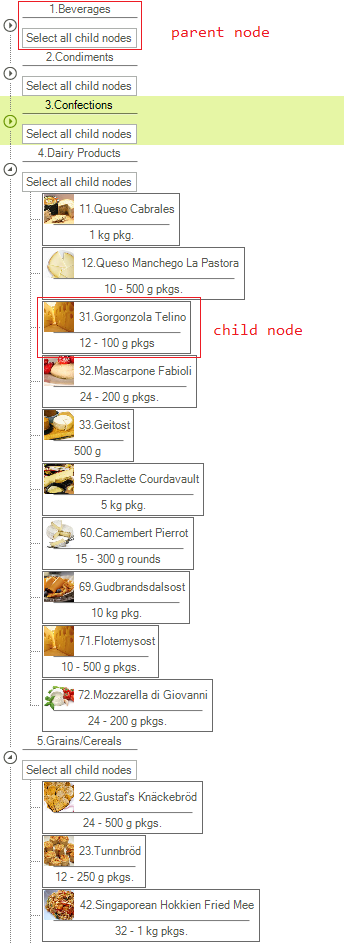

## Environment
<table>
	<tr>
		<td>Product</td>
		<td>RadTreeView for WinForms</td>
	</tr>
</table>

## Description

By design, **RadTreeView** allows customizing the visual node elements. The [Custom Nodes]() help article demonstrates a step-by-step tutorial how to use a custom **TreeNodeElement** for all nodes in the tree view. However, a common scenario is to use different custom node elements for the different levels in the tree view.  

## Solution

The aforementioned help article explains detailed steps how to create a custom node element. If you wish to have different custom node elements for the first and second levels in the tree view, you just need to implement two different custom **TreeNodeElement** derivatives with the relevant custom **TreeNodeContentElement** classes. 

Thanks to the UI virtualization mechanism only the currently visible node elements are created and they are further reused when needed. A node element is reused in other nodes if they are compatible with them. The important part here is to override the **IsCompatible** method of the **TreeNodeElement**. This method expects a Boolean result indicating whether the visual node element is applicable to the passed **RadTreeNode**. Thus, you can check the RadTreeNode.**Level** property indicating the hierarchical level of the node and determine which visual node element to use.  

>tip A complete solution providing a C# and VB.NET project is available [here](https://github.com/telerik/winforms-sdk/tree/master/TreeView/TreeViewDifferentCustomNodes).

# See Also

 * [TreeView Overview]()
 * [Binding to Database Data]()
 * [Custom Nodes]()

