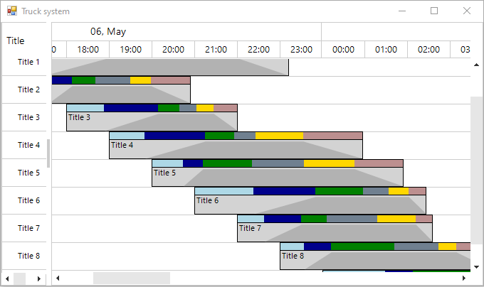

## Environment
 
|Product Version|Product|Author|
|----|----|----|
|2022.1.222|RadGanttView for WinForms|[Desislava Yordanova](https://www.telerik.com/blogs/author/desislava-yordanova)|

## Description

This article shows a sample approach how to customize the GanttViewTaskItemElement in such a way to indicate the whole delivery process for a truck driver:
 

## Solution

A complete solution providing a C# and VB.NET project is available [here](https://github.com/telerik/winforms-sdk/tree/master/GanttView/RadGanttViewTruckSchedulerExample).
 
# See Also

* [Custom Task Elements]() 