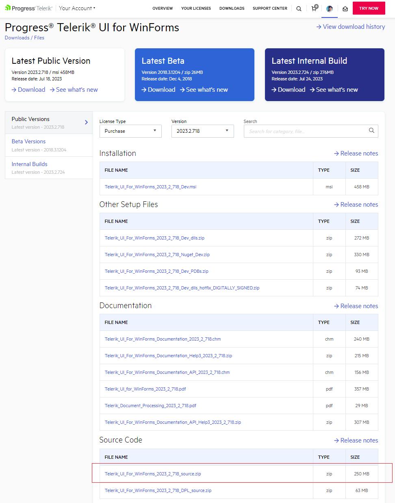
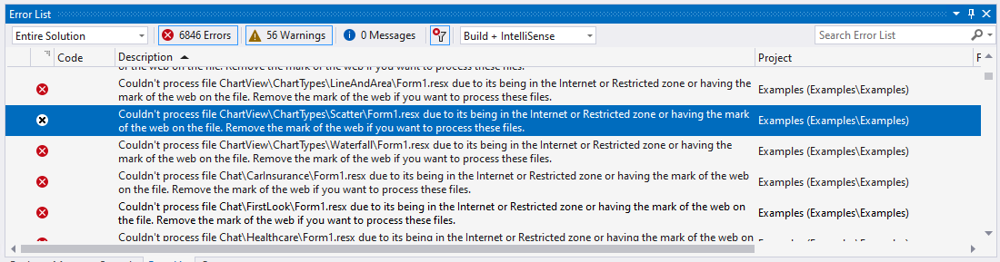
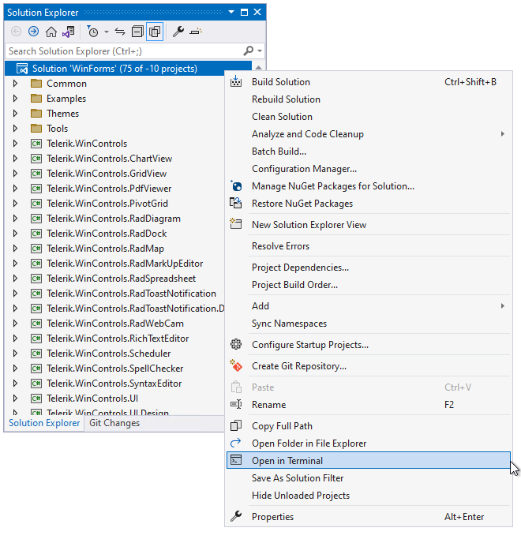
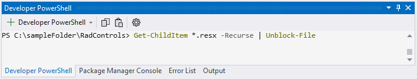

### Environment
 
|Product Version|Product|Author|
|----|----|----|
|2023.2.718|UI for WinForms|[Desislava Yordanova](https://www.telerik.com/blogs/author/desislava-yordanova)|
 
## Description
 
When the Telerik WinForms [source code is downloaded](), in some situations **.resx** files may be blocked with an error and the projects cannot be built.

>caption Zipped Telerik Source Code

Once the source code is downloaded and unzipped, if you try to build the application, you may observe the following build errors:

## Solution

To unblock those files there is a simple solution for multiple-recursive unblocking:

1\. Use 'Open in Terminal' item of the solution in 'Solution Explorer'.

2\. Enter the next commands in opened 'Developer PowerShell terminal':

Get-ChildItem *.resx -Recurse | Unblock-File

3\. The command will complete without a confirmation.

4\. The projects in the solution now can be built.

# See Also

* [How to Attach Telerik Source Code to Your Project]()
* [Download Product Files]()

