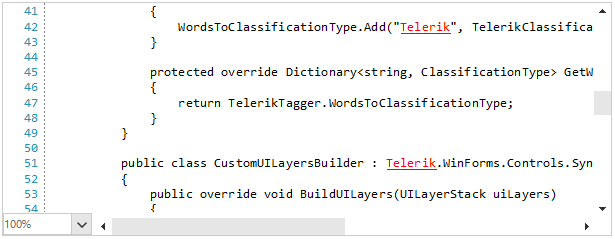

## Environment
 
|Product Version|Product|Author|
|----|----|----|
|2020.3.1020|RadSyntaxEditor for WinForms|[Desislava Yordanova](https://www.telerik.com/blogs/author/desislava-yordanova)|
 
## Description

[RadSyntaxEditor]() works with the underlying document with the help of [taggers](). Taggers are used to identify spans of text and assign them a specific tag if they match a specific condition. Thus, you can color different words in the document.

This article demonstrates a sample approach how to underline some text along with applying a specific fore color to it.   



## Solution 
 
It can be achieved by using a [custom tagger]() to classify the desired words (e.g. "Telerik") and mark these words as specific. Since **RadSyntaxEditor** renders its elements on different [layers] () based on the types of tags that are used, we will need a custom layer for the underline style.
 

````C#

public Form1()
{
    InitializeComponent();

    this.radSyntaxEditor1.TaggersRegistry.RegisterTagger(new TelerikTagger(this.radSyntaxEditor1.SyntaxEditorElement));
    this.radSyntaxEditor1.SyntaxEditorElement.UILayersBuilder = new CustomUILayersBuilder();
    this.radSyntaxEditor1.TextFormatDefinitions.AddLast(TelerikTagger.TelerikClassificationType, 
        new TextFormatDefinition(new SolidBrush(System.Drawing.Color.Red), null,
                                  new UnderlineInfo(new SolidBrush(System.Drawing.Color.Green), UnderlineDecorations.Line),
                                  new Telerik.WinForms.Controls.SyntaxEditor.UI.Pen(new SolidBrush(System.Drawing.Color.Green), 2))); 

}
public class TelerikTagger : WordTaggerBase
{
    public static readonly ClassificationType TelerikClassificationType = new ClassificationType("Telerik");
    public static readonly Dictionary<string, ClassificationType> WordsToClassificationType = new Dictionary<string, ClassificationType>();

    public TelerikTagger(RadSyntaxEditorElement editor) : base(editor)
    {
        WordsToClassificationType.Add("Telerik", TelerikClassificationType);
    }

    protected override Dictionary<string, ClassificationType> GetWordsToClassificationTypes()
    {
        return TelerikTagger.WordsToClassificationType;
    }
}

public class CustomUILayersBuilder : Telerik.WinForms.Controls.SyntaxEditor.UI.Layers.UILayersBuilder
{
    public override void BuildUILayers(UILayerStack uiLayers)
    {
        base.BuildUILayers(uiLayers);
        uiLayers.AddLast(new MyTextUnderlineUILayer());
    }
}
public class MyTextUnderlineUILayer : LineBasedUILayer<ClassificationTag>
{
    public override string Name => "MyTextUnderlineUILayer";

    protected override FrameworkElement GetLinePartUIElement(ClassificationTag tag,
                                                             Telerik.WinForms.SyntaxEditor.Core.Text.Span span,
                                                             UIUpdateContext updateContext)
    {
        if (tag.ClassificationType != TelerikTagger.TelerikClassificationType)
        {
            return null;
        }

        TextFormatDefinition textFormatting = updateContext.Editor.TextFormatDefinitions.
            GetTextFormatDefinition(TelerikTagger.TelerikClassificationType);
        Telerik.WinControls.SyntaxEditor.UI.Rect rect = updateContext.Editor.GetLinePartBoundingRectangle(span, true);

        Rect underlineRect = new Rect
        {
            Y = rect.Height,
            Width = rect.Width,
            Height = updateContext.Editor.EditorFontSize / 16
        };

        FrameworkElement underline = null;
        if (textFormatting.Underline != null)
        {
            underline = textFormatting.Underline.CreateUnderline(underlineRect);
        }

        return underline;
    }

    protected override void ResetPooledElementProperties(object element)
    {
    }
} 
 
 
````
````VB.NET

Sub New()

    InitializeComponent()

    Me.RadSyntaxEditor1.TaggersRegistry.RegisterTagger(New TelerikTagger(Me.RadSyntaxEditor1.SyntaxEditorElement))
    Me.RadSyntaxEditor1.SyntaxEditorElement.UILayersBuilder = New CustomUILayersBuilder()
    Me.RadSyntaxEditor1.TextFormatDefinitions.AddLast(TelerikTagger.TelerikClassificationType,
                     New TextFormatDefinition(New SolidBrush(System.Drawing.Color.Red),
                        Nothing, New UnderlineInfo(New SolidBrush(System.Drawing.Color.Green),
                        UnderlineDecorations.Line), New Telerik.WinForms.Controls.SyntaxEditor.UI.Pen(New SolidBrush(System.Drawing.Color.Green), 2)))
End Sub
Public Class TelerikTagger
    Inherits WordTaggerBase

    Public Shared ReadOnly TelerikClassificationType As ClassificationType = New ClassificationType("Telerik")
    Public Shared ReadOnly WordsToClassificationType As Dictionary(Of String, ClassificationType) = New Dictionary(Of String, ClassificationType)()

    Public Sub New(ByVal editor As RadSyntaxEditorElement)
        MyBase.New(editor)
        WordsToClassificationType.Add("Telerik", TelerikClassificationType)
    End Sub

    Protected Overrides Function GetWordsToClassificationTypes() As Dictionary(Of String, ClassificationType)
        Return TelerikTagger.WordsToClassificationType
    End Function
End Class

Public Class CustomUILayersBuilder
    Inherits Telerik.WinForms.Controls.SyntaxEditor.UI.Layers.UILayersBuilder

    Public Overrides Sub BuildUILayers(ByVal uiLayers As UILayerStack)
        MyBase.BuildUILayers(uiLayers)
        uiLayers.AddLast(New MyTextUnderlineUILayer())
    End Sub
End Class

Public Class MyTextUnderlineUILayer
    Inherits LineBasedUILayer(Of ClassificationTag)

    Public Overrides ReadOnly Property Name As String
        Get
            Return "MyTextUnderlineUILayer"
        End Get
    End Property

    Protected Overrides Function GetLinePartUIElement(ByVal tag As ClassificationTag,
                          ByVal span As Telerik.WinForms.SyntaxEditor.Core.Text.Span,
                                                      ByVal updateContext As UIUpdateContext) As FrameworkElement
        If Not tag.ClassificationType.Equals(TelerikTagger.TelerikClassificationType) Then
            Return Nothing
        End If

        Dim textFormatting As TextFormatDefinition = updateContext.Editor.TextFormatDefinitions.GetTextFormatDefinition(TelerikTagger.TelerikClassificationType)
        Dim rect As Telerik.WinControls.SyntaxEditor.UI.Rect = updateContext.Editor.GetLinePartBoundingRectangle(span, True)
        Dim underlineRect As Rect = New Rect With {
                .Y = rect.Height,
                .Width = rect.Width,
                .Height = updateContext.Editor.EditorFontSize / 16
            }
        Dim underline As FrameworkElement = Nothing

        If textFormatting.Underline IsNot Nothing Then
            underline = textFormatting.Underline.CreateUnderline(underlineRect)
        End If

        Return underline
    End Function

    Protected Overrides Sub ResetPooledElementProperties(ByVal element As Object)
    End Sub
End Class

```` 


# See Also

* [RadSyntaxEditor]()
* [Layers]()
* [Custom Taggers]()

