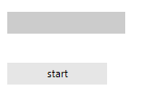

## Environment
 
|Product Version|Product|Author|
|----|----|----|
|2019.3.917|RadProgressBar for WinForms|[Desislava Yordanova](https://www.telerik.com/blogs/author/desislava-yordanova)|
 
## Description

Many users face a similar issue: once a time-consuming operation is started, **RadProgressBar** does not update immediately and literally freezes. Such cases occur when the long-running operation is executed on the same thread as the **RadProgressBar** update process: the primary UI Thread. The operation does not allow the form to update its UI and as a result the control does not perform any visual updates.

## Solution 

One obvious solution is to start the time-consuming operation in a new thread. A sample approach to achieve this is by using a [BackgroundWorker](https://docs.microsoft.com/en-us/dotnet/framework/winforms/controls/how-to-run-an-operation-in-the-background).  

The BackgroundWorker.[ProgressChanged](https://docs.microsoft.com/en-us/dotnet/api/system.componentmodel.backgroundworker.reportprogress?view=netframework-4.8) event is used to update the value of **RadProgressBar**:




#### Update progress 

````C#

private BackgroundWorker myBackgroundWorker;

public RadForm1()
{
    InitializeComponent();
    myBackgroundWorker = new BackgroundWorker();
    myBackgroundWorker.WorkerReportsProgress = true;
    myBackgroundWorker.WorkerSupportsCancellation = true;
    myBackgroundWorker.DoWork += myBackgroundWorker1_DoWork;
    myBackgroundWorker.RunWorkerCompleted += myBackgroundWorker1_RunWorkerCompleted;
    myBackgroundWorker.ProgressChanged += myBackgroundWorker1_ProgressChanged;
}

private void radButton1_Click(object sender, EventArgs e)
{
    if (!myBackgroundWorker.IsBusy)
    {
        myBackgroundWorker.RunWorkerAsync();
        this.radButton1.Enabled = false;
        this.radProgressBar1.Maximum = 100;
    }
}

 int count = 0;

private void myBackgroundWorker1_DoWork(object sender, DoWorkEventArgs e)
{
    BackgroundWorker worker = sender as BackgroundWorker;
    while (count < 100)
    {
        Thread.Sleep(200);
        worker.ReportProgress(count, "");
        count = count + 1;
    }
}

private void myBackgroundWorker1_RunWorkerCompleted(object sender, RunWorkerCompletedEventArgs e)
{
    this.radButton1.Enabled = true;
    this.radProgressBar1.Text = "100%";
    this.radProgressBar1.Value1 = this.radProgressBar1.Maximum;
}

private void myBackgroundWorker1_ProgressChanged(object sender, ProgressChangedEventArgs e)
{
    this.radProgressBar1.Value1 = e.ProgressPercentage;
    this.radProgressBar1.Text = this.radProgressBar1.Value1 + "%";
    this.radProgressBar1.ProgressBarElement.UpdateLayout();
    this.radProgressBar1.Refresh();
}

        
````
````VB.NET

Dim myBackgroundWorker As BackgroundWorker 

Sub New()

    InitializeComponent()
    myBackgroundWorker = New BackgroundWorker()
    myBackgroundWorker.WorkerReportsProgress = True
    myBackgroundWorker.WorkerSupportsCancellation = True
    AddHandler myBackgroundWorker.DoWork, AddressOf myBackgroundWorker1_DoWork
    AddHandler myBackgroundWorker.RunWorkerCompleted, AddressOf myBackgroundWorker1_RunWorkerCompleted
    AddHandler myBackgroundWorker.ProgressChanged, AddressOf myBackgroundWorker1_ProgressChanged 

End Sub

Private Sub RadButton1_Click(sender As Object, e As EventArgs) Handles RadButton1.Click
    If Not myBackgroundWorker.IsBusy Then
        myBackgroundWorker.RunWorkerAsync( )
        Me.RadButton1.Enabled = False  
        Me.RadProgressBar1.Maximum = 100
    End If
End Sub

Dim count = 0
Private Sub myBackgroundWorker1_DoWork(ByVal sender As Object, ByVal e As DoWorkEventArgs)
    Dim worker As BackgroundWorker = TryCast(sender, BackgroundWorker) 
    While count < 100
        Thread.Sleep(200)
        worker.ReportProgress(count, "")
        count = count + 1
    End While 
End Sub

Private Sub myBackgroundWorker1_RunWorkerCompleted(ByVal sender As Object, ByVal e As RunWorkerCompletedEventArgs) 
    Me.RadButton1.Enabled = True 
    Me.RadProgressBar1.Text = "100%"
    Me.RadProgressBar1.Value1 = Me.RadProgressBar1.Maximum
End Sub

Private Sub myBackgroundWorker1_ProgressChanged(sender As Object, e As ProgressChangedEventArgs)

    Me.RadProgressBar1.Value1 = e.ProgressPercentage
    Me.RadProgressBar1.Text = Me.RadProgressBar1.Value1 & "%"
    Me.RadProgressBar1.ProgressBarElement.UpdateLayout()
    Me.RadProgressBar1.Refresh()
End Sub
    

```` 
 


    
   
  
    
 
