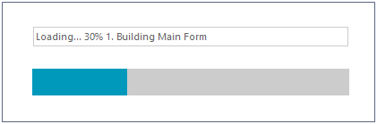

## Environment
 
|Product Version|Product|Author|
|----|----|----|
|2023.1.314|SplashScreen for WinForms|[Desislava Yordanova](https://www.telerik.com/blogs/author/desislava-yordanova)|
 

## Description

The SplashScreen from the Telerik UI for WinForms suite offers the possibility to show a custom UserControl. This article demonstrates a sample approach how to update the UserControl outside its class.



 
## Solution 

The **RadSplashScreenManager** internally uses a background Thread for showing the splash. Make sure that you don't access the RadSplashScreenControl or its elements outside the main UI thread. Note that all UI controls are not thread safe controls in the whole Windows Forms platform (not just Telerik controls, but all controls out there). You should use an [Invoke](https://learn.microsoft.com/en-us/dotnet/api/system.windows.forms.control.invoke?view=windowsdesktop-7.0&redirectedfrom=MSDN#System_Windows_Forms_Control_Invoke_System_Delegate_) to update the controls in cross threading scenario.

````C#

  internal static class Program
{
    private static Form1? _mainForm;
    private static int _currentProgress=0;
    private static SplashUserControl uc;

    /// <summary>
    ///  The main entry point for the application.
    /// </summary>
    [STAThread]
    static void Main()
    {
        // To customize application configuration such as set high DPI settings or default font,
        // see https://aka.ms/applicationconfiguration.
        ApplicationConfiguration.Initialize();

        RadSplashScreenManager.ContentCreated += RadSplashScreenManager_ContentCreated; 
        RadSplashScreenManager.FormLoad += RadSplashScreenManager_FormLoad;

        if (Screen.PrimaryScreen != null)
        { 
            RadSplashScreenManager.Show(typeof(SplashUserControl)); 
        } 
        _mainForm = new Form1(); 
        UpdateSplash("Logging Initialized"); 
        UpdateSplash("Program Setup Finished"); 
        UpdateSplash("Splash Started"); 
        Application.Run(_mainForm);
    }

    private static void RadSplashScreenManager_FormLoad(SplashFormEventArgs e)
    {
        UpdateSplash("Splash Started"); 
    } 

    private static void RadSplashScreenManager_ContentCreated(ContentCreatedEventArgs e)
    {
         uc = e.Content as SplashUserControl;
        _currentProgress = Math.Min(100, _currentProgress + 10); 
    }

    public static void UpdateSplash(string milestone = "")
    {
        _currentProgress = Math.Min(100, _currentProgress + 10);

        Action action = new Action(() =>
        {
            if (uc!=null)
            {
                uc.progressBar.Value1 = _currentProgress;
                uc.textBox.Text = "Loading... " + _currentProgress + "% " + milestone;
              
            }
        });

        uc.Invoke(action);
        Thread.Sleep(1500);
    }

    public static bool CloseSplash()
    {
        RadSplashScreenManager.ContentCreated -= RadSplashScreenManager_ContentCreated;
        RadSplashScreenManager.FormLoad -= RadSplashScreenManager_FormLoad; 
        RadSplashScreenManager.Close();
        return false;
    }      
}    
      
public partial class Form1 : RadForm
{ 
    public Form1()
    { 
        InitializeComponent();

        this.Load += Form1_Load;
        Program.UpdateSplash("1. Building Main Form");
        Program.UpdateSplash("2. Main Form Built");  
        Program.UpdateSplash("3. Connecting to DB");   
        Program.UpdateSplash("4. Connected to DB"); 

    }

    private void Form1_Load(object? sender, EventArgs e)
    {
        Program.UpdateSplash("5. Main Form Finalization"); 

        Program.CloseSplash();
    }
}
       
````
````VB.NET

Module Module1
    Private _mainForm As Form1
    Private _currentProgress As Integer = 0
    Private uc As SplashUserControl

    Public Sub Main()
        AddHandler RadSplashScreenManager.ContentCreated, AddressOf RadSplashScreenManager_ContentCreated
        AddHandler RadSplashScreenManager.FormLoad, AddressOf RadSplashScreenManager_FormLoad

        If Screen.PrimaryScreen IsNot Nothing Then
            RadSplashScreenManager.Show(GetType(SplashUserControl))
        End If

        _mainForm = New Form1()
        UpdateSplash("Logging Initialized")
        UpdateSplash("Program Setup Finished")
        UpdateSplash("Splash Started")
        Application.Run(New Form1())
    End Sub

    Private Sub RadSplashScreenManager_FormLoad(ByVal e As SplashFormEventArgs)
        UpdateSplash("Splash Started")
    End Sub

    Private Sub RadSplashScreenManager_ContentCreated(ByVal e As ContentCreatedEventArgs)
        uc = TryCast(e.Content, SplashUserControl)
        _currentProgress = Math.Min(100, _currentProgress + 10)
    End Sub

    Sub UpdateSplash(ByVal Optional milestone As String = "")
        _currentProgress = Math.Min(100, _currentProgress + 10)
        Dim action As Action = New Action(Function()

                                              If uc IsNot Nothing Then
                                                  uc.progressBar.Value1 = _currentProgress
                                                  uc.textBox.Text = "Loading... " & _currentProgress & "% " & milestone
                                              End If
                                          End Function)
        uc.Invoke(action)
        Thread.Sleep(1500)
    End Sub

    Function CloseSplash() As Boolean
        RemoveHandler RadSplashScreenManager.ContentCreated, AddressOf RadSplashScreenManager_ContentCreated
        RemoveHandler RadSplashScreenManager.FormLoad, AddressOf RadSplashScreenManager_FormLoad
        RadSplashScreenManager.Close()
        Return False
    End Function
End Module

Public Class Form1
    Public Sub New()
        InitializeComponent()
        AddHandler Me.Load, AddressOf Form1_Load
        Module1.UpdateSplash("1. Building Main Form")
        Module1.UpdateSplash("2. Main Form Built")
        Module1.UpdateSplash("3. Connecting to DB")
        Module1.UpdateSplash("4. Connected to DB")
    End Sub

    Private Sub Form1_Load(ByVal sender As Object, ByVal e As EventArgs)
        Module1.UpdateSplash("5. Main Form Finalization")
        Module1.CloseSplash()
    End Sub
End Class
    

```` 

# See Also

* [Customize Splash Content]() 
* [Getting Started]() 


 

 
