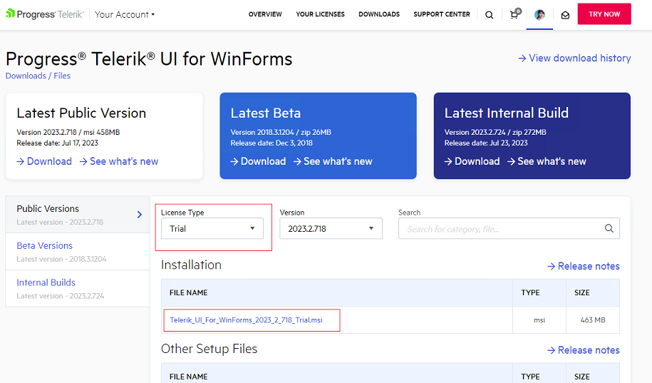
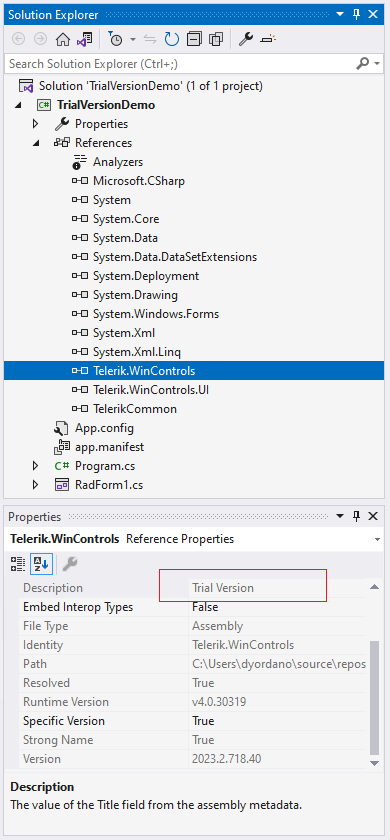
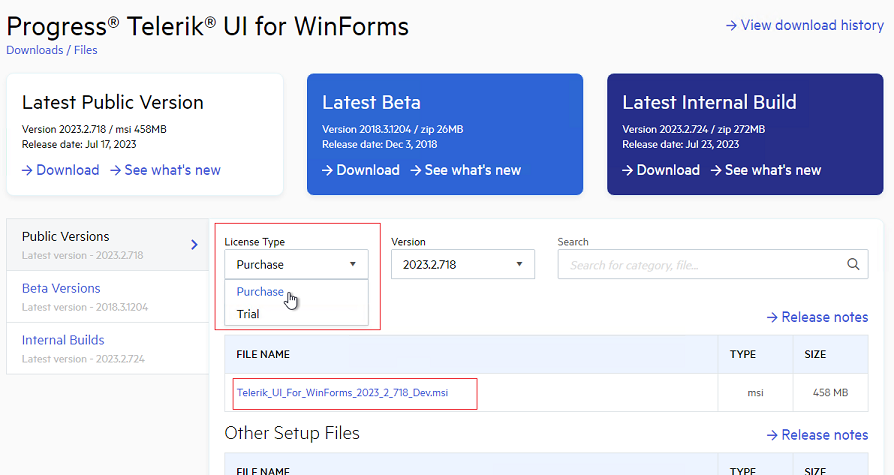
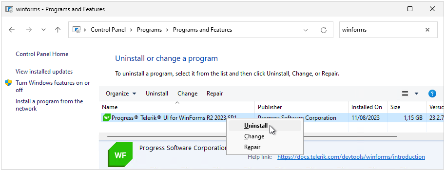

### Environment
 
|Product Version|Product|Author|
|----|----|----|
|2023.2.718|UI for WinForms|[Desislava Yordanova](https://www.telerik.com/blogs/author/desislava-yordanova)|
 
## Description

This tutorial explains in details how to upgrade your [Telerik Trial to a Licensed version]().

Let's start with having a trial version installed on your machine and a project that uses the trial version:

>caption Access to the Trial installation file from your Telerik account

If you expand the **References** in the Solution Explorer in Visual Studio, you will see the trial assemblies are added to the project:

>caption Trial Assemblies referred in the project

## Solution

Once you purchase a Telerik license, you will have access to the *Purchase* **License Type** in your [Telerik account]():

1\. **Download** the .msi file for the *Purchase* version.

2\. **Uninstall** the already installed *Trial* version:

3\. **Install** the downloaded .msi file in step 1.

4\. [Update the references]() in your project with the assemblies from the latest installation.

5\. **Delete** the license.licx file. 

6\. **Rebuild** your project, close Visual Studio and open it again to make sure that no references are kept in the memory by Visual Studio. 

7\. **Ensure** that [no old versions are available in GAC](): 

# See Also

* [Trial vs Licensed version]()
* [Download Product Files]():

