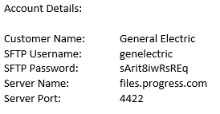
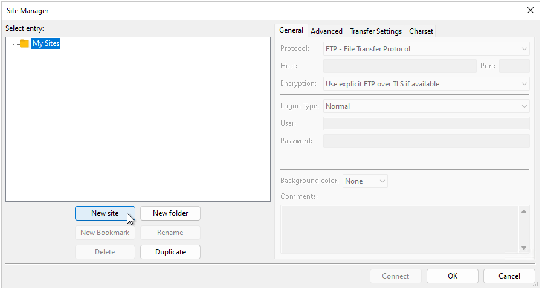
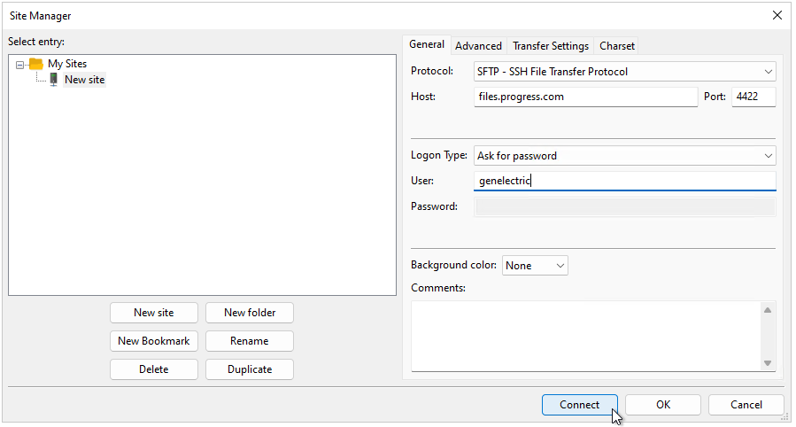
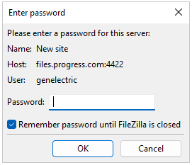
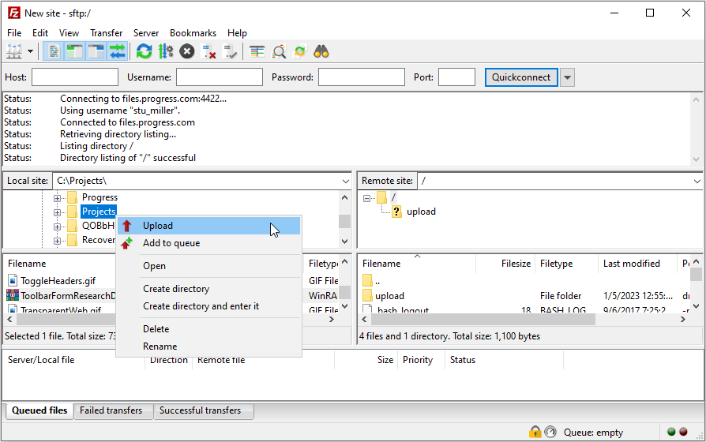

## Environment
|Product Version|Product|Author|
|----|----|----|
|2022.3.1109|UI for WinForms|[Desislava Yordanova](https://www.telerik.com/blogs/author/desislava-yordanova)|

## Description

When a client needs to provide a file that exceeds the limit in the support-ticketing system, the files exchange is performed by using the Progress SFTP. The agent handling the ticket, should create an account for the customer and provide *Username*, *Password*, *Server Name* and *Server Port* to the client to access the created account and upload the files.

>caution Keep in mind that all created accounts and all uploaded data is deleted from the server after 30 days to provide enough space for all following uploads. Make sure to upload/download all needed information in time as there will be no backups configured on the server.

## Solution

All details needed by the customer to establish a SFTP connection to the server are *Username*, *Password*, *Server Name* and *Server Port*:

 

To login, you should use an FTP client such as FileZilla or WinSCP etc. Below you will find instructions on how to establish the connection through FileZilla or WinSCP:

1\. Open Site Manager through the File menu (File>Site Manager) / or use the Site Manager button.

 

2\. Click on the New Site button below to create a new site connection.

 

Make sure you select SFTP – SSH File Tranfer Protocol from the Protocol drop-down menu. Fill in the host address, account name and Port number from the credentials you received earlier and click **Connect**.

 

Enter the password on the prompt and click OK.

 

On the left side of the menu, you should see your local computer tree structure and on the right is the SFTP server with the upload folder. Select, on the left, a local folder from where you want the file to be uploaded. Click Upload.

 

Once the Upload process is completed, an alert is shown.

 

 
