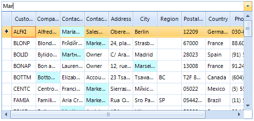

|Product Version|Product|Author|Last modified|
|----|----|----|----|
|2014.1.402|RadMultiColumnComboBox for WinForms|Dimitar Karamfilov|February 13, 2014|


This example shows how you can search in all columns in **RadMultiColumnComboBox**, rather than filtering by just a single column.  The example uses the **CustomFiltering** event of the **EditorElement** to perform a custom search. In this case we will search the entire underlying grid for the text in the editor and if a match is found, we will mark the corresponding cell in a specific color.
 

 
 
First we can initialize the control. To do that we can populate it with some data, enable the filtering by setting the appropriate properties (AutoFilter, DisplayMember) and add a custom **FilterDescriptor** (without this the CustomFiltering event won't fire). Also we should subscribe to the **CustomFiltering** and **KeyDown** events:  


````C#
private void Form1_Load(object sender, EventArgs e)
{
    // TODO: This line of code loads data into the 'nwindDataSet.Customers' table. You can move, or remove it, as needed.
    this.customersTableAdapter.Fill(this.nwindDataSet.Customers);
 
    this.radMultiColumnComboBox1.AutoFilter = true;
    this.radMultiColumnComboBox1.DisplayMember = "ContactName";
    radMultiColumnComboBox1.Text = "";
 
    FilterDescriptor filter = new FilterDescriptor();
    filter.PropertyName = this.radMultiColumnComboBox1.DisplayMember;
    filter.Operator = FilterOperator.Contains;
    this.radMultiColumnComboBox1.EditorControl.MasterTemplate.FilterDescriptors.Add(filter);
    radMultiColumnComboBox1.MultiColumnComboBoxElement.EditorControl.EnableCustomFiltering = true;
 
    radMultiColumnComboBox1.MultiColumnComboBoxElement.EditorControl.CustomFiltering += EditorControl_CustomFiltering;
    radMultiColumnComboBox1.KeyDown += radMultiColumnComboBox1_KeyDown;
 
}

````
````VB.NET
Private Sub Form1_Load(sender As Object, e As EventArgs) Handles MyBase.Load
    'TODO: This line of code loads data into the 'NwindDataSet.Customers' table. You can move, or remove it, as needed.
    Me.CustomersTableAdapter.Fill(Me.NwindDataSet.Customers)
 
    Me.RadMultiColumnComboBox1.AutoFilter = True
    Me.RadMultiColumnComboBox1.DisplayMember = "ContactName"
    RadMultiColumnComboBox1.Text = ""
 
    Dim filter As New FilterDescriptor()
    filter.PropertyName = Me.RadMultiColumnComboBox1.DisplayMember
    filter.[Operator] = FilterOperator.Contains
    Me.RadMultiColumnComboBox1.EditorControl.MasterTemplate.FilterDescriptors.Add(filter)
    RadMultiColumnComboBox1.MultiColumnComboBoxElement.EditorControl.EnableCustomFiltering = True
 
    AddHandler RadMultiColumnComboBox1.MultiColumnComboBoxElement.EditorControl.CustomFiltering, AddressOf EditorControl_CustomFiltering
    AddHandler RadMultiColumnComboBox1.KeyDown, AddressOf radMultiColumnComboBox1_KeyDown
 
End Sub

````

Now we can implement the **CustomFiltering** event handler. In it we will use a string variable to store the searched text (note that the text is corrected depending on the AutoCompleteMode). Also if the user clears the text we need to make sure that all rows are visible and their styles are reset. Finally we can iterate trough each cell of the current row and if it contains the searched text we can change its style:  
 

````C#
void EditorControl_CustomFiltering(object sender, Telerik.WinControls.UI.GridViewCustomFilteringEventArgs e)
{
    RadMultiColumnComboBoxElement element = radMultiColumnComboBox1.MultiColumnComboBoxElement;
 
    string textToSearch = radMultiColumnComboBox1.Text;
    if (AutoCompleteMode.Append == (element.AutoCompleteMode & AutoCompleteMode.Append))
    {
        if (element.SelectionLength > 0 && element.SelectionStart > 0)
        {
            textToSearch = radMultiColumnComboBox1.Text.Substring(0, element.SelectionStart);
        }
    }
    if (string.IsNullOrEmpty(textToSearch))
    {
        e.Visible = true;
 
        for (int i = 0; i < element.EditorControl.ColumnCount; i++)
        {
            e.Row.Cells[i].Style.Reset();
           
        }
        e.Row.InvalidateRow();
        return;
    }
 
    e.Visible = false;
    for (int i = 0; i < element.EditorControl.ColumnCount; i++)
    {
        string text = e.Row.Cells[i].Value.ToString();
        if (text.IndexOf(textToSearch, 0, StringComparison.InvariantCultureIgnoreCase) >= 0)
        {
            e.Visible = true;
            e.Row.Cells[i].Style.CustomizeFill = true;
            e.Row.Cells[i].Style.DrawFill = true;
            e.Row.Cells[i].Style.BackColor = Color.FromArgb(201, 252, 254);
        }
        else
        {
            e.Row.Cells[i].Style.Reset();
             
        }
    }
    e.Row.InvalidateRow();
 
}

````
````VB.NET
Private Sub EditorControl_CustomFiltering(sender As Object, e As Telerik.WinControls.UI.GridViewCustomFilteringEventArgs)
    Dim element As RadMultiColumnComboBoxElement = RadMultiColumnComboBox1.MultiColumnComboBoxElement
 
    Dim textToSearch As String = RadMultiColumnComboBox1.Text
    If AutoCompleteMode.Append = (element.AutoCompleteMode And AutoCompleteMode.Append) Then
        If element.SelectionLength > 0 AndAlso element.SelectionStart > 0 Then
            textToSearch = RadMultiColumnComboBox1.Text.Substring(0, element.SelectionStart)
        End If
    End If
 
    If String.IsNullOrEmpty(textToSearch) Then
        e.Visible = True
 
        For i As Integer = 0 To element.EditorControl.ColumnCount - 1
            e.Row.Cells(i).Style.Reset()
 
        Next
 
        e.Row.InvalidateRow()
        Return
    End If
 
    e.Visible = False
    For i As Integer = 0 To element.EditorControl.ColumnCount - 1
        Dim text As String = e.Row.Cells(i).Value.ToString()
        If text.IndexOf(textToSearch, 0, StringComparison.InvariantCultureIgnoreCase) >= 0 Then
            e.Visible = True
            e.Row.Cells(i).Style.CustomizeFill = True
            e.Row.Cells(i).Style.DrawFill = True
            e.Row.Cells(i).Style.BackColor = Color.FromArgb(201, 252, 254)
        Else
            e.Row.Cells(i).Style.Reset()
 
        End If
    Next
    e.Row.InvalidateRow()
End Sub

````

Finally we can use the KeyDown event in order to select the corresponding row (the DisplayMember text will be displayed in the textbox) when the user presses the enter key:

````C#
void radMultiColumnComboBox1_KeyDown(object sender, KeyEventArgs e)
{
    if (e.KeyCode == System.Windows.Forms.Keys.Enter)
    {
        if (this.radMultiColumnComboBox1.ValueMember != "")
        {
            radMultiColumnComboBox1.SelectedValue = radMultiColumnComboBox1.EditorControl.CurrentRow.Cells[radMultiColumnComboBox1.ValueMember].Value;
        }
        else
        {
            radMultiColumnComboBox1.SelectedValue = radMultiColumnComboBox1.EditorControl.CurrentRow.Cells[radMultiColumnComboBox1.DisplayMember].Value;
        }
 
        radMultiColumnComboBox1.Text = radMultiColumnComboBox1.EditorControl.CurrentRow.Cells[radMultiColumnComboBox1.DisplayMember].Value.ToString();
        radMultiColumnComboBox1.MultiColumnComboBoxElement.ClosePopup();
        radMultiColumnComboBox1.MultiColumnComboBoxElement.TextBoxElement.TextBoxItem.SelectAll();
    }
 
}

````
````VB.NET
Private Sub radMultiColumnComboBox1_KeyDown(sender As Object, e As KeyEventArgs)
    If e.KeyCode = System.Windows.Forms.Keys.Enter Then
        If Me.radMultiColumnComboBox1.ValueMember <> "" Then
            radMultiColumnComboBox1.SelectedValue = radMultiColumnComboBox1.EditorControl.CurrentRow.Cells(radMultiColumnComboBox1.ValueMember).Value
        Else
            radMultiColumnComboBox1.SelectedValue = radMultiColumnComboBox1.EditorControl.CurrentRow.Cells(radMultiColumnComboBox1.DisplayMember).Value
        End If
 
        radMultiColumnComboBox1.Text = radMultiColumnComboBox1.EditorControl.CurrentRow.Cells(radMultiColumnComboBox1.DisplayMember).Value.ToString()
        radMultiColumnComboBox1.MultiColumnComboBoxElement.ClosePopup()
        radMultiColumnComboBox1.MultiColumnComboBoxElement.TextBoxElement.TextBoxItem.SelectAll()
    End If
End Sub

````

>note You can download a VB and C# project from the following [link](https://github.com/telerik/winforms-sdk/tree/master/MultiColumnComboBox/CustomFiltering).
